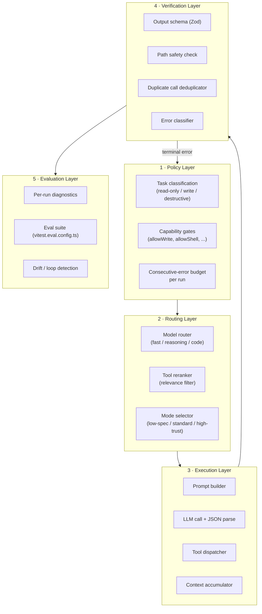
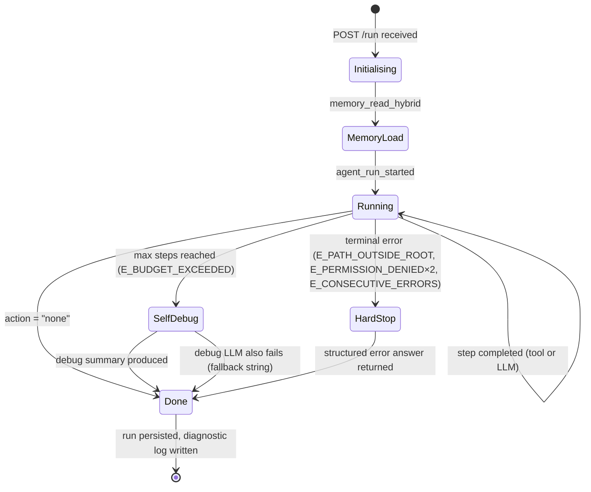

# TEMPORARY PLANNING DOCUMENT — Agent Harness Overhaul

> **Status: THEORETICAL ONLY — nothing described here is implemented.**
> This file exists solely to preserve context, reduce hallucinations across
> sessions, and keep future implementation work aligned.
> Delete or move to `docs/` once the architecture stabilises and implementation begins.

---

## Motivation

A live run against a real Ollama deployment exposed several interacting failures:

```
Step 0 → read_file("/home/user/.env")  →  Error: Access denied: path is outside the project root
Step 1 → (model retries with same path) →  same error
Step 2-5 → model invents progressively nonsensical workarounds
           (mysql_query, read_file("/dev/null"), raw JSON in thought field)
Step 6 → action: "none" — final "thought" is ~750-char hallucination
```

Root causes:

1. **No consecutive-error budget.** A repeating tool error burns steps identically to progress.
2. **No path-normalisation feedback.** The error message was technically correct but gave the model nothing actionable ("outside project root" without saying *what* the root is).
3. **No halt-on-hopeless logic.** Nothing detects "same tool, same path, same error ×N" and stops early.
4. **Weaker local models drift.** `llama3.1:8b` can lose the thread when the system prompt doesn't constrain recovery strategies tightly enough.

**The fix philosophy:** build the harness first, then fix individual bugs *within* that structure. Patching symptoms one-by-one without a coherent harness produces an accumulation of special-cases that nobody can reason about.

---

## Goals

- **Trustworthy local-first agent** — behaves predictably on `llama3.1:8b`–class models, not just frontier models.
- **Works with weaker local models** — the harness compensates for limited instruction-following by constraining the action space and providing tight error feedback.
- **Scalable across hardware tiers** — three operating modes (low-spec / standard / high-trust) each with appropriate limits.
- **Low hallucination / drift** — structured termination, typed error codes, and tight recovery prompts prevent the model from "inventing" paths.
- **Suitable for real work** — diagnostic logs, run-state transitions, and evaluation coverage give operators confidence.

---

## Architecture Plan

### 1. Design Principles

| Principle | Meaning in Manna |
|---|---|
| **Harness before features** | Every new capability must fit inside defined policy, routing, execution, verification, evaluation layers. |
| **Fail loudly, stop early** | Repeated identical failures must terminate the run with a typed error, not silently consume steps. |
| **Deterministic feedback loops** | Tool errors must include structured codes + context so the model can reason about them, not just a raw exception string. |
| **Mode-aware limits** | `AGENTS_MAX_STEPS`, `AGENT_MAX_TOOL_CALLS`, and consecutive-error budgets scale with the hardware/trust tier. |
| **Traceable decisions** | Every state transition emits a typed event (`agent:*`). No silent state. |
| **Processors are the extension point** | Policy enforcement lives in `packages/processors/`, not scattered across `agent.ts`. |

---

### 2. Core Layers



---

### 3. Task Taxonomy

| Class | Description | Example | Write gate |
|---|---|---|---|
| `read` | Read-only information gathering | "What does the .env file contain?" | No |
| `write` | Produces side-effects the user explicitly requested | "Rename this file" | Yes (`allowWrite: true`) |
| `destructive` | Irreversible side-effects | "Drop the table" | Yes + confirmation |
| `multi-step` | Requires ≥3 tool calls to complete | "Refactor the module and run tests" | Depends |
| `ambient` | Background / daemon task | Memory sweep, index rebuild | Scheduled |

The routing layer must classify the task *before* handing it to the execution layer so that the correct step budget and tool set are pre-configured.

---

### 4. Error Taxonomy

Typed error codes allow the harness to take different recovery actions rather than feeding every raw exception string back to the model.

| Code | Meaning | Recovery action |
|---|---|---|
| `E_PATH_OUTSIDE_ROOT` | `read_file` / `write_file` path violates sandbox | **Immediate stop** + user message: "Path `X` is outside the project root (`Y`). Cannot access." |
| `E_TOOL_UNKNOWN` | Model requested a tool not in the registered list | Append tool list to context, retry (max 2×) |
| `E_TOOL_PARSE` | Tool input failed schema validation | Append validation error, retry (max 2×) |
| `E_JSON_PARSE` | LLM output is not valid JSON | Append correction hint, retry (max 2×) |
| `E_DUPLICATE_CALL` | Same tool + same input already called this run | Skip execution, append dedup notice |
| `E_CONSECUTIVE_ERRORS` | N tool errors in a row (see §6) | Terminate run with structured summary |
| `E_BUDGET_EXCEEDED` | Step count or context chars over limit | Terminate run, emit `agent:budget_exceeded` |
| `E_LLM_TIMEOUT` | LLM did not respond within `AGENT_BUDGET_MAX_DURATION_MS` | Terminate, emit `agent:timeout` |
| `E_PERMISSION_DENIED` | Tool requires `allowWrite` but flag is not set | Append explanation, do **not** retry |

**Key design decision:** `E_PATH_OUTSIDE_ROOT` and `E_PERMISSION_DENIED` must **never** trigger a retry cycle. They are definitional — retrying cannot fix them. Any step that produces one of these codes increments both the tool-error counter *and* the "hard stop" counter; two hard-stop errors in one run terminate immediately.

---

### 5. Run State Model

A run transitions through these states (stored in diagnostics, emitted as events):



The `HardStop` state is new (not yet implemented). It must:

1. Immediately stop the execution loop.
2. Build a human-readable explanation from the typed error code.
3. Return that explanation as the run's `answer` field (not an exception).
4. Persist the run with `status: "hard_stopped"` (new enum value).
5. Emit `agent:hard_stop` with `{ reason, code, step }`.

---

### 6. Guardrail / Termination Strategy

The following counters must be tracked per-run inside `Agent.run()` alongside the existing `step` counter:

| Counter | Increment when | Hard stop when |
|---|---|---|
| `consecutiveErrors` | Any tool call returns an error | ≥ 3 (configurable: `AGENT_CONSECUTIVE_ERROR_LIMIT`, default `3`) |
| `hardStopErrors` | Tool returns `E_PATH_OUTSIDE_ROOT` or `E_PERMISSION_DENIED` | ≥ 2 |
| `duplicateCalls` | `ToolCallDeduplicator` blocks a call | ≥ 5 (treat as loop) |
| `jsonParseFailures` | Zod rejects the LLM output | ≥ 3 in a row |

`consecutiveErrors` resets to 0 on any **successful** tool call.

**Mode-specific defaults** (see §7):

| Mode | `AGENTS_MAX_STEPS` default | `AGENT_CONSECUTIVE_ERROR_LIMIT` default |
|---|---|---|
| `low-spec` | 5 | 2 |
| `standard` | 20 | 3 |
| `high-trust` | 50 | 5 |

---

### 7. Operating Modes

Three explicit operating modes replace the current single-step-limit knob.  
They are set via `AGENT_OPERATING_MODE` env var (`low-spec` | `standard` | `high-trust`).

#### Low-spec (`AGENT_OPERATING_MODE=low-spec`)

- Target hardware: 8–16 GB RAM, CPU-only or small GPU, models ≤ 8B params.
- `AGENTS_MAX_STEPS=5`, `AGENT_MAX_TOOL_CALLS=3`, `AGENT_CONSECUTIVE_ERROR_LIMIT=2`.
- Model router locks to `fast` profile for all steps (no reasoning/code escalation).
- Tool list pre-filtered to the top-5 most relevant (tool reranker always active).
- No multi-step write tasks allowed without explicit `allowWrite + allowMultiStep`.
- Self-debug on exhaustion: skipped (returns generic fallback immediately to save tokens).

#### Standard (`AGENT_OPERATING_MODE=standard`, default)

- Target hardware: 16–32 GB RAM, mid-range GPU, models 7–13B.
- `AGENTS_MAX_STEPS=20`, `AGENT_MAX_TOOL_CALLS=10`, `AGENT_CONSECUTIVE_ERROR_LIMIT=3`.
- Model router uses full profile selection.
- Self-debug on exhaustion: enabled with `fast` model.

#### High-trust (`AGENT_OPERATING_MODE=high-trust`)

- Target hardware: 32+ GB VRAM, large models (34B+), or when using a known-reliable model.
- `AGENTS_MAX_STEPS=50`, `AGENT_MAX_TOOL_CALLS=20`, `AGENT_CONSECUTIVE_ERROR_LIMIT=5`.
- Write tools available (still gated by `allowWrite`).
- Self-debug on exhaustion: enabled with `reasoning` model.
- Extended context budget (`AGENT_BUDGET_MAX_CONTEXT_CHARS` doubles).

---

### 8. Evaluation Strategy

The existing `vitest.eval.config.ts` suite should gain explicit coverage for harness behaviour:

| Eval scenario | Pass criteria |
|---|---|
| `read_file` outside project root → single hard stop | Run terminates at step 0, answer contains path context, `status: "hard_stopped"` |
| Same tool + same path ×3 | Run terminates with `E_CONSECUTIVE_ERRORS` before step 3 |
| Max steps exhausted | Self-debug summary returned, `agent:max_steps` emitted |
| `allowWrite=false` + write tool call | Tool refused with `E_PERMISSION_DENIED`, not retried |
| Duplicate tool calls | Deduplicator blocks ≥1 call, run still completes |
| Low-spec mode task | Completes within 5 steps or hard-stops cleanly |

Each eval should assert on:

1. Final `answer` content (no hallucinated JSON blobs, no `/dev/null` attempts).
2. `meta.steps` ≤ declared maximum.
3. Emitted events sequence (ordered `agent:start → agent:step* → agent:hard_stop|done`).
4. Diagnostic log entries (severity distribution, no `severity: "error"` entries missing a code).

---

### 9. Implementation Roadmap

Phases are ordered so each one is independently shippable and leaves the system in a working state.

#### Phase 0 — Observability baseline (prerequisite, ~1 session)

- [ ] Add `code` field to `IDiagnosticEntry` (typed error code from §4).
- [ ] Add `status: "hard_stopped"` to the persistence `IAgentRun` type.
- [ ] Emit `agent:hard_stop` event from event bus types.
- [ ] No behaviour change; existing tests must still pass.

#### Phase 1 — Structured error codes for tools (~1 session)

- [ ] Add `E_PATH_OUTSIDE_ROOT` code to `packages/shared/path-safety.ts` errors.
- [ ] Update `read_file` / `write_file` tools to throw structured errors (object with `code`, `message`, `context`).
- [ ] Update `agent.ts` tool-error handler to read the code and build actionable feedback text.
- [ ] Example feedback: *"Path `/home/user/.env` is outside the project root (`/app`). I cannot access files outside the project. Please ask for a file within the project."*
- [ ] Add eval: path-outside-root → single clear refusal.

#### Phase 2 — Consecutive-error budget + hard-stop (~1 session)

- [ ] Add `consecutiveErrors` and `hardStopErrors` counters to `Agent.run()`.
- [ ] Read `AGENT_CONSECUTIVE_ERROR_LIMIT` from env (default `3`).
- [ ] On `consecutiveErrors ≥ limit` or `hardStopErrors ≥ 2`: break loop, return structured answer, persist as `hard_stopped`.
- [ ] Add eval: same tool error ×3 → run terminates, not 6 steps of hallucination.

#### Phase 3 — Operating mode integration (~1–2 sessions)

- [ ] Add `AGENT_OPERATING_MODE` env var; document in `docs/use-the-application.md` and `.ai/ENVVARS.md`.
- [ ] Add `resolveOperatingMode()` helper in `packages/shared/`.
- [ ] Apply mode-specific defaults in `Agent.run()` (step budget, error limit, tool list size).
- [ ] Add low-spec mode to eval suite.

#### Phase 4 — Policy layer as processor (~1–2 sessions)

- [ ] Implement `PolicyProcessor` in `packages/processors/policy.ts`.
  - Pre-step: check task classification, verify capability gates, enforce duplicate guard.
  - Post-step: record error code, update counters.
- [ ] Register `PolicyProcessor` before other processors in `apps/api/agents.ts`.
- [ ] Migrate hard-stop logic from `agent.ts` into the processor.
- [ ] Update integration tests.

#### Phase 5 — Evaluation coverage sweep (~1 session)

- [ ] Add all eval scenarios from §8 to `tests/evals/`.
- [ ] Target: zero known failure modes (from §4) without a corresponding eval.
- [ ] Add drift-detection eval: run the `.env` task with `llama3.1:8b` mock, assert no hallucinated tool calls after a hard stop.

#### Phase 6 — Documentation + cleanup (~1 session)

- [ ] Update `docs/theory/agent-loop.md` with the extended failure-mode table from §4.
- [ ] Add `docs/theory/operating-modes.md`.
- [ ] Add `docs/theory/error-taxonomy.md`.
- [ ] Remove or archive this planning document (move to `docs/` as historical reference).

---

## Later-Phase Backlog

> Items in this section are **post-harness / after-core-overhaul**.  
> They should not be started until Phases 0–6 above are complete and stable.  
> Each item is a candidate for its own planning document or `docs/` page.

---

### B1 — Onboarding improvements

- [ ] Write a **quickstart guide** that guarantees at least one successful end-to-end run for a new user: minimal `.env`, `POST /run` with a concrete task, expected response shape.
- [ ] Add a **"What should I try next?"** section to the quickstart, giving a short curated list of tasks that exercise real capabilities without requiring write access.
- [ ] General first-run UX audit: identify and fix the most common sources of confusion (unclear env var names, missing defaults, ambiguous error messages on startup).

---

### B2 — Complete observability layer

The goal is a single, coherent observability payload attached to every run, surfaced in diagnostics and events.

| Observable | Where it lives today | Target state |
|---|---|---|
| Model / profile chosen per step | `agent:model_routed` event | Persisted in run record + diagnostic log |
| Per-step traces (thought, action, tool, result) | Diagnostic log (partial) | Structured trace array on run record |
| Tool latency breakdown | Not captured | Per-call `durationMs` in trace |
| Token and context usage | `contextLength` logged at step end | Token counts per LLM call if provider exposes them |
| Stop reason | `action: "none"` in thought | Explicit typed `stopReason` field (`hard_stop`, `budget`, `done`, `timeout`) |
| Debug meta payload | Not available | Optional `debug: true` flag on `POST /run` that returns full trace + meta in the response |

- [ ] Define a `IRunObservability` interface in `packages/shared/` covering the fields above.
- [ ] Attach `observability` to the persisted `IAgentRun` record.
- [ ] Expose a `debug` flag on `POST /run` (opt-in) that inlines the full observability payload in the HTTP response.
- [ ] Emit `agent:observability_snapshot` event at run completion.

---

### B3 — Activable persistent run history

Persistent run history (powered by `packages/persistence/`) is already partially implemented.  
This item makes the full observability data from B2 storable and configurable via environment.

- [ ] Add an env var (e.g. `MANNA_PERSISTENCE_ENABLED=true`) to gate whether runs are persisted at all; default to `false` for minimal deployments.
- [ ] When enabled, persist the full `IRunObservability` payload from B2 alongside the existing run record.
- [ ] Document the storage format and env var in `docs/use-the-application.md` and `.ai/ENVVARS.md`.
- [ ] Add a `GET /runs` or `GET /history` endpoint (read-only) to retrieve persisted run summaries.

---

### B4 — Specialised endpoints extending `POST /run`

Long-term, the generic `/run` endpoint should be complemented by narrower purpose-built endpoints that carry stronger semantic contracts (fixed tool sets, targeted prompts, typed response shapes).

Candidates:

| Endpoint | Purpose |
|---|---|
| `POST /summarize-file` | Summarize a file at a given path within the project root |
| `POST /explain-file` | Explain what a file does, its public API, its dependencies |
| `POST /docs-chat` | Conversational Q&A against the `docs/` tree |
| `POST /refactor-suggestion` | Suggest refactoring improvements for a given file or symbol |
| `POST /test-generate` | Generate test stubs for a given module or function |
| `POST /trace-request` | Replay and explain a previous run by ID |

- [ ] Define endpoint contracts (request body, response shape, allowed tools) in `docs/endpoint-map.md` before implementing.
- [ ] Each endpoint should reuse `Agent.run()` internally with a pre-configured task prefix and restricted tool set — no new execution engine.
- [ ] `/run` remains the general-purpose escape hatch; specialised endpoints are narrower alternatives, not replacements.

---

### B5 — Naming and terminology consistency

As the surface area grows (env vars, events, API fields, tool names, docs), inconsistencies accumulate.

- [ ] Audit all env var names against a chosen prefix convention (e.g. `MANNA_*` vs `AGENT_*`); pick one and document it in `.ai/ENVVARS.md`.
- [ ] Audit event names (`agent:*`, `tool:*`, `memory:*`) for consistent casing and namespace.
- [ ] Audit API response fields (`meta`, `answer`, `steps`, `observability`) across all endpoints for consistent naming.
- [ ] Audit `docs/glossary.md` — ensure every term used in code, config, and docs maps to a single glossary entry.
- [ ] Produce a one-page **terminology map** (code name → docs name → event name → env var) and add it to `docs/` or `.ai/`.
- [ ] Apply renaming in a single dedicated PR to minimise noise in the history.

---

### B6 — Visual workflow builder

A visual, node-based interface for constructing multi-step agent workflows (sequences of tool calls, branching on conditions, human-in-the-loop approval gates).

- [ ] **Assessment first:** check whether an equivalent UI already exists in the repository (e.g. in `apps/`) or in an upstream dependency before building anything new. If a suitable component exists, evaluate reuse.
- [ ] If building new: define the data model for a "workflow graph" (nodes = steps, edges = transitions, triggers = events) before any UI work.
- [ ] Target integration: workflows should compile to a `POST /run` call or a sequence of specialised endpoint calls (B4).
- [ ] Keep this as a future item until the core harness (Phases 0–6) and observability (B2) are stable; the builder needs a reliable backend to be useful.

---

## Appendix: Relevant Existing Symbols

Quick lookup so future sessions don't re-explore:

| Symbol | Location | Notes |
|---|---|---|
| `Agent.run()` | `packages/agent/agent.ts` | Main loop; add counters in Phase 2 |
| `MAX_STEPS` | `packages/agent/agent.ts:58` | Reads `AGENTS_MAX_STEPS` env var |
| `AGENT_MAX_TOOL_CALLS` | `packages/agent/agent.ts` | Per-step tool-call limit |
| `AGENT_BUDGET_MAX_DURATION_MS` | env | Run wall-clock budget |
| `AGENT_BUDGET_MAX_CONTEXT_CHARS` | env | Context accumulator cap |
| `IDiagnosticEntry` | `packages/diagnostics/` | Add `code` field here (Phase 0) |
| `IProcessInputStepArgs` | `packages/processors/types.ts` | Hook point for PolicyProcessor |
| `IProcessOutputStepArgs` | `packages/processors/types.ts` | Hook point for PolicyProcessor |
| `path-safety.ts` | `packages/shared/path-safety.ts` | Throw typed errors here (Phase 1) |
| `ToolCallDeduplicator` | `packages/tools/tool-call-deduplicator.ts` | Already exists; wire counters (Phase 2) |
| `saveAgentRun` | `packages/persistence/db.ts` | Add `hard_stopped` status (Phase 0) |
| `emit` | `packages/events/bus.ts` | Add `agent:hard_stop` event (Phase 0) |
| `vitest.eval.config.ts` | repo root | Eval suite entry point |

---

*Last updated: 2026-05-12. Author: Copilot planning session. Backlog section (B1–B6) added 2026-05-12.*
