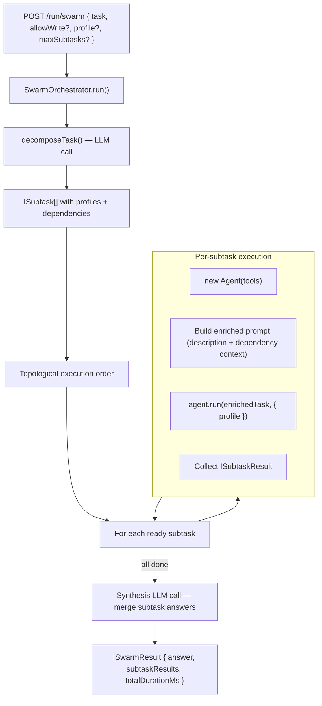

# AI_README — Machine-Oriented Codebase Reference

> This file is written for AI models, not humans.
> It is dense, precise, and optimised for fast context-loading by an LLM acting as a coding assistant on this repository.
> Skip pleasantries. Parse facts.
>
> **Mandatory read**: This file MUST be read in full at the start of every session.
> A `.github/copilot-instructions.md` file enforces this for GitHub Copilot automatically.
> If you are another AI agent: read this file before taking any action.

---

## Host Hardware Specs

> These specs define what the local machine can realistically run. Use them when recommending or selecting Ollama models.

| Component               | Spec                                                            |
| ----------------------- | --------------------------------------------------------------- |
| **CPU**                 | AMD Ryzen 9 9950X3D — 16 cores / 32 threads, base 4.3 GHz (AM5) |
| **RAM**                 | 32 GB DDR5-6000 CL32 (2 × 16 GB Lexar THOR OC)                  |
| **GPU**                 | NVIDIA GeForce RTX 4090 — **24 GB VRAM** (Founders Edition)     |
| **Storage (fast)**      | 2 TB WD_BLACK SN8100, PCIe 5.0 ×4 NVMe (primary)                |
| **Storage (secondary)** | 1 TB Crucial P310, PCIe 4.0 ×4 NVMe                             |
| **Motherboard**         | Asus ROG STRIX X870E-H GAMING WIFI7 (ATX, AM5)                  |
| **PSU**                 | Asus ROG THOR P2 1000 W, 80+ Platinum, fully modular            |

**Key implication for model selection**: 24 GB VRAM allows running models up to ~13 B parameters in full precision (FP16) or up to ~34 B at 4-bit quantisation (Q4_K_M) entirely on-GPU via Ollama. Larger models will offload layers to RAM (32 GB system RAM available), which degrades throughput. Prefer models that fit fully in VRAM for latency-sensitive paths (fast, ide profiles).

---

## Recommended Models by Profile

> Assign these as the default values for the corresponding env vars. Update this table whenever models change on Ollama.

| Profile / Variable             | Recommended model                     | Rationale                                                                        |
| ------------------------------ | ------------------------------------- | -------------------------------------------------------------------------------- |
| `OLLAMA_MODEL` (base fallback) | `llama3.1:8b-instruct-q8_0`           | Fits in VRAM, good general capability                                            |
| `AGENT_MODEL_FAST`             | `llama3.1:8b-instruct-q8_0`           | Low latency; fully on-GPU                                                        |
| `AGENT_MODEL_REASONING`        | `deepseek-r1:32b-qwen-distill-q4_K_M` | 32 B at Q4 fits in 24 GB; strong reasoning                                       |
| `AGENT_MODEL_CODE`             | `qwen2.5-coder:14b-instruct-q8_0`     | Best code quality that still fits in VRAM                                        |
| `AGENT_MODEL_DEFAULT`          | `llama3.1:8b-instruct-q8_0`           | Same as FAST; safe fallback                                                      |
| `AGENT_MODEL_ROUTER_MODEL`     | `phi4-mini:latest`                    | Fast routing; ~3.8 B params ≈ 2× throughput vs 8 B; model must return valid JSON |
| `OLLAMA_EMBED_MODEL`           | `nomic-embed-text`                    | Efficient, high-quality embeddings                                               |
| `TOOL_VISION_MODEL`            | `llava:13b-v1.6-vicuna-q4_K_M`        | Multimodal; 13 B Q4 fits in VRAM                                                 |
| `TOOL_STT_MODEL`               | `whisper`                             | No GPU requirement; CPU is fast enough                                           |
| `TOOL_IDE_MODEL`               | `qwen2.5-coder:7b-instruct-q8_0`      | Sub-100 ms completions; cursor-time latency                                      |
| `TOOL_DIAGRAM_MODEL`           | `qwen2.5-coder:14b-instruct-q8_0`     | Code-specialised model excels at structured Mermaid syntax generation            |

**Rules for recommending models**:

1. Prefer models that fit entirely in 24 GB VRAM (no layer offload).
2. For latency-critical paths (`fast`, IDE), prefer smaller/quantised models over accuracy.
3. For `reasoning`, prefer the largest model that still fits in VRAM at Q4 quantisation.
4. For `code`, prefer a code-specialised model (Qwen-Coder, DeepSeek-Coder, CodeLlama).
5. When a new model replaces an existing one, update this table AND the env var defaults in the Key Environment Variables section.

---

## Identity

**Repo**: `Guebbit/AI-coding-assistant`
**Language**: TypeScript (strict mode, ESM modules via `tsx`)
**Runtime**: Node.js ≥ 18
**Package topology**: flat monorepo — no workspaces; `packages/` and `apps/` are imported by relative path, not by npm package name.

---

## What this system is

A **local-first agentic loop** that wraps Ollama-hosted LLMs and exposes them via a small Express HTTP API.
It is NOT a chatbot frontend. It is a **tool-using agent server**.

Four operational surfaces:

1. `POST /run` — triggers the full agentic loop (reason → pick tool → execute → repeat).
2. `POST /run/swarm`, `POST /run/swarm/stream` — multi-agent swarm orchestration (decompose → delegate → synthesise).
3. `POST /workflow`, `POST /workflow/stream` — sequential workflow orchestration (explicit ordered steps, each bounded independently).
4. `POST /autocomplete`, `POST /lint-conventions`, `POST /page-review` — direct IDE endpoints, **bypass** the agent loop entirely.
5. `GET /info/modes`, `GET /info/models`, `GET /help` — informational endpoints; return instance metadata, no LLM calls.

---

## Execution graph — `POST /run`

```mermaid
flowchart TD
    POST["HTTP POST /run { task, allowWrite?, profile? }"]
    POST --> API["apps/api/index.ts"]
    API --> Validate["validates profile against fast|reasoning|code|default"]
    API --> Select["selects Agent instance (readOnly or writeEnabled)"]
    API --> Run["agent.run(task, { profile? })"]

    Run --> GetMem["getMemory(task) ← packages/memory/memory.ts"]
    Run --> EmitStart["emit('agent:start')"]

    subgraph LOOP["LOOP (max MAX_STEPS, default 5)"]
        ProcInput["processInputStep processors\n(e.g. tool-reranker filters tools)"]
        BuildPrompt["buildPrompt(task, context, memory)"]
        RouteModel["routeModel(task, context, step, contextLength, cumulativeDurationMs)"]
        RouteModel --> Forced{"forcedProfile set?"}
        Forced -->|Yes| ReturnImm["return it immediately (no LLM cost)"]
        Forced -->|No| BudgetCheck{"budget heuristics?"}
        BudgetCheck -->|"context > 80% ceiling"| ReasoningProfile["use reasoning (larger ctx)"]
        BudgetCheck -->|"duration > 70% ceiling"| FastProfile["use fast (finish quickly)"]
        BudgetCheck -->|No budget trigger| Mode{"router mode?"}
        Mode -->|rules| Keywords["keyword + heuristic match"]
        Mode -->|model| RouterLLM["calls ROUTER_MODEL with JSON prompt + budget state"]

        Generate["generateWithMetadata(prompt, { model })"]
        Parse["parse response → agentStepSchema (Zod)"]
        Parse -->|"parse failure"| Correct["append correction to context\nrecord json diagnostic entry\ncontinue"]
        Correct --> ProcInput
        ProcOutput["processOutputStep processors\n(e.g. verification gate)"]
        Verify{"AGENT_VERIFICATION_ENABLED?"}
        Verify -->|"true + action≠none"| VerifyLLM["lightweight LLM check: valid tool choice?"]
        VerifyLLM -->|"valid=false"| AppendIssue["append issue to thought\nemit tool:verification_failed"]
        VerifyLLM -->|"valid=true"| ActionCheck

        ActionCheck{"action?"}
        ActionCheck -->|"'none'"| AddMem["addMemory(...)"]
        AddMem --> EmitDone["emit('agent:done')"]
        EmitDone --> DiagLog["writeDiagnosticLog if entries > 0"]
        DiagLog --> ReturnAnswer["return thought ← final answer"]

        ActionCheck -->|"unknown"| AppendErr["append error to context\nrecord tool diagnostic\ncontinue"]
        AppendErr --> ProcInput

        ActionCheck -->|"tool name"| ToolExec["tool.execute(input)"]
        ToolExec -->|success| ToolOk["append result to context, emit('tool:result')"]
        ToolExec -->|failure| ToolFail["append error to context\nrecord tool diagnostic\nemit('tool:error')"]
        ToolOk --> ProcInput
        ToolFail --> ProcInput

        ProcInput --> BuildPrompt --> RouteModel
        ReturnImm --> Generate
        ReasoningProfile --> Generate
        FastProfile --> Generate
        Keywords --> Generate
        RouterLLM --> Generate
        Generate --> Parse --> ProcOutput --> Verify --> ActionCheck
        AppendIssue --> ActionCheck
    end

    EmitStart --> LOOP
    GetMem --> LOOP
    LOOP -->|"loop exhausted"| SelfDebug["generate self-debug summary (FAST_MODEL)"]
    SelfDebug --> SaveMem["addMemory MAX_STEPS summary"]
    SaveMem --> WriteDiag["writeDiagnosticLog with AI commentary"]
    WriteDiag --> MaxSteps["emit('agent:max_steps', {task, summary, diagnosticFile})"]
    MaxSteps --> ReturnSummary["return AI-generated summary"]
```



---

## Structured output contract

Every LLM response in the agent loop is expected to be **strict JSON** matching:

```typescript
// packages/agent/schemas.ts
{
    thought: string; // chain-of-thought; at least 1 char
    action: string; // tool name OR the literal "none"
    input: Record<string, unknown>; // forwarded verbatim to tool.execute()
}
```

Validated with Zod (`agentStepSchema`). Failure → context correction → retry (same step slot).

---

## Model routing

File: `packages/agent/model-router.ts`

Profiles: `fast` | `reasoning` | `code` | `default`

Two modes (env `AGENT_MODEL_ROUTER_MODE`):

| Mode              | Mechanism                               | Notes                                   |
| ----------------- | --------------------------------------- | --------------------------------------- |
| `rules` (default) | keyword scan of `task + context`        | synchronous, zero LLM cost              |
| `model`           | calls `ROUTER_MODEL` with a JSON prompt | async, falls back to `default` on error |

Profile resolution (env vars → fallback chain):

```
AGENT_MODEL_CODE      → AGENT_MODEL_DEFAULT → OLLAMA_MODEL → "llama3"
AGENT_MODEL_FAST      → AGENT_MODEL_DEFAULT → OLLAMA_MODEL → "llama3"
AGENT_MODEL_REASONING → AGENT_MODEL_DEFAULT → OLLAMA_MODEL → "llama3"
```

---

## Tool registry

Defined in `packages/tools/`. Each tool satisfies `packages/tools/types.ts`:

```typescript
interface Tool {
    name: string;
    description: string;
    execute(input: Record<string, unknown>): Promise<unknown>;
}
```

Tools registered per request in `apps/api/agents.ts`:

| Tool name           | File                   | Write?  | Notes                                                                                                 |
| ------------------- | ---------------------- | ------- | ----------------------------------------------------------------------------------------------------- |
| `read_file`         | `fs.read.ts`           | no      | Sandboxed to project root                                                                             |
| `write_file`        | `fs.write.ts`          | **yes** | Writes under `PROJECT_OUTPUT_ROOT`                                                                    |
| `shell`             | `shell.ts`             | no      | Allowlist-enforced; rejects unsafe commands                                                           |
| `mysql_query`       | `mysql.query.ts`       | no      | SELECT-only; rejects non-SELECT SQL                                                                   |
| `browser_fetch`     | `browser.ts`           | no      | Playwright Chromium; truncates content to 5000 chars                                                  |
| `image_classify`    | `image.classify.ts`    | no      | Sends image to `TOOL_VISION_MODEL` (default `llava-llama3`); accepts `path` (disk) or `data` (base64) |
| `semantic_search`   | `semantic.search.ts`   | no      | Embeds query via Ollama; scores files via cosine similarity                                           |
| `speech_to_text`    | `speech.to.text.ts`    | no      | Calls `TOOL_STT_MODEL` (default `whisper`); accepts `path` (disk) or `data` (base64)                  |
| `read_pdf`          | `pdf.read.ts`          | no      | Returns `{ text, pages }`; accepts `path` (disk) or `data` (base64)                                   |
| `code_autocomplete` | `code.autocomplete.ts` | no      | IDE-style completion via `TOOL_IDE_MODEL` (default `starcoder2`)                                      |
| `generate_diagram`  | `diagram.generate.ts`  | no      | Generates Mermaid diagrams from descriptions; renders to SVG/PNG via mmdc                             |
| `scaffold_project`  | `project.scaffold.ts`  | **yes** | Copies boilerplate from `BOILERPLATE_ROOT`                                                            |
| `read_docx`         | `docx.read.ts`         | no      | Extracts text from `.docx` via ZIP/XML parsing; sandboxed to project root                             |
| `read_csv`          | `csv.read.ts`          | no      | Parses CSV/TSV; returns `{ text, headers, rowCount }`                                                 |
| `read_html`         | `html.read.ts`         | no      | Strips HTML tags; returns `{ text, title? }`                                                          |
| `read_json`         | `json.read.ts`         | no      | Reads and parses a JSON file; returns `{ data: unknown }`                                             |
| `read_markdown`     | `markdown.read.ts`     | no      | Reads a Markdown file; returns `{ text }`                                                             |
| `document_ingest`   | `document.ingest.ts`   | **yes** | Detects format, chunks, embeds, and upserts into Qdrant                                               |

Write tools (`write_file`, `scaffold_project`, `document_ingest`) are only registered when the request body contains `"allowWrite": true`.

---

## Memory subsystem

File: `packages/memory/memory.ts`

Hybrid approach:

1. **In-process ring buffer** — up to 20 recent entries; always available.
2. **Qdrant vector store** — semantic recall via Ollama embeddings (`OLLAMA_EMBED_MODEL`, default `nomic-embed-text`).

API:

- `getMemory(task: string): Promise<string[]>` — returns relevant past entries.
- `addMemory(entry: string): Promise<void>` — persists after each completed run.

Qdrant is optional. If unreachable, the system silently falls back to the in-process buffer only.

---

## Event bus

File: `packages/events/bus.ts`

Synchronous, typed, in-process pub/sub. No external broker.

```typescript
emit(event: AgentEvent): void
on(type: string | "*", handler: (event: AgentEvent) => void): void
```

Canonical event types emitted during a run:

| Event type                 | Emitted when                                                                                                                                                                     |
| -------------------------- | -------------------------------------------------------------------------------------------------------------------------------------------------------------------------------- |
| `agent:start`              | `agent.run()` begins                                                                                                                                                             |
| `agent:model_routed`       | model profile chosen for this step                                                                                                                                               |
| `agent:step`               | LLM response parsed successfully                                                                                                                                                 |
| `agent:done`               | action === "none", final answer ready                                                                                                                                            |
| `agent:max_steps`          | loop exhausted without "none"; payload now includes `{ task, summary, diagnosticFile }` — `summary` is an AI-generated debug analysis, `diagnosticFile` is the Markdown log path |
| `agent:error`              | LLM call threw                                                                                                                                                                   |
| `tool:result`              | tool executed successfully                                                                                                                                                       |
| `tool:error`               | tool threw                                                                                                                                                                       |
| `tool:verification_failed` | verification processor detected an invalid tool choice; payload: `{ step, tool, issue }`                                                                                         |
| `swarm:start`              | swarm orchestrator begins a run                                                                                                                                                  |
| `swarm:decomposed`         | task decomposition complete; payload: `{ subtaskCount, reasoning, subtasks }`                                                                                                    |
| `swarm:subtask_start`      | a subtask agent is starting; payload: `{ subtaskId, profile }`                                                                                                                   |
| `swarm:subtask_done`       | a subtask agent completed; payload: `{ subtaskId, durationMs }`                                                                                                                  |
| `swarm:subtask_error`      | a subtask agent failed; payload: `{ subtaskId, error }`                                                                                                                          |
| `swarm:done`               | swarm finished with final answer; payload: `{ answer, totalDurationMs }`                                                                                                         |

The API subscribes to `"*"` and logs all events via `winston`.

---

## Processors (middleware)

File: `packages/processors/`

Optional hooks that intercept each agent step. Registered via `agent.addProcessor(p)`.

```typescript
interface Processor {
    processInputStep?(args: ProcessInputStepArgs): Promise<ProcessInputStepArgs | void>;
    processOutputStep?(args: ProcessOutputStepArgs): Promise<ProcessOutputStepArgs | void>;
}
```

Processors run **in registration order**. A processor may return a modified args object to influence the agent, or return `void` to leave it unchanged.

### Built-in processors

#### Verification gate (`packages/processors/verification.ts`)

Implements `processOutputStep`. Fires when `action !== "none"` and `AGENT_VERIFICATION_ENABLED === 'true'`.

After the agent picks a tool, makes a lightweight LLM call (using `AGENT_VERIFICATION_MODEL`, defaulting to `AGENT_MODEL_FAST`) asking:

> _"Did this tool choice correctly address the task? Reply JSON: {valid: boolean, issue?: string}"_

If `valid === false`, appends the `issue` to the agent's thought so it can self-correct on the next step, and emits `tool:verification_failed`.

| Env var                      | Default            | Effect                        |
| ---------------------------- | ------------------ | ----------------------------- |
| `AGENT_VERIFICATION_ENABLED` | `false`            | Enable post-tool verification |
| `AGENT_VERIFICATION_MODEL`   | `AGENT_MODEL_FAST` | Model for verification call   |

#### Tool reranker (`packages/processors/tool-reranker.ts`)

Implements `processInputStep`. Active when `TOOL_RERANKER_ENABLED === 'true'`.

On first invocation embeds all tool descriptions via Ollama and caches the vectors. Per step, embeds the task, computes cosine similarity against cached tool embeddings, and filters `args.tools` to the top-N names. Fails open (returns unchanged args on error).

| Env var                 | Default | Effect                |
| ----------------------- | ------- | --------------------- |
| `TOOL_RERANKER_ENABLED` | `false` | Enable tool reranking |
| `TOOL_RERANKER_TOP_N`   | `10`    | Max tools per step    |

---

## LLM package

File: `packages/llm/ollama.ts`

Thin wrapper around the Ollama REST API (`OLLAMA_BASE_URL`, default `http://localhost:11434`).

Key exports:

- `generate(prompt, options)` — raw string response.
- `generateWithMetadata(prompt, options)` — returns `{ response, model, done, doneReason, totalDurationNs, ... }`.

Models are addressed by string name. No provider abstraction; Ollama is the only supported backend.

---

## IDE direct endpoints

File: `apps/api/ide-endpoints.ts`  
Registered in `apps/api/index.ts` via `registerIdeRoutes(app)`.

These are **not** agent-loop routes. They respond with a single LLM call.

| Endpoint                 | Input                            | Purpose                                                   |
| ------------------------ | -------------------------------- | --------------------------------------------------------- |
| `POST /autocomplete`     | `{ prefix, suffix?, language? }` | Cursor-time code completion via `TOOL_IDE_MODEL`          |
| `POST /lint-conventions` | `{ code, language? }`            | Deterministic TS/style findings + optional LLM enrichment |
| `POST /page-review`      | `{ code, language?, filename? }` | Categorised review suggestions for a full file            |

> Human-readable reference with full schemas, rate limits, timeouts, curl examples, and a future-endpoint roadmap: `docs/endpoint-map.md`.

---

## Upload endpoints

File: `apps/api/upload-endpoints.ts`
Registered in `apps/api/index.ts` via `registerUploadRoutes(app)`.

These are **not** agent-loop routes. They accept `multipart/form-data` file uploads and call the corresponding tool with inline base64 data.

| Endpoint                      | Form fields                                         | Purpose                                                     |
| ----------------------------- | --------------------------------------------------- | ----------------------------------------------------------- |
| `POST /upload/image-classify` | `file` (required), `prompt?`, `model?`              | Classify/describe an uploaded image via `TOOL_VISION_MODEL` |
| `POST /upload/speech-to-text` | `file` (required), `model?`, `language?`, `prompt?` | Transcribe an uploaded audio file via `TOOL_STT_MODEL`      |
| `POST /upload/read-pdf`       | `file` (required)                                   | Extract text from an uploaded PDF                           |

Max upload size: 50 MB. Uses `multer` with in-memory storage.

---

## Informational endpoints

File: `apps/api/info-endpoints.ts`  
Registered in `apps/api/index.ts` via `registerInfoRoutes(app)`.

These are **not** agent-loop routes. They make no LLM calls and return metadata about the running Manna instance.

| Endpoint           | Purpose                                                                                                |
| ------------------ | ------------------------------------------------------------------------------------------------------ |
| `GET /info/modes`  | Lists all Manna agent routing profiles with their resolved model, env var, and description             |
| `GET /info/models` | Proxies Ollama's `GET /api/tags` — returns all locally available models with size, digest, and details |
| `GET /help`        | Structured JSON overview of every REST API endpoint (method, path, summary, parameters)                |

> These endpoints are the `--help` equivalent for the HTTP API.

---

## SSE streaming endpoint

File: `apps/api/stream-endpoints.ts`  
Registered in `apps/api/index.ts` via `registerStreamRoutes(app)`.

`POST /run/stream` — same request body as `POST /run` but streams agent lifecycle events as Server-Sent Events.

Headers: `Content-Type: text/event-stream`, `Cache-Control: no-cache`, `Connection: keep-alive`.

| SSE event   | Trigger                       | Data shape                                                   |
| ----------- | ----------------------------- | ------------------------------------------------------------ |
| `step`      | `agent:step`                  | `{ step, action, thought }` (thought truncated at 300 chars) |
| `tool`      | `tool:result` or `tool:error` | `{ tool, result? }` or `{ tool, error }`                     |
| `route`     | `agent:model_routed`          | `{ profile, model, reason }`                                 |
| `done`      | `agent:done`                  | `{ result }`                                                 |
| `error`     | `agent:error`                 | `{ error }`                                                  |
| `max_steps` | `agent:max_steps`             | `{ task, summary }`                                          |

The stream closes automatically when the agent run completes (done / error / max_steps).

---

## Swarm orchestration

File: `packages/swarm/`  
Endpoints: `apps/api/swarm-endpoints.ts`  
Registered in `apps/api/index.ts` via `registerSwarmRoutes(app)`.

The swarm decomposes a complex task into subtasks, delegates each to a specialised agent, and synthesises a final answer.



| Endpoint                 | Purpose                                |
| ------------------------ | -------------------------------------- |
| `POST /run/swarm`        | Run swarm, return final result as JSON |
| `POST /run/swarm/stream` | Run swarm, stream events as SSE        |

Request body:

```json
{
    "task": "string (required)",
    "allowWrite": false,
    "profile": "fast|reasoning|code|default",
    "maxSubtasks": 6
}
```

SSE events for `/run/swarm/stream`:

| SSE event       | Trigger                      | Data shape                                  |
| --------------- | ---------------------------- | ------------------------------------------- |
| `decomposed`    | `swarm:decomposed`           | `{ subtaskCount, reasoning, subtasks }`     |
| `subtask_start` | `swarm:subtask_start`        | `{ subtaskId, profile }`                    |
| `subtask_done`  | `swarm:subtask_done`         | `{ subtaskId, durationMs }`                 |
| `subtask_error` | `swarm:subtask_error`        | `{ subtaskId, error }`                      |
| `step`          | `agent:step`                 | `{ step, action, thought }`                 |
| `tool`          | `tool:result` / `tool:error` | `{ tool, result? }` or `{ tool, error }`    |
| `route`         | `agent:model_routed`         | `{ profile, model, reason }`                |
| `done`          | `swarm:done`                 | `{ result, totalDurationMs, subtaskCount }` |
| `error`         | swarm run failed             | `{ error }`                                 |

---

## Key environment variables

| Variable                                 | Default                   | Effect                                                                                                                                                |
| ---------------------------------------- | ------------------------- | ----------------------------------------------------------------------------------------------------------------------------------------------------- |
| `OLLAMA_BASE_URL`                        | `http://localhost:11434`  | Ollama API endpoint                                                                                                                                   |
| `OLLAMA_MODEL`                           | `llama3`                  | Base model (fallback for all profiles)                                                                                                                |
| `OLLAMA_EMBED_MODEL`                     | `nomic-embed-text`        | Embedding model for semantic search & memory                                                                                                          |
| `AGENT_MODEL_ROUTER_MODE`                | `rules`                   | `rules` or `model`                                                                                                                                    |
| `AGENT_MODEL_ROUTER_MODEL`               | `phi4-mini:latest`        | Model used when mode=model; also default router when mode=rules falls through                                                                         |
| `AGENT_MODEL_FAST`                       | `OLLAMA_MODEL`            | Model for fast/simple tasks                                                                                                                           |
| `AGENT_MODEL_REASONING`                  | `OLLAMA_MODEL`            | Model for multi-step reasoning                                                                                                                        |
| `AGENT_MODEL_CODE`                       | `OLLAMA_MODEL`            | Model for code tasks                                                                                                                                  |
| `AGENT_MODEL_DEFAULT`                    | `OLLAMA_MODEL`            | Final fallback profile                                                                                                                                |
| `AGENTS_MAX_STEPS`                       | `5`                       | Maximum loop iterations per run                                                                                                                       |
| `AGENT_BUDGET_MAX_DURATION_MS`           | `60000`                   | Max wall-clock time per run (ms); router downgrades to `fast` at 70%                                                                                  |
| `AGENT_BUDGET_MAX_CONTEXT_CHARS`         | `50000`                   | Max context length (chars); router upgrades to `reasoning` at 80%                                                                                     |
| `AGENT_VERIFICATION_ENABLED`             | `false`                   | Enable post-tool verification gate processor                                                                                                          |
| `AGENT_VERIFICATION_MODEL`               | `AGENT_MODEL_FAST`        | Model for the verification LLM call                                                                                                                   |
| `TOOL_VISION_MODEL`                      | `llava-llama3`            | Vision model for `image_classify`                                                                                                                     |
| `TOOL_STT_MODEL`                         | `whisper`                 | Speech-to-text model                                                                                                                                  |
| `TOOL_IDE_MODEL`                         | `starcoder2`              | Completion model for IDE endpoints                                                                                                                    |
| `TOOL_DIAGRAM_MODEL`                     | `AGENT_MODEL_CODE`        | Model used to generate Mermaid diagram markup                                                                                                         |
| `TOOL_RERANKER_ENABLED`                  | `false`                   | Enable tool reranker processor                                                                                                                        |
| `TOOL_RERANKER_TOP_N`                    | `10`                      | Max tools passed to agent per step when reranker is on                                                                                                |
| `DIAGRAM_OUTPUT_DIR`                     | `data/diagrams`           | Output directory for rendered diagrams                                                                                                                |
| `DIAGNOSTIC_LOG_ENABLED`                 | `true`                    | Toggle diagnostic Markdown file output                                                                                                                |
| `DIAGNOSTIC_LOG_DIR`                     | `data/diagnostics`        | Output folder for diagnostic logs                                                                                                                     |
| `DIAGNOSTIC_LOG_MAX_FILES`               | `100`                     | Auto-prune threshold for diagnostic log files                                                                                                         |
| `SWARM_DECOMPOSER_MODEL`                 | `AGENT_MODEL_REASONING`   | Model used for task decomposition in the swarm                                                                                                        |
| `SWARM_SYNTHESIS_MODEL`                  | `AGENT_MODEL_REASONING`   | Model used for final answer synthesis in the swarm                                                                                                    |
| `PORT`                                   | `3001`                    | Express server port                                                                                                                                   |
| `CORS_ORIGIN`                            | `*`                       | Allowed CORS origin(s) for the Express API. Set to a specific origin in production (e.g. `https://manna.example.com`). Defaults to `*` (all origins). |
| `MYSQL_HOST/PORT/USER/PASSWORD/DATABASE` | various                   | MySQL connection for `mysql_query`                                                                                                                    |
| `QDRANT_URL`                             | `http://localhost:6333`   | Qdrant endpoint for semantic memory                                                                                                                   |
| `QDRANT_COLLECTION`                      | —                         | Qdrant collection name                                                                                                                                |
| `BOILERPLATE_ROOT`                       | `data/boilerplates`       | Source directory for `scaffold_project`                                                                                                               |
| `PROJECT_OUTPUT_ROOT`                    | `data/generated-projects` | Output directory for `write_file` / `scaffold_project`                                                                                                |
| `LOG_ENABLED`                            | `true`                    | Toggle logging                                                                                                                                        |
| `LOG_LEVEL`                              | `info`                    | `error` / `warn` / `info` / `debug`                                                                                                                   |
| `LOG_PRETTY`                             | `false`                   | `true` = human-readable; `false` = JSON lines                                                                                                         |

---

## Directory map

```
/
├── apps/
│   └── api/
│       ├── index.ts          — Express entry; wires all packages; POST /run, POST /workflow, GET /health
│       ├── agents.ts         — shared agent instances (readOnlyAgent, writeEnabledAgent) + createAgent() + createSwarmOrchestrator() + processor registration
│       ├── stream-endpoints.ts — registerStreamRoutes(); POST /run/stream (SSE)
│       ├── swarm-endpoints.ts — registerSwarmRoutes(); POST /run/swarm, POST /run/swarm/stream
│       ├── workflow-endpoints.ts — registerWorkflowRoutes(); POST /workflow, POST /workflow/stream
│       ├── ide-endpoints.ts  — registerIdeRoutes(); /autocomplete, /lint-conventions, /page-review
│       ├── upload-endpoints.ts — registerUploadRoutes(); /upload/image-classify, /upload/speech-to-text, /upload/read-pdf
│       └── info-endpoints.ts — registerInfoRoutes(); GET /info/modes, GET /info/models, GET /help
├── packages/
│   ├── agent/
│   │   ├── agent.ts          — Agent class; core loop; buildPrompt(); MAX_STEPS; per-run maxSteps override; diagnostic accumulation; self-debug on max_steps
│   │   ├── model-router.ts   — routeModel(); profile resolution; rules vs model mode; budget-aware heuristics
│   │   └── schemas.ts        — agentStepSchema (Zod); AgentStep type
│   ├── swarm/
│   │   ├── types.ts          — ISubtask, IDecomposition, ISubtaskResult, ISwarmResult, ISwarmConfig
│   │   ├── decomposer.ts     — decomposeTask(); LLM-based task decomposition
│   │   ├── orchestrator.ts   — SwarmOrchestrator class; dependency-aware execution + synthesis
│   │   └── index.ts          — re-exports all swarm types and classes
│   ├── diagnostics/
│   │   ├── types.ts          — IDiagnosticEntry interface
│   │   ├── writer.ts         — writeDiagnosticLog(); Markdown report writer
│   │   ├── cleanup.ts        — cleanupOldLogs(); prunes oldest files beyond max
│   │   └── index.ts          — re-exports all diagnostics types and functions
│   ├── events/
│   │   └── bus.ts            — emit(); on(); off(); synchronous typed event bus
│   ├── llm/
│   │   └── ollama.ts         — generate(); generateWithMetadata(); Ollama REST wrapper
│   ├── memory/
│   │   ├── memory.ts         — getMemory(); addMemory(); hybrid ring+Qdrant
│   │   └── types.ts          — memory entry types
│   ├── tools/
│   │   ├── types.ts          — Tool interface
│   │   ├── tool-builder.ts   — helper for constructing Tool objects
│   │   ├── index.ts          — re-exports all tool instances
│   │   ├── fs.read.ts        — read_file
│   │   ├── fs.write.ts       — write_file
│   │   ├── shell.ts          — shell (allowlisted)
│   │   ├── mysql.query.ts    — mysql_query (SELECT-only)
│   │   ├── browser.ts        — browser_fetch (Playwright)
│   │   ├── image.classify.ts — image_classify
│   │   ├── semantic.search.ts— semantic_search
│   │   ├── speech.to.text.ts — speech_to_text
│   │   ├── pdf.read.ts       — read_pdf
│   │   ├── code.autocomplete.ts — code_autocomplete
│   │   ├── diagram.generate.ts  — generate_diagram
│   │   ├── project.scaffold.ts  — scaffold_project
│   │   ├── docx.read.ts      — read_docx (read-only)
│   │   ├── csv.read.ts       — read_csv (read-only)
│   │   ├── html.read.ts      — read_html (read-only)
│   │   ├── json.read.ts      — read_json (read-only)
│   │   ├── markdown.read.ts  — read_markdown (read-only)
│   │   └── document.ingest.ts — document_ingest (write; chunks + embeds + upserts to Qdrant)
│   ├── processors/
│   │   ├── types.ts          — Processor interface; ProcessInputStepArgs; ProcessOutputStepArgs
│   │   ├── processor-builder.ts — helper
│   │   ├── verification.ts   — verificationProcessor; post-tool verification gate
│   │   ├── tool-reranker.ts  — createToolRerankerProcessor(); embedding-based top-N tool selection
│   │   └── index.ts
│   ├── shared/
│   │   ├── env.ts            — envFloat(); envInt() helpers
│   │   ├── path-safety.ts    — resolveSafePath(); resolveInsideRoot()
│   │   ├── chunker.ts        — chunkText(); IChunk; IChunkOptions
│   │   └── index.ts          — re-exports all shared utilities
│   ├── evals/
│   │   ├── types.ts          — eval harness types
│   │   ├── scorer-builder.ts
│   │   ├── index.ts
│   │   └── scorers/
│   │       ├── tool-accuracy.ts  — scores whether correct tool was chosen
│   │       └── agent-quality.ts  — scores response quality
│   └── logger/
│       └── logger.ts         — getLogger(name); winston wrapper
├── docker-compose.yml        — compose stack for Ollama + Qdrant; no MySQL
├── .env.example              — compose env template
├── data/                     — runtime data; gitignored
│   ├── boilerplates/         — template sources for scaffold_project
│   ├── diagrams/             — output of generate_diagram (SVG/PNG + .mmd sources)
│   ├── diagnostics/          — timestamped Markdown diagnostic logs (one per incident)
│   ├── generated-projects/   — output of write_file / scaffold_project
│   └── qdrant/               — Qdrant storage volume
└── docs/                     — VitePress documentation site
    └── endpoint-map.md       — Full API endpoint taxonomy and map (human-readable)
```

---

## Invariants and safety constraints

- `shell` tool: only allowlisted commands execute; any other command returns an error without execution.
- `mysql_query` tool: only `SELECT` statements are accepted; any mutating SQL is rejected before reaching the database.
- `read_file` tool: paths are resolved relative to the project root; path traversal outside the root is blocked.
- `write_file` / `scaffold_project`: only accessible when the HTTP request body sets `"allowWrite": true`; these tools are not registered at all in the default agent instance.
- `document_ingest`: only accessible when `allowWrite: true`; paths sandboxed to project root via `resolveSafePath`.
- Reader tools (`read_docx`, `read_csv`, `read_html`, `read_json`, `read_markdown`): paths are sandboxed to the project root.
- LLM response parsing: invalid JSON or schema mismatch causes a self-correction prompt to be appended to context; it does not crash the loop.
- Unknown tool names: the agent appends an error listing valid tools and retries; no crash.
- Qdrant unavailability: silently degraded to ring-buffer-only memory; no crash.
- Diagnostic logs: written only to `DIAGNOSTIC_LOG_DIR` (default `data/diagnostics`); output path validated via `resolveInsideRoot`.
- Verification processor: disabled by default (`AGENT_VERIFICATION_ENABLED=false`); opt-in only. Fails open — a verification call error does not block the agent.
- Tool reranker: disabled by default (`TOOL_RERANKER_ENABLED=false`); opt-in only. Fails open — a reranking error returns the original tool list.

---

## Adding a new tool — minimal steps

1. Create `packages/tools/<name>.ts` implementing `Tool` (`{ name, description, execute }`).
2. Export the instance from `packages/tools/index.ts`.
3. Import and add to `readOnlyTools` (or `writeTools`) array in `apps/api/index.ts`.
4. No other registration is needed; the agent discovers tools from the array passed to its constructor.

---

## Common modification patterns

| Goal                        | Files to touch                                                                          |
| --------------------------- | --------------------------------------------------------------------------------------- |
| Change max loop iterations  | `AGENTS_MAX_STEPS` env var, or `MAX_STEPS` default in `packages/agent/agent.ts`         |
| Add a new model profile     | `packages/agent/model-router.ts` — extend `ModelProfile`, `resolveModel`, routing logic |
| Add a new HTTP endpoint     | `apps/api/ide-endpoints.ts`, `apps/api/workflow-endpoints.ts`, or `apps/api/index.ts`   |
| Change the prompt structure | `Agent.buildPrompt()` in `packages/agent/agent.ts`                                      |
| Intercept/modify steps      | Implement `Processor` in `packages/processors/`, register via `agent.addProcessor()`    |
| Change memory strategy      | `packages/memory/memory.ts`                                                             |
| Add an eval scorer          | `packages/evals/scorers/`                                                               |
| Add a diagnostic category   | `packages/diagnostics/types.ts` — extend `IDiagnosticEntry.category` documentation      |
| Change budget thresholds    | `AGENT_BUDGET_MAX_DURATION_MS` / `AGENT_BUDGET_MAX_CONTEXT_CHARS` env vars              |
| Enable verification         | Set `AGENT_VERIFICATION_ENABLED=true`; optionally set `AGENT_VERIFICATION_MODEL`        |
| Enable tool reranking       | Set `TOOL_RERANKER_ENABLED=true`; optionally set `TOOL_RERANKER_TOP_N`                  |

---

## Update Protocol — What to do every time the codebase changes

This section defines the **mandatory documentation and configuration actions** the AI must perform whenever the software is modified. These are not optional. They must be executed as part of any change, not after the fact.

---

### Trigger: A model is added, removed, or renamed in Ollama

1. Update the **Recommended Models by Profile** table in this file.
    - Assign the new model to the most appropriate profile(s) based on size, quantisation, and task type.
    - Remove or replace any model that is no longer available.
    - Follow the model-selection rules in that section (VRAM fit, latency vs accuracy trade-offs).
2. Update the **Key Environment Variables** table — adjust the default values in the `Default` column to match.
3. If the new model affects routing logic (e.g., a new code-specialist model), update `packages/agent/model-router.ts` keywords/heuristics to route tasks to it.
4. If `TOOL_VISION_MODEL`, `TOOL_STT_MODEL`, or `TOOL_IDE_MODEL` are affected, update those rows in both the Recommended Models table and the env vars table.
5. Confirm that the suggested model still fits within the 24 GB VRAM constraint (see Host Hardware Specs). If not, prefer the largest Q4_K_M quantisation that fits.

---

### Trigger: A new tool is added to `packages/tools/`

1. Add a row to the **Tool Registry** table:
    - Columns: tool name, file, write access (yes/no), one-line description.
2. Add the file to the **Directory map** under `packages/tools/`.
3. Update the **Adding a new tool — minimal steps** section if the registration pattern has changed.
4. Determine the preferred model for this tool:
    - Tools that are latency-sensitive (IDE, autocomplete) → `TOOL_IDE_MODEL` / `fast` profile.
    - Tools that are compute-intensive or multimodal (vision, STT, PDF reasoning) → dedicated `TOOL_*_MODEL` env var; document it in Key Environment Variables.
    - Tools that require deep reasoning (semantic search, code analysis) → `code` or `reasoning` profile.
    - Add the env var and its recommended default to the **Key Environment Variables** table.
5. If the tool requires `allowWrite: true`, note that in the Tool Registry and in the Invariants section.
6. Update `MAX_STEPS` recommendation in this file if the tool is multi-step by nature (e.g., agentic browser navigation): suggest a higher `AGENTS_MAX_STEPS` value.

---

### Trigger: A tool is removed or renamed

1. Remove its row from the **Tool Registry** table.
2. Remove its entry from the **Directory map**.
3. Remove any dedicated env var it introduced from the **Key Environment Variables** table.
4. Remove any routing keywords associated with it in `packages/agent/model-router.ts` notes here.

---

### Trigger: A new HTTP endpoint is added

1. Add a row to the **IDE direct endpoints** table (or create a new section if it is an agent-loop endpoint).
2. Update the **Execution graph** if the endpoint enters the agent loop.
3. Note any new env vars required; add them to the **Key Environment Variables** table.
4. **Update `openapi.yaml`** — add the new path, its request/response schemas, and any new reusable components. Validate that the file remains valid OpenAPI 3.1.
5. **Update `CHANGELOG.md`** — add a line under `[Unreleased] > Added` (or `Changed` / `Removed` as appropriate) describing the new endpoint, its purpose, and its request/response shape.

---

### Trigger: An existing HTTP endpoint is modified or removed

1. Update the relevant sections in this file (endpoint tables, execution graph if applicable).
2. **Update `openapi.yaml`** — modify or remove the corresponding path entry and any schemas that are no longer valid.
3. **Update `CHANGELOG.md`** — describe what changed and why under the appropriate section (`Changed` or `Removed`).

---

### Trigger: A new environment variable is introduced

1. Add it to the **Key Environment Variables** table with: variable name, default value, and a one-line description of its effect.
2. If it controls model selection, cross-reference it in the **Recommended Models by Profile** table.

---

### Trigger: The directory structure changes (new package, new app, moved files)

1. Update the **Directory map** to reflect the new layout.
2. Update any section that references the moved/renamed file by path.

---

### Trigger: Hardware is upgraded or changed

1. Update the **Host Hardware Specs** table.
2. Re-evaluate the **Recommended Models by Profile** table — VRAM capacity is the primary constraint.
3. Adjust model-selection rules if the new hardware changes what fits in VRAM or changes the latency profile.

---

### General rule for all changes

After any of the above triggers, the AI must:

- Verify that no cross-references in this file are stale (env var names, file paths, tool names).
- Confirm that the **Invariants and safety constraints** section still accurately reflects the code.
- Ensure the **Structured output contract** section matches the current Zod schema in `packages/agent/schemas.ts`.
- **Run `npm run complete:check`** before finishing. This runs the full build, test, lint, and formatting pipeline. Fix all errors and warnings that arise — do not leave known failures for the user to resolve.

---

## Coding Style

When writing code in this repository, the AI **must** follow these conventions:

1. **Apply SOLID principles and Uncle Bob (Robert C. Martin) teachings:**
    - **Single Responsibility** — each module, class, and function does one thing.
    - **Open/Closed** — extend behaviour without modifying existing code.
    - **Liskov Substitution** — subtypes must be substitutable for their base types.
    - **Interface Segregation** — prefer small, focused interfaces over large catch-all ones.
    - **Dependency Inversion** — depend on abstractions, not concretions.
    - Keep functions short and focused. Prefer pure functions. Avoid deep nesting.
    - Extract shared logic into dedicated modules (e.g. `packages/shared/`).

2. **Add comprehensive comments** (this overrides the typical Clean Code stance on minimal comments):
    - Every **exported function** must have a JSDoc block explaining what it does, its parameters, and its return value.
    - Every **exported interface / type** must have a JSDoc block describing its purpose and the meaning of each field.
    - Every **module / file** should start with a JSDoc `@module` block summarising the file's responsibility.
    - Internal (non-exported) functions should have at least a one-liner JSDoc if non-trivial.
    - Use `@param`, `@returns`, `@throws`, `@template` tags where applicable.
    - Inline comments within function bodies are welcome for complex or non-obvious logic.

3. **Shared utilities:**
    - Environment variable parsing helpers (`envFloat`, `envInt`) live in `packages/shared/env.ts`.
    - Path safety helpers (`resolveSafePath`, `resolveInsideRoot`) live in `packages/shared/path-safety.ts`.
    - Do **not** duplicate these helpers in individual tool files — import from `packages/shared/`.

4. **Naming conventions** (enforced by `@typescript-eslint/naming-convention` in `eslint.config.ts`):
    - **Interfaces** — `PascalCase` with an **`I` prefix**: `ITool`, `IProcessor`, `IFinding`.
    - **Enums** — `PascalCase` with an **`E` prefix**: `EProfile`, `ELogLevel`, `EWriteMode`.
    - **Enum members** — `PascalCase` or `UPPER_CASE`: `Fast`, `Reasoning`, `MAX_RETRIES`.
    - **Type aliases** — `PascalCase` (no prefix): `ModelProfile`, `EndpointName`.
    - **Classes** — `PascalCase` (no prefix): `Agent`.
    - **Functions** — `camelCase`: `getLogger`, `createAgent`, `resolveSafePath`.
    - **Variables** — `camelCase` or `UPPER_CASE` (for module-level constants): `context`, `MAX_STEPS`.
    - **Parameters** — `camelCase` (leading underscore allowed for unused params): `task`, `_unused`.
    - **Class properties** — `camelCase` or `UPPER_CASE` (leading underscore allowed for private fields).
    - **Object literal properties** — no format enforced (external API compat).
    - **Imports** — no format enforced (third-party module names vary).

5. **Use Mermaid diagrams for visual representations:**
    - When writing or updating documentation (in `docs/`, `AI_README.md`, or `CHANGELOG.md`), include **Mermaid diagrams** (` ```mermaid `) for any flow, architecture, sequence, or relationship that benefits from a visual representation.
    - Prefer `flowchart TD` (top-down) or `flowchart LR` (left-right) for pipelines and data flows.
    - Use `sequenceDiagram` for request/response interaction flows.
    - Use `classDiagram` or `erDiagram` for data models or entity relationships.
    - ASCII box-and-arrow diagrams (` ```text `) are acceptable as a **compact supplement** when inline with explanatory text, but **every documentation page that describes a pipeline, architecture, or multi-step process must include at least one Mermaid diagram**.
    - VitePress renders Mermaid natively via `vitepress-plugin-mermaid` (already configured in `docs/.vitepress/config.mts`).

---

## Directory map

Updated entry for `packages/shared/`:

```
packages/
  └── shared/
      ├── env.ts          — envFloat(); envInt(); environment variable parsing
      ├── path-safety.ts  — resolveSafePath(); resolveInsideRoot(); directory traversal prevention
      └── index.ts        — re-exports all shared utilities
```
