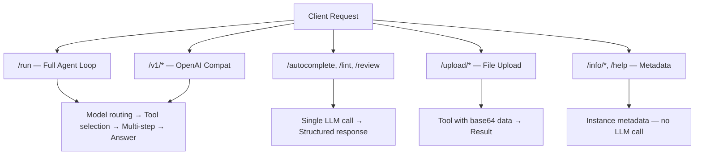
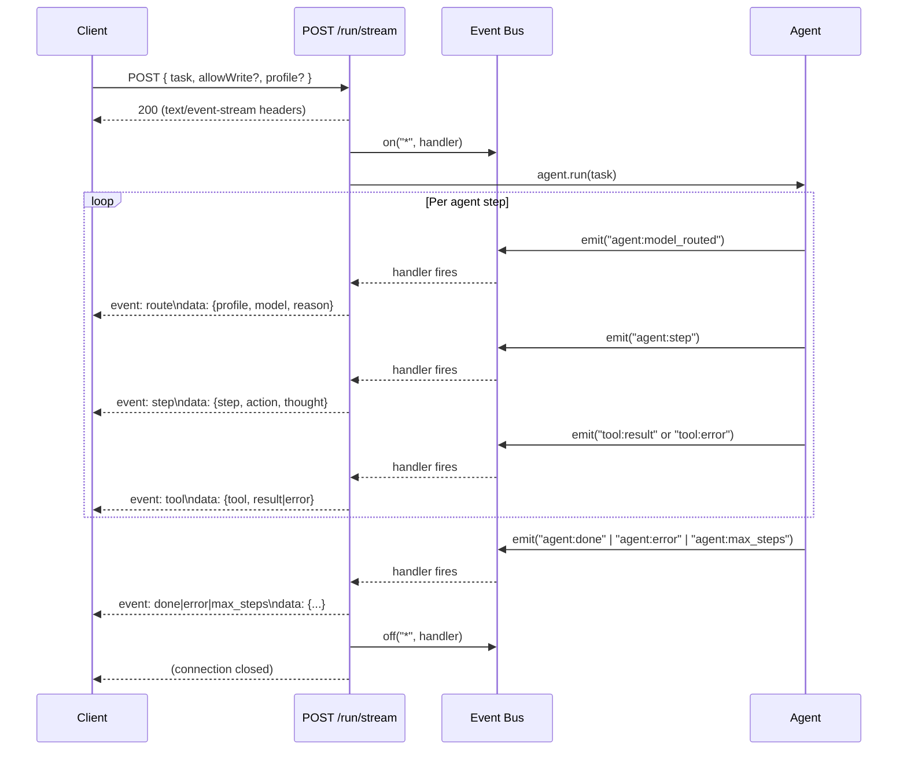
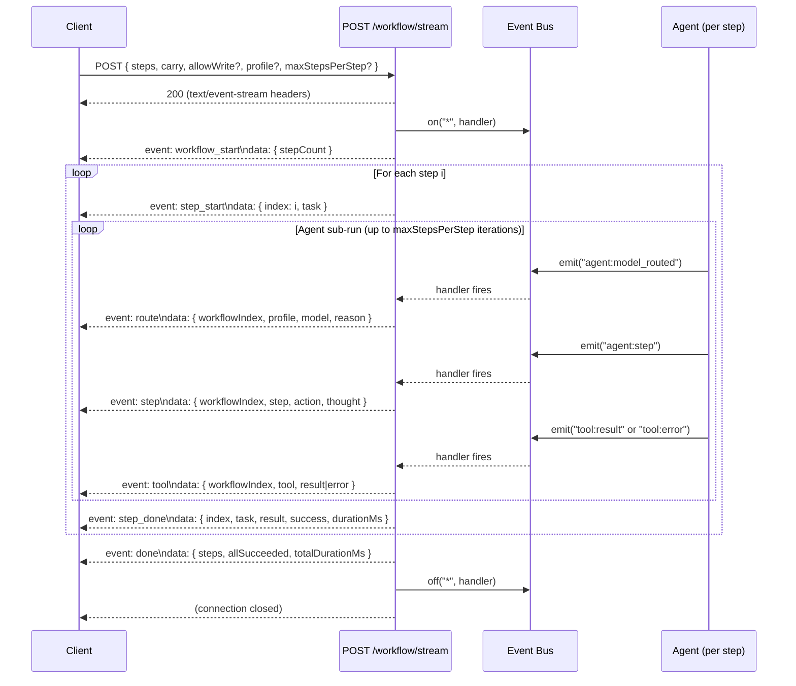

# Endpoint Map

::: tip TL;DR
`/run` = full agent loop for open-ended tasks. `/workflow` = sequential multi-step bounded orchestration. `/autocomplete`, `/lint-conventions`, `/page-review` = fast single-LLM-call endpoints. `/upload/*` = file uploads. `/info/*` + `/help` = instance metadata (no LLM).
:::

This page is the authoritative human-readable reference for every HTTP endpoint exposed by the Manna API server.

---

## Visual tree

```
Manna API  (default port :3001)
│
├── GET  /health                     — Health check (no LLM)
│
├── POST /run                        — Generic agentic loop (handles everything)
│   ├── Reasoning, tool selection, multi-step execution
│   ├── Access to ALL registered tools
│   └── Params: task (required), allowWrite?, profile?
│
├── POST /run/stream                 — Streaming variant of /run (SSE)
│
├── POST /run/swarm                  — Multi-agent swarm orchestration
├── POST /run/swarm/stream           — Streaming variant of /run/swarm (SSE)
│
├── POST /workflow                   — Sequential multi-step workflow (each step bounded independently)
│   ├── Accepts: steps[] (required), carry?, allowWrite?, profile?, maxStepsPerStep?
│   └── carry modes: none | summary (default) | full
├── POST /workflow/stream            — Streaming variant of /workflow (SSE)
│
├── POST /autocomplete               — Direct: IDE code completion (single LLM call)
├── POST /lint-conventions           — Direct: Lint + convention findings (deterministic + LLM)
├── POST /page-review                — Direct: Whole-file categorized review (single LLM call)
│
├── POST /upload/image-classify      — Upload: Image classification via multipart file upload
├── POST /upload/speech-to-text      — Upload: Audio transcription via multipart file upload
├── POST /upload/read-pdf            — Upload: PDF text extraction via multipart file upload
│
├── GET  /info/modes                 — Info: list agent routing profiles (modes)
├── GET  /info/models                — Info: list models available in Ollama
├── GET  /help                       — Info: structured overview of all API endpoints
│
└── (future specialized endpoints — not yet implemented)
    ├── POST /docs-chat              — Fast documentation Q&A
    ├── POST /summarize-file         — Single-file summarization
    └── POST /query-database         — Structured SQL query + explanation
```

---

## Why two categories?

| Category                                | Mechanism                                                                               | When to use                                                                           |
| --------------------------------------- | --------------------------------------------------------------------------------------- | ------------------------------------------------------------------------------------- |
| **Generic** (`POST /run`)               | Full agentic loop: model routing → tool selection → multi-step execution → final answer | Open-ended tasks, anything that isn't a well-defined single operation                 |
| **Specialized** (`/autocomplete`, etc.) | Single LLM call or deterministic logic; no loop, no tool selection overhead             | High-frequency, latency-sensitive operations with a predictable input/output contract |

The rule of thumb is: **when a use case is frequent enough and has a well-defined input/output contract, it gets its own endpoint.** Specialized endpoints are faster, easier to integrate, and give frontend surfaces a reliable schema to depend on.

### Request routing overview



---

## Existing endpoints

### `GET /health`

Simple liveness check. No LLM call. Safe to poll from monitoring tools and Docker healthchecks.

**Response** `200 OK`

```json
{
    "status": "ok",
    "timestamp": "2024-01-15T10:30:00.000Z"
}
```

**curl example**

```bash
curl http://localhost:3001/health
```

---

### `POST /run`

The generic agentic endpoint. Accepts a natural-language task and runs the full agent loop: model routing → tool selection → execution → loop until a final answer is produced (or `MAX_STEPS` is reached).

This is the right endpoint whenever no specialized endpoint covers the use case.

**Request body**

| Field        | Type                                           | Required | Description                                                                                                                   |
| ------------ | ---------------------------------------------- | -------- | ----------------------------------------------------------------------------------------------------------------------------- |
| `task`       | `string`                                       | ✅       | Natural-language description of what the agent should do                                                                      |
| `allowWrite` | `boolean`                                      | —        | When `true`, unlocks `write_file` and `scaffold_project` tools. Default `false`.                                              |
| `profile`    | `"fast" \| "reasoning" \| "code" \| "default"` | —        | Force a specific model profile, bypassing automatic routing. If omitted, the router selects a profile based on the task text. |

**Response** `200 OK`

```json
{
    "result": "The agent's final answer as a string."
}
```

**Error responses**

| Status | When                                                                                        |
| ------ | ------------------------------------------------------------------------------------------- |
| `400`  | `task` is missing, empty, or not a string; or `profile` is not one of the four valid values |
| `500`  | Unhandled error inside the agent loop                                                       |

**How the loop works** (see also [Agent Loop Mental Model](/theory/agent-loop) and [How It Works (Layered)](/theory/how-it-works-layered))

1. Memory is queried for relevant past entries.
2. A prompt is built from the task, accumulated context, and memory.
3. The model router selects a profile (or uses the forced `profile`).
4. The LLM returns a structured JSON step: `{ thought, action, input }`.
5. If `action === "none"`, the loop ends and `thought` is returned as the result.
6. Otherwise the named tool is executed with `input`, and its result is appended to context. Repeat up to `AGENTS_MAX_STEPS` (default 5).

**Relevant env vars**

| Variable                  | Default        | Effect                                                      |
| ------------------------- | -------------- | ----------------------------------------------------------- |
| `AGENTS_MAX_STEPS`        | `5`            | Maximum loop iterations                                     |
| `AGENT_MODEL_FAST`        | `OLLAMA_MODEL` | Model used for the `fast` profile                           |
| `AGENT_MODEL_REASONING`   | `OLLAMA_MODEL` | Model used for the `reasoning` profile                      |
| `AGENT_MODEL_CODE`        | `OLLAMA_MODEL` | Model used for the `code` profile                           |
| `AGENT_MODEL_DEFAULT`     | `OLLAMA_MODEL` | Model used for the `default` profile                        |
| `AGENT_MODEL_ROUTER_MODE` | `rules`        | `rules` (keyword heuristics) or `model` (LLM-based routing) |

**curl example**

```bash
curl -X POST http://localhost:3001/run \
  -H "Content-Type: application/json" \
  -d '{
    "task": "Read src/utils/auth.ts and explain the authentication flow",
    "allowWrite": false,
    "profile": "reasoning"
  }'
```

---

### `POST /run/stream`

Same as `POST /run` but streams agent lifecycle events in real time as
[Server-Sent Events](https://developer.mozilla.org/en-US/docs/Web/API/Server-sent_events).
The original `POST /run` is completely unchanged.

**Request body** — identical to `POST /run`

| Field        | Type                                           | Required | Description                                            |
| ------------ | ---------------------------------------------- | -------- | ------------------------------------------------------ |
| `task`       | `string`                                       | ✅       | Natural-language task description                      |
| `allowWrite` | `boolean`                                      | —        | Unlock write tools. Default `false`.                   |
| `profile`    | `"fast" \| "reasoning" \| "code" \| "default"` | —        | Force a specific model profile, bypassing auto-routing |

**Response headers**

```
Content-Type: text/event-stream
Cache-Control: no-cache
Connection: keep-alive
```

**SSE event types**

| Event type  | Trigger                       | Data shape                                                       |
| ----------- | ----------------------------- | ---------------------------------------------------------------- |
| `step`      | `agent:step`                  | `{ step: number, action: string, thought: string }`              |
| `tool`      | `tool:result` or `tool:error` | `{ tool: string, result?: string }` or `{ tool, error: string }` |
| `route`     | `agent:model_routed`          | `{ profile: string, model: string, reason: string }`             |
| `done`      | `agent:done`                  | `{ result: string }`                                             |
| `error`     | `agent:error`                 | `{ error: string }`                                              |
| `max_steps` | `agent:max_steps`             | `{ task: string, summary: string }`                              |

The connection closes automatically when the agent completes (on `done`, `error`, or `max_steps`).
Thought content in `step` events is truncated at 300 characters.



**Error responses**

| Status | When                                                               |
| ------ | ------------------------------------------------------------------ |
| `400`  | `task` is missing, empty, or not a string; or `profile` is invalid |

**curl example**

```bash
curl -N -X POST http://localhost:3001/run/stream \
  -H "Content-Type: application/json" \
  -d '{
    "task": "List all TypeScript files in packages/agent/",
    "allowWrite": false
  }'
```

Example output:

```
event: route
data: {"profile":"code","model":"qwen2.5-coder:14b-instruct-q8_0","reason":"keyword_match:code"}

event: step
data: {"step":0,"action":"shell","thought":"I need to list all TypeScript files..."}

event: tool
data: {"tool":"shell","result":"packages/agent/agent.ts\npackages/agent/model-router.ts\n..."}

event: step
data: {"step":1,"action":"none","thought":"Here are all TypeScript files in packages/agent/: ..."}

event: done
data: {"result":"Here are all TypeScript files in packages/agent/: ..."}
```

---

### `POST /workflow`

Sequential multi-step workflow orchestration. Accepts an **explicit ordered list of steps** and runs each as a bounded, independent `agent.run()` sub-call. Each step has its own `maxStepsPerStep` iteration cap — a slow or failing step does **not** consume the budget of subsequent steps.

File: `apps/api/workflow-endpoints.ts`  
Registered via `registerWorkflowRoutes(app)` in `apps/api/index.ts`.

**Request body**

| Field             | Type                                           | Required | Default                  | Description                                                              |
| ----------------- | ---------------------------------------------- | -------- | ------------------------ | ------------------------------------------------------------------------ |
| `steps`           | `string[]`                                     | ✅       | —                        | Ordered list of step task strings (1–50 items)                           |
| `carry`           | `"none" \| "summary" \| "full"`                | —        | `"summary"`              | How prior step outputs are forwarded into subsequent steps               |
| `allowWrite`      | `boolean`                                      | —        | `false`                  | Unlock write tools (`write_file`, `scaffold_project`, `document_ingest`) |
| `profile`         | `"fast" \| "reasoning" \| "code" \| "default"` | —        | auto-routed              | Force a model profile for every step                                     |
| `maxStepsPerStep` | `integer` (1–100)                              | —        | `AGENTS_MAX_STEPS` (≈ 5) | Per-step agent-loop iteration cap                                        |

#### Context carry modes

| Mode      | Behaviour                                                                                                      |
| --------- | -------------------------------------------------------------------------------------------------------------- |
| `none`    | Steps are fully isolated — no prior output forwarded.                                                          |
| `summary` | A compact bullet-list summary of prior step results is prepended to each subsequent step prompt. **(default)** |
| `full`    | The complete verbatim output of every prior step is appended. Context may grow quickly with many steps.        |

**Response**

```json
{
    "steps": [
        {
            "index": 0,
            "task": "List all TypeScript files under packages/",
            "result": "packages/agent/agent.ts\npackages/agent/model-router.ts\n...",
            "success": true,
            "durationMs": 1234
        },
        {
            "index": 1,
            "task": "Summarise the purpose of each listed file",
            "result": "agent.ts — core agentic loop ...",
            "success": true,
            "durationMs": 3456
        }
    ],
    "allSucceeded": true,
    "totalDurationMs": 4690
}
```

> **Note**: The response is always `200 OK` even if individual steps errored — check each step's `success` field. A `500` is only returned for unexpected server-level failures.

**Error responses**

| Status | When                                                                                   |
| ------ | -------------------------------------------------------------------------------------- |
| `400`  | `steps` is missing/empty/invalid, `maxStepsPerStep` out of range, or `profile` invalid |
| `500`  | Unexpected server error                                                                |

**curl example**

```bash
curl -X POST http://localhost:3001/workflow \
  -H "Content-Type: application/json" \
  -d '{
    "steps": [
      "List all TypeScript files under packages/agent/",
      "Summarise what each file does in one sentence"
    ],
    "carry": "summary",
    "maxStepsPerStep": 10
  }'
```

**curl example — overnight write workflow**

```bash
curl -X POST http://localhost:3001/workflow \
  -H "Content-Type: application/json" \
  -d '{
    "steps": [
      "Read the existing src/index.ts and summarise its structure",
      "Create a utility module at src/utils/helper.ts with common string helpers",
      "Write unit tests for src/utils/helper.ts",
      "Update the README with the new utility module"
    ],
    "allowWrite": true,
    "profile": "code",
    "carry": "full",
    "maxStepsPerStep": 15
  }'
```

**Env / config notes**

| Variable                         | Default | Effect on `/workflow`                                  |
| -------------------------------- | ------- | ------------------------------------------------------ |
| `AGENTS_MAX_STEPS`               | `5`     | Default per-step cap when `maxStepsPerStep` is omitted |
| `AGENT_BUDGET_MAX_DURATION_MS`   | `60000` | Per-step wall-clock budget ceiling (same as `/run`)    |
| `AGENT_BUDGET_MAX_CONTEXT_CHARS` | `50000` | Per-step context length ceiling (same as `/run`)       |

---

### `POST /workflow/stream`

Same as `POST /workflow`, but streams lifecycle events as Server-Sent Events. The connection stays open until all steps complete.

**Request body** — identical to `POST /workflow`

**Response headers**

```
Content-Type: text/event-stream
Cache-Control: no-cache
Connection: keep-alive
```

**SSE event types**

| Event type       | When                            | Data shape                                                               |
| ---------------- | ------------------------------- | ------------------------------------------------------------------------ |
| `workflow_start` | Before first step               | `{ stepCount: number }`                                                  |
| `step_start`     | Before each step begins         | `{ index: number, task: string }`                                        |
| `step`           | On inner `agent:step`           | `{ workflowIndex, step, action, thought }` (thought truncated at 300 ch) |
| `tool`           | On `tool:result` / `tool:error` | `{ workflowIndex, tool, result? \| error? }`                             |
| `route`          | On `agent:model_routed`         | `{ workflowIndex, profile, model, reason }`                              |
| `step_done`      | After each step completes       | Full `WorkflowStepResult` object (see above)                             |
| `done`           | After all steps finish          | Full `WorkflowResponse` object (see above)                               |
| `error`          | On fatal server error           | `{ error: string }`                                                      |



**curl example**

```bash
curl -N -X POST http://localhost:3001/workflow/stream \
  -H "Content-Type: application/json" \
  -d '{
    "steps": [
      "List all TypeScript files under packages/agent/",
      "Summarise what each file does in one sentence"
    ],
    "carry": "summary",
    "maxStepsPerStep": 10
  }'
```

Example output:

```
event: workflow_start
data: {"stepCount":2}

event: step_start
data: {"index":0,"task":"List all TypeScript files under packages/agent/"}

event: route
data: {"workflowIndex":0,"profile":"code","model":"qwen2.5-coder:14b-instruct-q8_0","reason":"keyword_match:code"}

event: step
data: {"workflowIndex":0,"step":0,"action":"shell","thought":"I need to list all TypeScript files..."}

event: tool
data: {"workflowIndex":0,"tool":"shell","result":"packages/agent/agent.ts\n..."}

event: step_done
data: {"index":0,"task":"List all TypeScript files under packages/agent/","result":"packages/agent/agent.ts\n...","success":true,"durationMs":1234}

event: step_start
data: {"index":1,"task":"Summarise what each file does in one sentence"}

event: step
data: {"workflowIndex":1,"step":0,"action":"none","thought":"agent.ts — core loop ..."}

event: step_done
data: {"index":1,"task":"Summarise what each file does in one sentence","result":"agent.ts — core loop ...","success":true,"durationMs":2100}

event: done
data: {"steps":[...],"allSucceeded":true,"totalDurationMs":3334}
```

---

### `POST /autocomplete`

IDE-style cursor-time code completion. Makes a single LLM call via `TOOL_IDE_MODEL` (default `starcoder2`). Results are cached in-memory (LRU-style) for 30 seconds to reduce load during rapid typing.

**Rate limit**: 120 requests / minute per client IP.  
**Timeout**: `AUTOCOMPLETE_TIMEOUT_MS` (default **2500 ms**).

**Request body**

| Field      | Type     | Required | Description                                                                |
| ---------- | -------- | -------- | -------------------------------------------------------------------------- |
| `prefix`   | `string` | ✅       | Code appearing before the cursor                                           |
| `suffix`   | `string` | —        | Code appearing after the cursor (fill-in-the-middle)                       |
| `language` | `string` | —        | Language hint, e.g. `"typescript"`, `"python"`. Defaults to `"plaintext"`. |

**Response** `200 OK`

```json
{
    "completion": "const result = items.filter(x => x.active);",
    "model": "qwen2.5-coder:7b-instruct-q8_0",
    "language": "typescript",
    "cached": false,
    "latencyMs": 210,
    "createdAtIso": "2024-01-15T10:30:00.000Z"
}
```

When the result comes from the cache, `cached` is `true` and `latencyMs` reflects cache-retrieval time only.

**Cache configuration env vars**

| Variable                         | Default      | Effect                                |
| -------------------------------- | ------------ | ------------------------------------- |
| `TOOL_IDE_MODEL`                 | `starcoder2` | Model used for completions            |
| `AUTOCOMPLETE_TIMEOUT_MS`        | `2500`       | Per-request timeout in milliseconds   |
| `AUTOCOMPLETE_CACHE_TTL_MS`      | `30000`      | Cache entry time-to-live              |
| `AUTOCOMPLETE_CACHE_MAX_ENTRIES` | `500`        | Maximum entries before LRU eviction   |
| `AUTOCOMPLETE_MAX_TOKENS`        | `128`        | Maximum tokens the model may generate |

**curl example**

```bash
curl -X POST http://localhost:3001/autocomplete \
  -H "Content-Type: application/json" \
  -d '{
    "prefix": "function greet(name: string) {\n  return ",
    "language": "typescript"
  }'
```

---

### `POST /lint-conventions`

Two-pass code quality analysis:

1. **Deterministic pass** — TypeScript compiler diagnostics (for `.ts`/`.tsx`/`.js`/`.jsx`) plus style rules (max line length, trailing whitespace, tab indentation, `console.log`, `var` usage, explicit `any`).
2. **LLM pass** — optional enrichment that sends the code to `AGENT_MODEL_CODE` (or a custom model) and merges the AI findings with the deterministic ones. Skip by setting `includeLlm: false`.

**Rate limit**: 30 requests / minute per client IP.  
**Timeout**: `LINT_CONVENTIONS_TIMEOUT_MS` (default **10 000 ms**).

**Request body**

| Field         | Type      | Required | Description                                                                                  |
| ------------- | --------- | -------- | -------------------------------------------------------------------------------------------- |
| `content`     | `string`  | ✅       | Source code to analyze                                                                       |
| `language`    | `string`  | —        | Language hint. Falls back to extension of `filePath` if provided. Defaults to `"plaintext"`. |
| `filePath`    | `string`  | —        | Virtual file path used for extension inference and TypeScript compilation context            |
| `includeLlm`  | `boolean` | —        | Whether to run the LLM enrichment pass. Default `true`.                                      |
| `model`       | `string`  | —        | Override the LLM model. Defaults to `AGENT_MODEL_CODE`.                                      |
| `maxFindings` | `integer` | —        | Maximum total findings to return (1–200). Default `80`.                                      |

**Response** `200 OK`

```json
{
    "requestId": "550e8400-e29b-41d4-a716-446655440000",
    "language": "typescript",
    "filePath": "src/utils/helpers.ts",
    "summary": {
        "total": 4,
        "errors": 1,
        "warnings": 2,
        "infos": 1,
        "deterministicCount": 3,
        "llmCount": 1
    },
    "findings": [
        {
            "source": "typescript",
            "severity": "error",
            "category": "typescript",
            "message": "Type 'string' is not assignable to type 'number'.",
            "line": 12,
            "column": 5,
            "rule": "TS2322"
        },
        {
            "source": "convention",
            "severity": "warning",
            "category": "style",
            "message": "Line exceeds 120 characters",
            "line": 34,
            "column": 121,
            "rule": "max-line-length"
        }
    ],
    "llmModelUsed": "qwen2.5-coder:14b-instruct-q8_0",
    "latencyMs": 850
}
```

**Finding object**

| Field      | Type                                    | Notes                                                |
| ---------- | --------------------------------------- | ---------------------------------------------------- |
| `source`   | `"typescript" \| "convention" \| "llm"` | Origin of the finding                                |
| `severity` | `"error" \| "warning" \| "info"`        |                                                      |
| `category` | `string`                                | e.g. `"typescript"`, `"style"`, `"convention"`       |
| `message`  | `string`                                | Human-readable description                           |
| `line`     | `number?`                               | 1-based line number                                  |
| `column`   | `number?`                               | 1-based column number                                |
| `rule`     | `string?`                               | Rule identifier, e.g. `"TS2322"`, `"no-console-log"` |

**Relevant env vars**

| Variable                      | Default        | Effect                      |
| ----------------------------- | -------------- | --------------------------- |
| `AGENT_MODEL_CODE`            | `OLLAMA_MODEL` | LLM used for enrichment     |
| `LINT_CONVENTIONS_TIMEOUT_MS` | `10000`        | Per-request timeout         |
| `LINT_CONVENTIONS_MAX_TOKENS` | `600`          | Max tokens for LLM response |

**curl example**

```bash
curl -X POST http://localhost:3001/lint-conventions \
  -H "Content-Type: application/json" \
  -d '{
    "content": "var x: any = 1;\nconsole.log(x);\n",
    "language": "typescript",
    "filePath": "src/example.ts"
  }'
```

---

### `POST /page-review`

Whole-file engineering review. Sends the entire file to the LLM in a single call and returns structured, categorized suggestions.

**Rate limit**: 20 requests / minute per client IP.  
**Timeout**: `PAGE_REVIEW_TIMEOUT_MS` (default **20 000 ms**).

**Request body**

| Field            | Type     | Required | Description                                                                      |
| ---------------- | -------- | -------- | -------------------------------------------------------------------------------- |
| `content`        | `string` | ✅       | Full source code of the file to review                                           |
| `language`       | `string` | —        | Language hint. Falls back to extension of `filePath`. Defaults to `"plaintext"`. |
| `filePath`       | `string` | —        | Virtual file path used for extension inference and context                       |
| `projectContext` | `string` | —        | Free-text description of the project to improve suggestion relevance             |
| `model`          | `string` | —        | Override the LLM model. Defaults to `AGENT_MODEL_CODE`.                          |

**Response** `200 OK`

```json
{
    "requestId": "550e8400-e29b-41d4-a716-446655440000",
    "model": "qwen2.5-coder:14b-instruct-q8_0",
    "language": "typescript",
    "filePath": "src/services/user.ts",
    "categories": {
        "correctness": [
            {
                "title": "Unhandled promise rejection",
                "detail": "The async call on line 42 is not wrapped in try/catch.",
                "priority": "high"
            }
        ],
        "maintainability": [],
        "standards": [],
        "enhancements": [
            {
                "title": "Consider caching the DB result",
                "detail": "The query on line 18 runs on every request; a short TTL cache would reduce latency.",
                "priority": "low"
            }
        ]
    },
    "latencyMs": 3200
}
```

**Suggestion object** (inside each category array)

| Field      | Type                          | Notes                          |
| ---------- | ----------------------------- | ------------------------------ |
| `title`    | `string`                      | Short label for the suggestion |
| `detail`   | `string`                      | Longer explanation             |
| `priority` | `"high" \| "medium" \| "low"` |                                |

Up to 12 suggestions are returned per category.

**Relevant env vars**

| Variable                 | Default        | Effect                      |
| ------------------------ | -------------- | --------------------------- |
| `AGENT_MODEL_CODE`       | `OLLAMA_MODEL` | LLM used for the review     |
| `PAGE_REVIEW_TIMEOUT_MS` | `20000`        | Per-request timeout         |
| `PAGE_REVIEW_MAX_TOKENS` | `1200`         | Max tokens for LLM response |

**curl example**

```bash
curl -X POST http://localhost:3001/page-review \
  -H "Content-Type: application/json" \
  -d '{
    "content": "import express from '\''express'\'';\n...",
    "language": "typescript",
    "filePath": "apps/api/index.ts",
    "projectContext": "Local-first agent API server"
  }'
```

---

## Upload endpoints

File: `apps/api/upload-endpoints.ts`
Registered in `apps/api/index.ts` via `registerUploadRoutes(app)`.

These endpoints accept files via `multipart/form-data` upload — no need for files to be on disk. They call the corresponding tool with inline base64 data. Max upload size: **50 MB**.

### `POST /upload/image-classify`

Classify or describe an uploaded image using a vision model.

| Field    | Type   | Required | Default                  | Description                |
| -------- | ------ | -------- | ------------------------ | -------------------------- |
| `file`   | file   | **yes**  | —                        | The image file to classify |
| `prompt` | string | no       | `"Describe this image…"` | Custom vision prompt       |
| `model`  | string | no       | `TOOL_VISION_MODEL`      | Override the vision model  |

**Response shape:**

```json
{
    "model": "llava-llama3",
    "response": "The image shows a cat sitting on a windowsill..."
}
```

**curl example:**

```bash
curl -X POST http://localhost:3001/upload/image-classify \
  -F 'file=@photo.jpg' \
  -F 'prompt=What breed of cat is this?'
```

### `POST /upload/speech-to-text`

Transcribe an uploaded audio file.

| Field      | Type   | Required | Default          | Description                           |
| ---------- | ------ | -------- | ---------------- | ------------------------------------- |
| `file`     | file   | **yes**  | —                | The audio file to transcribe          |
| `model`    | string | no       | `TOOL_STT_MODEL` | Override the STT model                |
| `language` | string | no       | —                | ISO 639-1 language hint (e.g. `"en"`) |
| `prompt`   | string | no       | —                | Context/prompt for transcription      |

**Response shape:**

```json
{
    "model": "whisper",
    "text": "Hello, this is a transcription of the audio..."
}
```

**curl example:**

```bash
curl -X POST http://localhost:3001/upload/speech-to-text \
  -F 'file=@recording.wav' \
  -F 'language=en'
```

### `POST /upload/read-pdf`

Extract text from an uploaded PDF.

| Field  | Type | Required | Default | Description           |
| ------ | ---- | -------- | ------- | --------------------- |
| `file` | file | **yes**  | —       | The PDF file to parse |

**Response shape:**

```json
{
    "pageCount": 5,
    "text": "Extracted text content from the PDF..."
}
```

**curl example:**

```bash
curl -X POST http://localhost:3001/upload/read-pdf \
  -F 'file=@document.pdf'
```

---

---

## Why specialized endpoints?

`POST /run` is powerful but heavyweight:

```

/run request
→ model routing (keyword scan or LLM call)
→ tool selection (LLM reasoning step)
→ tool execution
→ possible further loop iterations (up to MAX_STEPS)
→ final answer

```

That pipeline is exactly what you want for open-ended, complex, multi-step tasks — "read these three files and summarize the auth flow", "scaffold a new Express service", "query the database and explain the results". The agent picks the right tools, chains them as needed, and reasons about the output.

But it is **overkill for high-frequency, well-scoped operations** like cursor-time code completion. Every autocomplete keypress would go through model routing, prompt construction, and a full agentic reasoning step before producing a single line of code. That latency is unacceptable in an IDE plugin.

Specialized endpoints cut straight to the point:

```

/autocomplete request
→ single LLM call (TOOL_IDE_MODEL, low temperature)
→ structured JSON response

````

**The design rule**: when a use case is **frequent enough** and has a **well-defined input/output contract** (the caller knows exactly what fields to send and what fields to expect back), carve it out into its own endpoint.

Benefits:
- **Lower latency** — no routing overhead, single LLM call, optional caching.
- **Predictable schema** — frontend code can be strongly typed against a stable response shape.
- **Easier integration** — WebStorm plugin, web dashboard, CLI, and mobile apps each call the most appropriate endpoint directly without constructing natural-language prompts.
- **Independent rate limits and timeouts** — an autocomplete flood doesn't eat into the `/run` capacity.

---

## Informational endpoints

These endpoints return metadata about the running Manna instance. They make **no LLM calls** and have negligible latency.

File: `apps/api/info-endpoints.ts`
Registered via `registerInfoRoutes(app)` in `apps/api/index.ts`.

### `GET /info/modes`

Lists all available Manna agent routing profiles (modes), the Ollama model each is currently configured to use, the controlling environment variable, and a human-readable description.

**Response** `200 OK`

```json
{
  "count": 4,
  "modes": [
    {
      "profile": "fast",
      "model": "llama3.1:8b-instruct-q8_0",
      "envVar": "AGENT_MODEL_FAST",
      "description": "Low-latency model for simple, quick tasks. Fully GPU-resident for sub-second response."
    }
  ]
}
````

**curl example**

```bash
curl http://localhost:3001/info/modes
```

---

### `GET /info/models`

Proxies Ollama's `GET /api/tags` and returns all locally available models with size, digest, and detail metadata. Returns `502` if Ollama is unreachable.

**Response** `200 OK`

```json
{
    "count": 5,
    "ollamaBaseUrl": "http://localhost:11434",
    "models": [
        {
            "name": "llama3.1:8b-instruct-q8_0",
            "size": 8538212864,
            "digest": "a1b2c3...",
            "modifiedAt": "2024-12-01T10:00:00Z",
            "details": { "family": "llama", "parameter_size": "8B", "quantization_level": "Q8_0" }
        }
    ]
}
```

**Error responses**

| Status | When                                               |
| ------ | -------------------------------------------------- |
| `502`  | Ollama is unreachable or returned a non-2xx status |

**curl example**

```bash
curl http://localhost:3001/info/models
```

---

### `GET /help`

Returns a structured JSON overview of every REST API endpoint — the equivalent of `--help` on a CLI tool. Includes HTTP method, path, one-line summary, and parameter list for each endpoint.

**Response** `200 OK`

```json
{
    "description": "Manna AI Agent Platform — REST API quick reference",
    "endpointCount": 14,
    "endpoints": [
        {
            "method": "POST",
            "path": "/run",
            "summary": "Submit a task to the full agentic loop (reasoning → tool selection → execution).",
            "params": [
                {
                    "name": "task",
                    "type": "string",
                    "required": true,
                    "description": "Natural-language task."
                }
            ]
        }
    ]
}
```

**curl example**

```bash
curl http://localhost:3001/help
```

---

## Future endpoints

The following endpoints are **planned / proposed** — they are not implemented yet. They follow the same specialized-endpoint pattern described above.

| Endpoint               | Purpose                                          | Implementation notes                                                                              |
| ---------------------- | ------------------------------------------------ | ------------------------------------------------------------------------------------------------- |
| `POST /docs-chat`      | Question about Manna documentation → fast answer | Single LLM call with docs pre-loaded as context; uses `AGENT_MODEL_FAST` for sub-second responses |
| `POST /summarize-file` | File path → structured summary                   | Wraps `read_file` tool + single LLM summarization call                                            |
| `POST /query-database` | Natural language → SQL → results + explanation   | Wraps `mysql_query` tool; returns `{ sql, rows, explanation }`                                    |

This list will grow as use cases become frequent enough to justify a dedicated endpoint. The pattern is intentionally extensible.

---

## Adding a new specialized endpoint

Follow these steps to add a new direct endpoint (the same pattern used by `/autocomplete`, `/lint-conventions`, and `/page-review`):

1. **Define the contract** — write a Zod schema for the request body and a TypeScript interface for the response. Think carefully about what the caller needs to send and what they need back.

2. **Add the route** — implement the handler in `apps/api/ide-endpoints.ts` (for IDE/tool-facing endpoints), `apps/api/upload-endpoints.ts` (for file-upload endpoints), or a new file for a different domain. Use the existing handlers as a template: `withTimeout`, `enforceRateLimit`, Zod validation (for JSON endpoints), or `multer` middleware (for upload endpoints).

3. **Register the route** — call the registration function from `apps/api/index.ts`. Follow the `registerIdeRoutes(app)` pattern.

4. **Add rate limiting and a timeout** — add entries to `endpointWindowMs`, `endpointMaxRequests`, and `endpointTimeoutMs` in `ide-endpoints.ts` (or equivalent in your new file). Choose values appropriate to the expected call frequency and model latency.

5. **Document it here** — add a section to this page following the same structure (request body table, response shape, env vars, curl example). Update the visual tree at the top.

6. **Update `AI_README.md`** — per the update protocol: add a row to the IDE direct endpoints table, add any new env vars to the Key Environment Variables table, and add the file to the Directory map if you created a new file.

```

```
