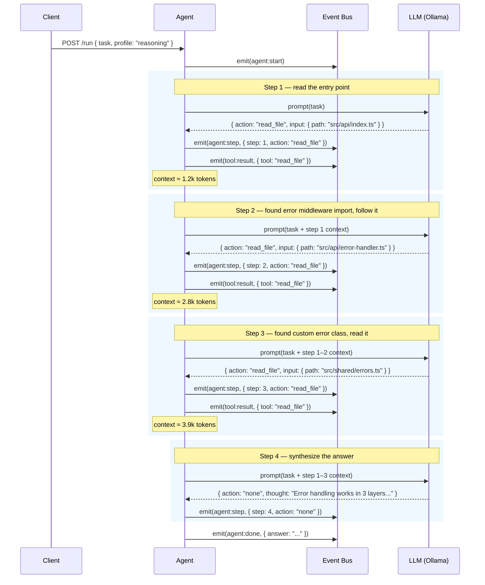

# Example: Analyze Code Across Multiple Files

::: tip TL;DR
Multi-file reasoning: the agent reads 3 files over 4 steps, builds up context, and synthesizes an answer. Watch how context grows with each step.
:::

## The Request

You're onboarding onto a TypeScript API project and want to understand the error handling strategy.

```bash
curl -X POST http://localhost:3001/run \
  -H "Content-Type: application/json" \
  -d '{
    "task": "How does error handling work in the API? Trace the flow from request to response.",
    "profile": "reasoning"
  }'
```

Note the `"profile": "reasoning"` — this forces the [model router](/glossary#model-router) to use the reasoning-optimized model for every step.

---

## What Happens Under the Hood

This is a **4-step** [agent loop](/glossary#agent-loop). The agent reads multiple files, each time adding the content to its context window before reasoning about the next step.



### How context grows

| Step | Action                                  | Files in context | Approx. tokens |
| ---- | --------------------------------------- | ---------------- | -------------- |
| 1    | `read_file("src/api/index.ts")`         | 1                | ~1,200         |
| 2    | `read_file("src/api/error-handler.ts")` | 2                | ~2,800         |
| 3    | `read_file("src/shared/errors.ts")`     | 3                | ~3,900         |
| 4    | `action: "none"` (answer)               | 3                | ~4,400         |

Each tool result is appended to the context that gets sent to the LLM on the next step. The agent literally accumulates knowledge through the loop.

### Event log

```json
{ "type": "agent:start",        "task": "How does error handling work in the API? ..." }
{ "type": "agent:model_routed", "profile": "reasoning", "model": "qwen3:14b" }
{ "type": "agent:step",         "step": 1, "action": "read_file", "thought": "I'll start with the API entry point to find how requests are handled and where errors are caught." }
{ "type": "tool:result",        "tool": "read_file", "result": "import express from 'express';\nimport { errorHandler } from './error-handler';\n..." }
{ "type": "agent:model_routed", "profile": "reasoning", "model": "qwen3:14b" }
{ "type": "agent:step",         "step": 2, "action": "read_file", "thought": "The entry point imports an errorHandler middleware. I need to read that file to understand the error handling strategy." }
{ "type": "tool:result",        "tool": "read_file", "result": "import { AppError } from '../shared/errors';\n\nexport function errorHandler(err, req, res, next) {\n  if (err instanceof AppError) {\n    return res.status(err.statusCode).json({ error: err.message });\n  }\n  res.status(500).json({ error: 'Internal server error' });\n}" }
{ "type": "agent:model_routed", "profile": "reasoning", "model": "qwen3:14b" }
{ "type": "agent:step",         "step": 3, "action": "read_file", "thought": "There's a custom AppError class imported from shared/errors. Let me read that to complete the picture." }
{ "type": "tool:result",        "tool": "read_file", "result": "export class AppError extends Error {\n  constructor(public statusCode: number, message: string) {\n    super(message);\n    this.name = 'AppError';\n  }\n}\n\nexport class NotFoundError extends AppError {\n  constructor(resource: string) {\n    super(404, `${resource} not found`);\n  }\n}" }
{ "type": "agent:model_routed", "profile": "reasoning", "model": "qwen3:14b" }
{ "type": "agent:step",         "step": 4, "action": "none", "thought": "Error handling works in 3 layers: ..." }
{ "type": "agent:done",         "answer": "Error handling works in 3 layers: ..." }
```

### The LLM's reasoning chain

Notice how each step's `thought` references what was found in the previous step:

- **Step 1**: "I'll start with the entry point" → reads `index.ts`
- **Step 2**: "The entry point imports an errorHandler" → follows the import
- **Step 3**: "There's a custom AppError class" → follows that import too
- **Step 4**: Synthesizes all three files into a coherent answer

This is the [agent loop](/glossary#agent-loop) doing what it's designed for — **iterative exploration driven by the LLM's own judgment**.

---

## The Response

```json
{
    "success": true,
    "status": 200,
    "message": "",
    "data": {
        "result": "Error handling works in 3 layers:\n\n1. **Custom error classes** (`src/shared/errors.ts`): `AppError` extends `Error` with a `statusCode`. Subclasses like `NotFoundError` preset the code (404) and message.\n\n2. **Throw site**: Route handlers throw `AppError` subclasses — `throw new NotFoundError('User')` — instead of setting status codes manually.\n\n3. **Catch-all middleware** (`src/api/error-handler.ts`): Express error middleware catches everything. If it's an `AppError`, the response uses its `statusCode` and `message`. Anything else returns a generic 500.\n\nThe pattern is clean: throw typed errors, catch them centrally."
    },
    "meta": {
        "startedAt": "2026-04-15T15:10:00.000Z",
        "durationMs": 8420,
        "model": "qwen3:14b",
        "steps": 4,
        "toolCalls": 3,
        "contextLength": 4412
    }
}
```

---

## Key Takeaway

> The agent **follows the code's dependency graph** the same way a developer would: read the entry point, follow imports, build a mental model. Each step's context grows, giving the LLM more to reason about.

---

**Related docs:**
[Agent Loop](/glossary#agent-loop) · [Context Window](/glossary#context-window) · [Model Profile](/glossary#model-profile) · [read_file tool](/packages/tools/read-file) · [Prompt, Context, Memory](/theory/prompt-context-memory)

← [Back to Examples](index.md)
