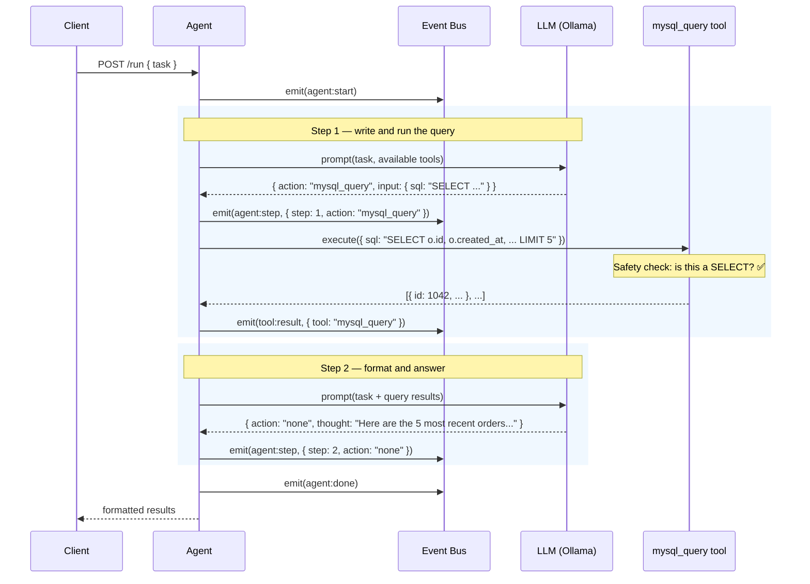
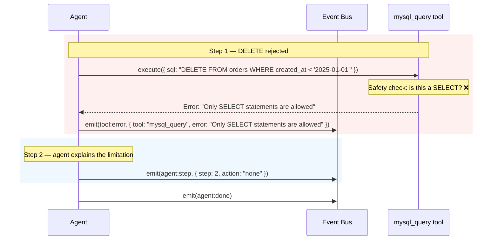

# Example: Query a Database

::: tip TL;DR
The agent writes a SELECT query, runs it via the `mysql_query` tool, and formats the results. Unsafe SQL (DELETE, DROP, etc.) is rejected before it ever reaches the database.
:::

## The Request

You have a MySQL database with `orders` and `customers` tables. You want the 5 most recent orders with customer names.

```bash
curl -X POST http://localhost:3001/run \
  -H "Content-Type: application/json" \
  -d '{
    "task": "Show me the 5 most recent orders with customer names"
  }'
```

---

## What Happens Under the Hood



### Event log

```json
{ "type": "agent:start",        "task": "Show me the 5 most recent orders with customer names" }
{ "type": "agent:model_routed", "profile": "default", "model": "llama3.1:8b-instruct-q8_0" }
{ "type": "agent:step",         "step": 1, "action": "mysql_query", "thought": "I'll join the orders and customers tables, order by date descending, and limit to 5." }
{ "type": "tool:result",        "tool": "mysql_query", "result": "[{\"id\":1042,\"created_at\":\"2026-04-15\",\"total\":149.99,\"customer_name\":\"Alice Chen\"},{\"id\":1041,\"created_at\":\"2026-04-14\",\"total\":89.50,\"customer_name\":\"Bob Rivera\"},{\"id\":1040,\"created_at\":\"2026-04-14\",\"total\":234.00,\"customer_name\":\"Carol Zhang\"},{\"id\":1039,\"created_at\":\"2026-04-13\",\"total\":55.00,\"customer_name\":\"Dave Okafor\"},{\"id\":1038,\"created_at\":\"2026-04-12\",\"total\":178.25,\"customer_name\":\"Eve Johansson\"}]" }
{ "type": "agent:model_routed", "profile": "default", "model": "llama3.1:8b-instruct-q8_0" }
{ "type": "agent:step",         "step": 2, "action": "none", "thought": "Here are the 5 most recent orders..." }
{ "type": "agent:done",         "answer": "Here are the 5 most recent orders:..." }
```

### The SQL the agent wrote

```sql
SELECT o.id, o.created_at, o.total, c.name AS customer_name
FROM orders o
JOIN customers c ON o.customer_id = c.id
ORDER BY o.created_at DESC
LIMIT 5
```

The `mysql_query` tool validates this is a `SELECT` statement before executing. This is a [core invariant](/glossary#json-contract) of the system — the tool **only allows read-only queries**.

---

## The Response

```json
{
    "success": true,
    "status": 200,
    "message": "",
    "data": {
        "result": "Here are the 5 most recent orders:\n\n| Order ID | Date       | Total    | Customer        |\n|----------|------------|----------|-----------------|\n| 1042     | 2026-04-15 | $149.99  | Alice Chen      |\n| 1041     | 2026-04-14 | $89.50   | Bob Rivera      |\n| 1040     | 2026-04-14 | $234.00  | Carol Zhang     |\n| 1039     | 2026-04-13 | $55.00   | Dave Okafor     |\n| 1038     | 2026-04-12 | $178.25  | Eve Johansson   |"
    },
    "meta": {
        "startedAt": "2026-04-15T16:00:00.000Z",
        "durationMs": 2104,
        "model": "llama3.1:8b-instruct-q8_0",
        "steps": 2,
        "toolCalls": 1,
        "contextLength": 891
    }
}
```

---

## What If They Ask to DELETE?

Here's where the safety boundary kicks in. If someone sends:

```bash
curl -X POST http://localhost:3001/run \
  -H "Content-Type: application/json" \
  -d '{
    "task": "Delete all orders older than 2025"
  }'
```

The agent might try to run a `DELETE` query — but the tool rejects it **before it reaches the database**:



### Rejection event log

````json
{ "type": "agent:start",        "task": "Delete all orders older than 2025" }
{ "type": "agent:model_routed", "profile": "default", "model": "llama3.1:8b-instruct-q8_0" }
{ "type": "agent:step",         "step": 1, "action": "mysql_query", "thought": "I'll delete old orders with a DELETE query." }
{ "type": "tool:error",         "tool": "mysql_query", "error": "Only SELECT statements are allowed" }
{ "type": "agent:model_routed", "profile": "default", "model": "llama3.1:8b-instruct-q8_0" }
{ "type": "agent:step",         "step": 2, "action": "none", "thought": "I'm unable to delete data — the database tool only allows SELECT queries for safety. You would need to run this directly on your database." }
{ "type": "agent:done",         "answer": "I can't delete data — the mysql_query tool only allows SELECT queries for safety. To remove old orders, run this directly on your database:\n\n```sql\nDELETE FROM orders WHERE created_at < '2025-01-01';\n```\n\n⚠️ Back up your data first." }
````

The agent receives the error, understands the constraint, and gives you the SQL to run yourself. The loop **doesn't crash** — it handles the rejection gracefully and continues.

---

## Key Takeaway

> The `mysql_query` tool has a hard `SELECT`-only gate. The agent can write any SQL it wants — but the tool only executes read-only queries. Safety lives in the tool, not in the prompt.

---

**Related docs:**
[mysql_query tool](/packages/tools/mysql-query) · [Agent Loop](/glossary#agent-loop) · [Fail-Open](/glossary#fail-open) · [Scenarios: SQL query](/scenarios/sql-query) · [Endpoint Map](/endpoint-map)

← [Back to Examples](index.md)
