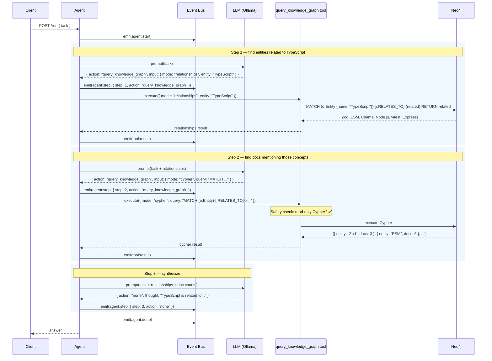
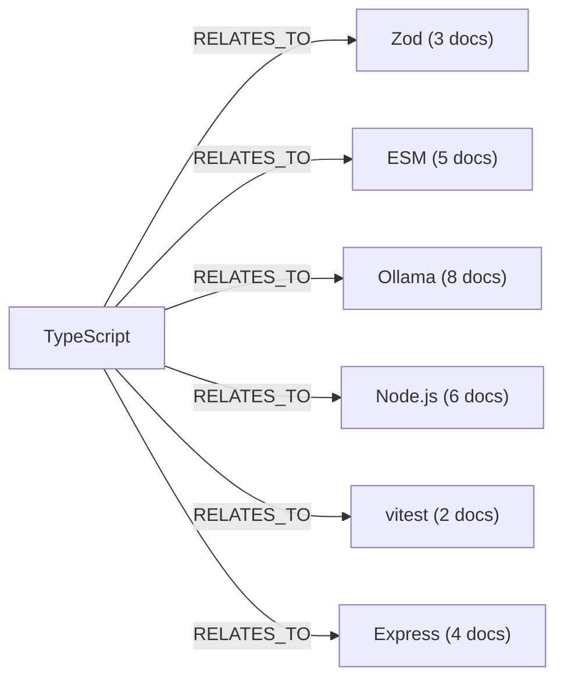

# Example: Knowledge Graph Query

::: tip TL;DR
The agent uses `query_knowledge_graph` to traverse [Neo4j](/glossary#neo4j) relationships and find entities connected to a concept — enabling multi-hop reasoning that vector search alone can't do.
:::

## The Request

Your team has been ingesting documentation. You want to know what technologies relate to TypeScript in the knowledge graph.

```bash
curl -X POST http://localhost:3001/run \
  -H "Content-Type: application/json" \
  -d '{
    "task": "What technologies are related to TypeScript in our docs?"
  }'
```

---

## What Happens Under the Hood

This is a **3-step** flow. The agent queries the [knowledge graph](/glossary#knowledge-graph) twice — first for direct relationships, then for the documents that reference those related concepts.



### Multi-hop reasoning visualized

This is the graph traversal the agent performed:



Vector search ([Qdrant](/glossary#qdrant)) would find documents _containing_ "TypeScript." The knowledge graph finds **concepts that TypeScript is connected to** — a fundamentally different kind of retrieval.

### Event log

```json
{ "type": "agent:start",        "task": "What technologies are related to TypeScript in our docs?" }
{ "type": "agent:model_routed", "profile": "default", "model": "llama3.1:8b-instruct-q8_0" }
{ "type": "agent:step",         "step": 1, "action": "query_knowledge_graph", "thought": "I'll query the knowledge graph for entities related to TypeScript." }
{ "type": "tool:result",        "tool": "query_knowledge_graph", "result": "{\"rows\":[{\"name\":\"Zod\",\"type\":\"Library\",\"relationship\":\"RELATES_TO\"},{\"name\":\"ESM\",\"type\":\"Module System\",\"relationship\":\"RELATES_TO\"},{\"name\":\"Ollama\",\"type\":\"Tool\",\"relationship\":\"RELATES_TO\"},{\"name\":\"Node.js\",\"type\":\"Runtime\",\"relationship\":\"RELATES_TO\"},{\"name\":\"vitest\",\"type\":\"Test Framework\",\"relationship\":\"RELATES_TO\"},{\"name\":\"Express\",\"type\":\"Framework\",\"relationship\":\"RELATES_TO\"}],\"rowCount\":6}" }
{ "type": "agent:model_routed", "profile": "default", "model": "llama3.1:8b-instruct-q8_0" }
{ "type": "agent:step",         "step": 2, "action": "query_knowledge_graph", "thought": "Now I'll find how many documents reference each related entity to give a more useful answer." }
{ "type": "tool:result",        "tool": "query_knowledge_graph", "result": "{\"rows\":[{\"entity\":\"Zod\",\"docCount\":3},{\"entity\":\"ESM\",\"docCount\":5},{\"entity\":\"Ollama\",\"docCount\":8},{\"entity\":\"Node.js\",\"docCount\":6},{\"entity\":\"vitest\",\"docCount\":2},{\"entity\":\"Express\",\"docCount\":4}],\"rowCount\":6,\"query\":\"MATCH (e:Entity {name:'TypeScript'})-[:RELATES_TO]-(related) WITH related MATCH (related)-[:MENTIONED_IN]->(d) RETURN related.name AS entity, count(d) AS docCount ORDER BY docCount DESC\"}" }
{ "type": "agent:model_routed", "profile": "default", "model": "llama3.1:8b-instruct-q8_0" }
{ "type": "agent:step",         "step": 3, "action": "none", "thought": "TypeScript is related to 6 technologies in the knowledge graph..." }
{ "type": "agent:done",         "answer": "..." }
```

### Cypher safety

The `query_knowledge_graph` tool blocks mutating [Cypher](/glossary#cypher) keywords (`CREATE`, `DELETE`, `SET`, `MERGE`, `REMOVE`, `DETACH`). Only read-only queries are executed. This is enforced at the tool level, just like `mysql_query`'s SELECT-only gate.

---

## The Response

```json
{
    "success": true,
    "status": 200,
    "message": "",
    "data": {
        "result": "In the knowledge graph, **TypeScript** is related to 6 technologies, ranked by how often they appear in docs:\n\n| Technology | Type           | Doc mentions |\n|------------|----------------|--------------|\n| Ollama     | Tool           | 8            |\n| Node.js    | Runtime        | 6            |\n| ESM        | Module System  | 5            |\n| Express    | Framework      | 4            |\n| Zod        | Library        | 3            |\n| vitest     | Test Framework | 2            |\n\nThe strongest connections are with **Ollama** (the LLM backend) and **Node.js** (the runtime). Zod appears in validation contexts (the agent's JSON contract uses it)."
    },
    "meta": {
        "startedAt": "2026-04-15T17:30:00.000Z",
        "durationMs": 4210,
        "model": "llama3.1:8b-instruct-q8_0",
        "steps": 3,
        "toolCalls": 2,
        "contextLength": 1842
    }
}
```

---

## Key Takeaway

> The knowledge graph answers "what's related to X?" — a question vector search can't handle. It traverses entity relationships instead of matching text similarity, enabling multi-hop reasoning across your documentation.

---

**Related docs:**
[graph package](/packages/graph) · [Knowledge Graph](/glossary#knowledge-graph) · [Neo4j](/glossary#neo4j) · [Cypher](/glossary#cypher) · [GraphRAG](/glossary#graphrag) · [RAG Theory](/theory/RAG)

← [Back to Examples](index.md)
