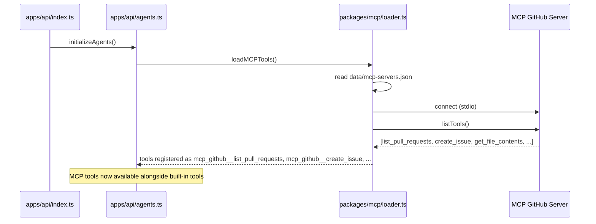
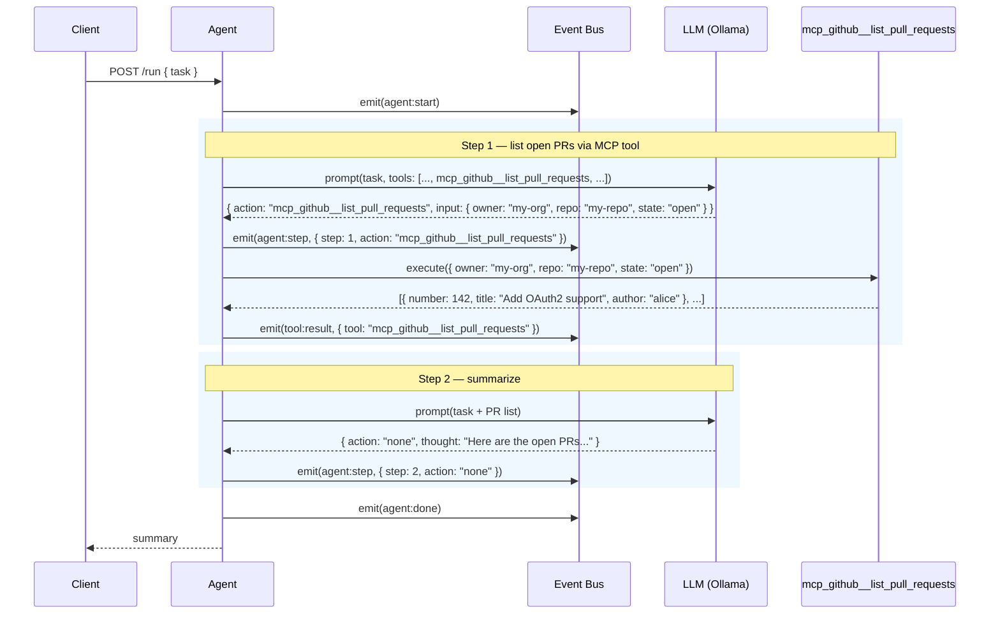

# Example: Using MCP Tools (GitHub)

::: tip TL;DR
[MCP](/glossary#mcp) tools are discovered at startup from external servers and appear in the agent's toolbox as `mcp_{server}__{tool}`. The agent uses them like any built-in tool — no special syntax needed.
:::

## The Request

You have a GitHub MCP server configured. You want a summary of open PRs.

```bash
curl -X POST http://localhost:3001/run \
  -H "Content-Type: application/json" \
  -d '{
    "task": "List open PRs in my-org/my-repo and summarize them"
  }'
```

---

## How MCP Tools Get Loaded (Startup)

Before any request is served, Manna discovers MCP tools at startup:



The naming convention: **`mcp_{serverName}__{toolName}`**. Double underscore separates server from tool. So `list_pull_requests` from the `github` server becomes `mcp_github__list_pull_requests`.

### Config that made this happen

```json
{
    "servers": [
        {
            "name": "github",
            "transport": "stdio",
            "command": "npx",
            "args": ["-y", "@modelcontextprotocol/server-github"],
            "env": {
                "GITHUB_PERSONAL_ACCESS_TOKEN": "${GITHUB_TOKEN}"
            }
        }
    ]
}
```

File location: `data/mcp-servers.json`

---

## What Happens Under the Hood



### Event log

```json
{ "type": "agent:start",        "task": "List open PRs in my-org/my-repo and summarize them" }
{ "type": "agent:model_routed", "profile": "default", "model": "llama3.1:8b-instruct-q8_0" }
{ "type": "agent:step",         "step": 1, "action": "mcp_github__list_pull_requests", "thought": "I'll use the GitHub MCP tool to fetch open pull requests for this repository." }
{ "type": "tool:result",        "tool": "mcp_github__list_pull_requests", "result": "[{\"number\":142,\"title\":\"Add OAuth2 support\",\"author\":\"alice\",\"labels\":[\"feature\"],\"created_at\":\"2026-04-10\"},{\"number\":139,\"title\":\"Fix rate limiter edge case\",\"author\":\"bob\",\"labels\":[\"bug\"],\"created_at\":\"2026-04-08\"},{\"number\":137,\"title\":\"Update TypeScript to 5.9\",\"author\":\"carol\",\"labels\":[\"chore\"],\"created_at\":\"2026-04-05\"}]" }
{ "type": "agent:model_routed", "profile": "default", "model": "llama3.1:8b-instruct-q8_0" }
{ "type": "agent:step",         "step": 2, "action": "none", "thought": "Here are the 3 open PRs with summaries..." }
{ "type": "agent:done",         "answer": "..." }
```

### What the LLM sees in its prompt

The MCP tools appear in the tool list just like built-in tools:

```
Available tools:
- read_file: Read a file from the project directory
- shell: Run an allowlisted shell command
- mysql_query: Run a read-only SQL query
- browser_fetch: Fetch a web page
- mcp_github__list_pull_requests: List pull requests in a GitHub repository
- mcp_github__create_issue: Create an issue in a GitHub repository
- mcp_github__get_file_contents: Get file contents from a GitHub repository
...
```

The agent doesn't know or care that `mcp_github__list_pull_requests` comes from an external server. It picks the tool the same way it picks `read_file` — by matching the tool description to the task.

---

## The Response

```json
{
    "success": true,
    "status": 200,
    "message": "",
    "data": {
        "result": "There are **3 open PRs** in my-org/my-repo:\n\n1. **#142 — Add OAuth2 support** (alice, Apr 10)\n   Feature PR adding OAuth2 provider integration. Labels: `feature`.\n\n2. **#139 — Fix rate limiter edge case** (bob, Apr 8)\n   Bug fix for rate limiter failing under concurrent requests. Labels: `bug`.\n\n3. **#137 — Update TypeScript to 5.9** (carol, Apr 5)\n   Chore PR bumping TypeScript and fixing new strict-mode warnings. Labels: `chore`."
    },
    "meta": {
        "startedAt": "2026-04-15T17:15:00.000Z",
        "durationMs": 2845,
        "model": "llama3.1:8b-instruct-q8_0",
        "steps": 2,
        "toolCalls": 1,
        "contextLength": 1203
    }
}
```

---

## What If the MCP Server Is Down?

MCP follows the [fail-open](/glossary#fail-open) pattern. If the GitHub MCP server fails to connect at startup:

- The tool is simply not registered
- The agent works with whatever tools are available
- No crash, no error on startup — just a warning log

If the tool is registered but the MCP server goes down mid-request:

- `tool:error` is emitted
- The error is appended to context
- The agent explains it couldn't complete the action

---

## Key Takeaway

> MCP tools are plug-and-play. Add a server to `data/mcp-servers.json`, restart, and the tools appear automatically. The agent treats them identically to built-in tools.

---

**Related docs:**
[mcp package](/packages/mcp) · [MCP](/glossary#mcp) · [MCP Theory](/theory/MCP) · [Fail-Open](/glossary#fail-open) · [Agent Loop](/glossary#agent-loop)

← [Back to Examples](index.md)
