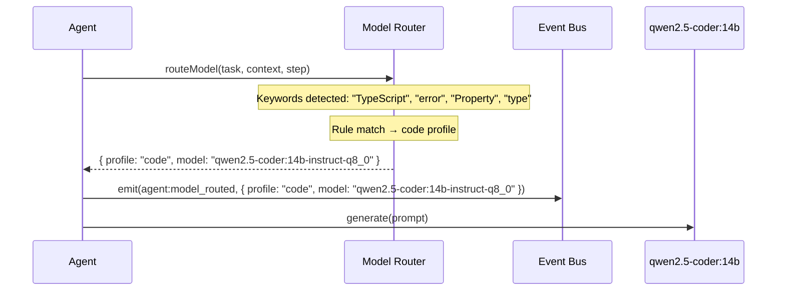
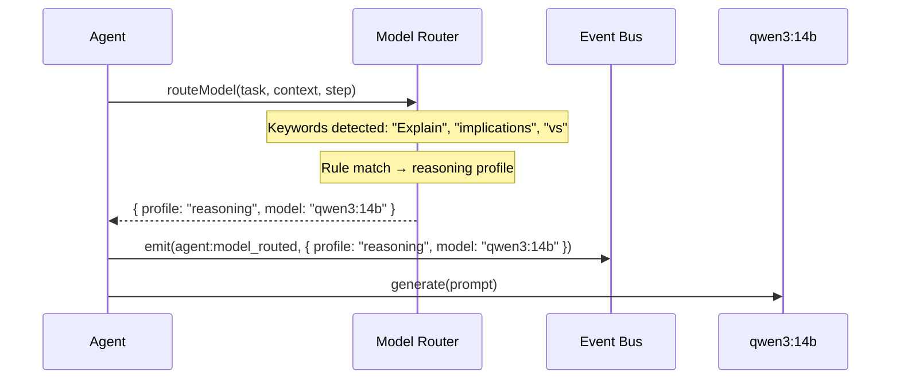
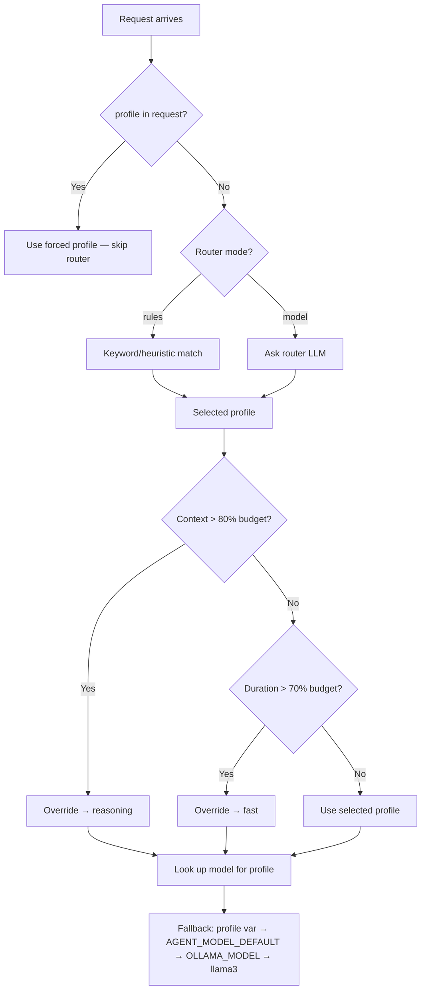

# Example: Model Routing in Action

::: tip TL;DR
Manna picks a different [model profile](/glossary#model-profile) depending on the task. A coding task gets the `code` profile (qwen2.5-coder). A reasoning task gets `reasoning` (qwen3). You can see the routing decision in the `agent:model_routed` event.
:::

## Request 1 — Coding Task

```bash
curl -X POST http://localhost:3001/run \
  -H "Content-Type: application/json" \
  -d '{
    "task": "Fix the TypeScript error in auth.ts: Property accessToken does not exist on type Session"
  }'
```

### What the Router Decides

The [model router](/glossary#model-router) analyzes the task and picks the `code` profile:



### Event log — coding task

```json
{ "type": "agent:start",        "task": "Fix the TypeScript error in auth.ts: Property accessToken does not exist on type Session" }
{ "type": "agent:model_routed", "profile": "code", "model": "qwen2.5-coder:14b-instruct-q8_0" }
{ "type": "agent:step",         "step": 1, "action": "read_file", "thought": "I need to read auth.ts to see the Session type and understand the error." }
{ "type": "tool:result",        "tool": "read_file", "result": "import { Session } from './types';\n\nexport function getToken(session: Session) {\n  return session.accessToken; // ← Error here\n}\n..." }
{ "type": "agent:model_routed", "profile": "code", "model": "qwen2.5-coder:14b-instruct-q8_0" }
{ "type": "agent:step",         "step": 2, "action": "read_file", "thought": "The Session type doesn't include accessToken. Let me check the type definition." }
{ "type": "tool:result",        "tool": "read_file", "result": "export interface Session {\n  userId: string;\n  expiresAt: Date;\n}\n// accessToken is missing from this type" }
{ "type": "agent:model_routed", "profile": "code", "model": "qwen2.5-coder:14b-instruct-q8_0" }
{ "type": "agent:step",         "step": 3, "action": "none", "thought": "The fix is to add accessToken to the Session interface..." }
{ "type": "agent:done",         "answer": "..." }
```

### Response

```json
{
  "success": true,
  "status": 200,
  "message": "",
  "data": {
    "result": "The `Session` interface in `types.ts` is missing the `accessToken` field. Add it:\n\n```typescript\nexport interface Session {\n  userId: string;\n  expiresAt: Date;\n  accessToken: string;  // ← add this\n}\n```\n\nThis fixes the error in `auth.ts` because `session.accessToken` now exists on the type."
  },
  "meta": {
    "startedAt": "2026-04-15T18:30:00.000Z",
    "durationMs": 4125,
    "model": "qwen2.5-coder:14b-instruct-q8_0",
    "steps": 3,
    "toolCalls": 2,
    "contextLength": 1450
  }
}
```

---

## Request 2 — Reasoning Task

Now a follow-up that needs reasoning, not code:

```bash
curl -X POST http://localhost:3001/run \
  -H "Content-Type: application/json" \
  -d '{
    "task": "Explain the security implications of storing access tokens in the session object vs using httpOnly cookies"
  }'
```

### What the Router Decides

Different task, different profile:



### Event log — reasoning task

```json
{ "type": "agent:start",        "task": "Explain the security implications of storing access tokens in the session object vs using httpOnly cookies" }
{ "type": "agent:model_routed", "profile": "reasoning", "model": "qwen3:14b" }
{ "type": "agent:step",         "step": 1, "action": "none", "thought": "This is a conceptual question I can answer from training knowledge. Session storage vs httpOnly cookies have different XSS and CSRF attack surfaces..." }
{ "type": "agent:done",         "answer": "..." }
```

Notice: **1 step, 0 tool calls**. This is a knowledge question — the reasoning model answers directly without reading any files.

### Response

```json
{
  "success": true,
  "status": 200,
  "message": "",
  "data": {
    "result": "**Session object (server-side memory):**\n- ✅ Not accessible to client-side JavaScript (immune to XSS token theft)\n- ❌ Vulnerable to session fixation if session IDs are predictable\n- ❌ Requires sticky sessions or shared session store for horizontal scaling\n- Token lives in server memory — if the server restarts, sessions are lost\n\n**httpOnly cookies:**\n- ✅ Not accessible to JavaScript (`httpOnly` flag blocks `document.cookie`)\n- ✅ Automatically sent with every request (no client-side token management)\n- ❌ Vulnerable to CSRF unless you add `SameSite=Strict` or CSRF tokens\n- ❌ Size limit (~4KB per cookie)\n\n**Recommendation:** Use httpOnly cookies with `Secure`, `SameSite=Strict`, and short expiry. Add CSRF protection. This gives you XSS resistance + automatic transmission without client-side JavaScript touching the token."
  },
  "meta": {
    "startedAt": "2026-04-15T18:32:00.000Z",
    "durationMs": 2640,
    "model": "qwen3:14b",
    "steps": 1,
    "toolCalls": 0,
    "contextLength": 285
  }
}
```

---

## How the Router Works

The router has two modes (set via `AGENT_MODEL_ROUTER_MODE`):

### `rules` mode (default)

Keyword and heuristic matching. Fast, no LLM call:

| Signal | Profile selected |
| ------ | --------------- |
| "fix", "error", "TypeScript", "code", "implement" | `code` |
| "explain", "why", "compare", "implications", "analyze" | `reasoning` |
| "list", "count", "show", "get" | `fast` |
| No strong signal | `default` |

### `model` mode

A small LLM (the router model) reads the task and outputs a JSON profile choice. More accurate but adds ~200ms latency:

```json
{
  "profile": "code",
  "reason": "Task involves fixing a TypeScript type error, which requires code understanding"
}
```

### Fallback and override behaviour



---

## Key Takeaway

> The model router matches the right model to the right task automatically. Coding tasks get the code-optimized model; reasoning tasks get the reasoning model. You see the decision in the `agent:model_routed` event — and you can always override it with `"profile"` in the request.

---

**Related docs:**
[Model Router](/glossary#model-router) · [Model Profile](/glossary#model-profile) · [Model Selection & Routing](/model-selection) · [Events & Observability](/theory/events-observability) · [Endpoint Map](/endpoint-map)

← [Back to Examples](index.md)
