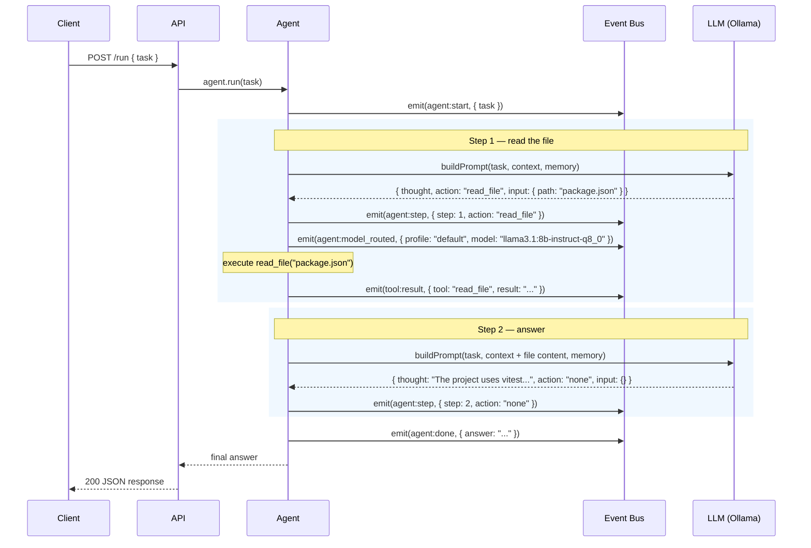

# Example: Read a File and Answer a Question

::: tip TL;DR
The simplest agent flow: read one file → answer the question. Two steps, one tool call, done.
:::

## The Request

A Node.js project. You want to know what test framework it uses.

```bash
curl -X POST http://localhost:3001/run \
  -H "Content-Type: application/json" \
  -d '{
    "task": "What test framework does this project use?"
  }'
```

---

## What Happens Under the Hood

The [agent loop](/glossary#agent-loop) runs for **2 steps**:

1. The model reads `package.json` to find the test framework.
2. It sees vitest in the dependencies, answers, and stops.



### Event log

What you'd see in the server logs (simplified):

```json
{ "type": "agent:start",        "task": "What test framework does this project use?" }
{ "type": "agent:model_routed", "profile": "default", "model": "llama3.1:8b-instruct-q8_0" }
{ "type": "agent:step",         "step": 1, "action": "read_file", "thought": "I need to check the project dependencies to find the test framework. Let me read package.json." }
{ "type": "tool:result",        "tool": "read_file", "result": "{ \"name\": \"my-node-app\", \"devDependencies\": { \"vitest\": \"^3.1.1\", \"typescript\": \"^5.8.3\" } ... }" }
{ "type": "agent:model_routed", "profile": "default", "model": "llama3.1:8b-instruct-q8_0" }
{ "type": "agent:step",         "step": 2, "action": "none", "thought": "The project uses vitest as its test framework, listed in devDependencies." }
{ "type": "agent:done",         "answer": "This project uses **vitest** (v3.1.1) as its test framework. It's listed in `devDependencies` in package.json." }
```

### The LLM's decisions (JSON contract)

Each step, the model returns a [structured JSON decision](/glossary#json-contract):

**Step 1:**

```json
{
    "thought": "I need to check the project dependencies to find the test framework. Let me read package.json.",
    "action": "read_file",
    "input": { "path": "package.json" }
}
```

**Step 2:**

```json
{
    "thought": "The project uses vitest as its test framework, listed in devDependencies.",
    "action": "none",
    "input": {}
}
```

When `action` is `"none"`, the loop ends and `thought` becomes the final answer.

---

## The Response

```json
{
    "success": true,
    "status": 200,
    "message": "",
    "data": {
        "result": "This project uses **vitest** (v3.1.1) as its test framework. It's listed in `devDependencies` in package.json."
    },
    "meta": {
        "startedAt": "2026-04-15T14:22:01.000Z",
        "durationMs": 1842,
        "model": "llama3.1:8b-instruct-q8_0",
        "steps": 2,
        "toolCalls": 1,
        "contextLength": 623
    }
}
```

---

## Key Takeaway

> The agent loop is a **read-think-act** cycle. Most simple questions are answered in 2 steps: one tool call to gather data, one `action: "none"` to deliver the answer.

---

**Related docs:**
[Agent Loop](/glossary#agent-loop) · [JSON Contract](/glossary#json-contract) · [read_file tool](/packages/tools/read-file) · [Model Router](/glossary#model-router) · [Events & Observability](/theory/events-observability)

← [Back to Examples](index.md)
