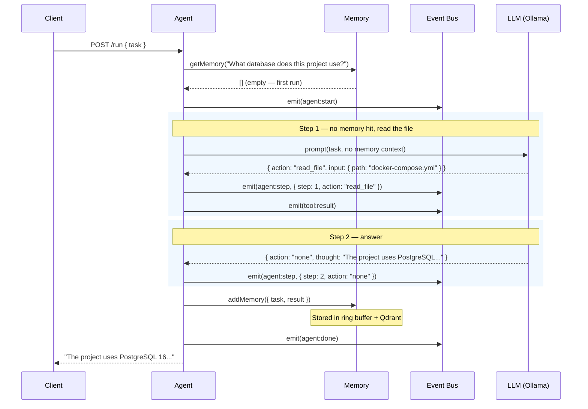
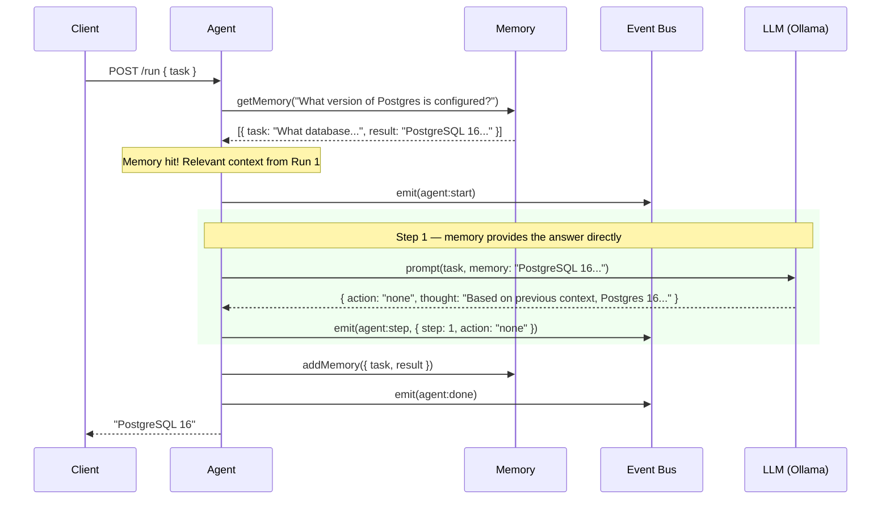
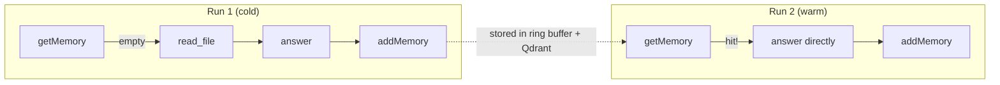

# Example: Memory Across Runs

::: tip TL;DR
Run 1 (cold): agent reads a file and answers. Run 2 (warm): the same question is answered faster because memory provides the context from Run 1 — no tool call needed.
:::

## The Setup

Two sequential requests to the same Manna instance. The first run reads a file. The second run asks a related question and benefits from [semantic memory](/glossary#semantic-search) stored during Run 1.

---

## Run 1 — Cold (No Memory)

### The Request

```bash
curl -X POST http://localhost:3001/run \
  -H "Content-Type: application/json" \
  -d '{
    "task": "What database does this project use?"
  }'
```

### What Happens



### Event log — Run 1

```json
{ "type": "agent:start",        "task": "What database does this project use?" }
{ "type": "agent:model_routed", "profile": "default", "model": "llama3.1:8b-instruct-q8_0" }
{ "type": "agent:step",         "step": 1, "action": "read_file", "thought": "I'll check docker-compose.yml for database service definitions." }
{ "type": "tool:result",        "tool": "read_file", "result": "services:\n  db:\n    image: postgres:16\n    environment:\n      POSTGRES_DB: myapp\n      POSTGRES_USER: admin\n    ports:\n      - '5432:5432'\n  ..." }
{ "type": "agent:model_routed", "profile": "default", "model": "llama3.1:8b-instruct-q8_0" }
{ "type": "agent:step",         "step": 2, "action": "none", "thought": "The project uses PostgreSQL 16, configured in docker-compose.yml." }
{ "type": "agent:done",         "answer": "The project uses **PostgreSQL 16**, running as a Docker service. The database is named `myapp` with user `admin`, exposed on port 5432." }
```

**Result**: 2 steps, 1 tool call, ~1,800ms.

After Run 1, memory now contains:

```json
{
    "task": "What database does this project use?",
    "result": "The project uses PostgreSQL 16, running as a Docker service..."
}
```

This entry is stored in both the [ring buffer](/glossary#ring-buffer) (local, fast) and [Qdrant](/glossary#qdrant) (vector-indexed, semantic).

---

## Run 2 — Warm (Memory Hit)

### The Request

A different question, but semantically related:

```bash
curl -X POST http://localhost:3001/run \
  -H "Content-Type: application/json" \
  -d '{
    "task": "What version of Postgres is configured?"
  }'
```

### What Happens



### Event log — Run 2

```json
{ "type": "agent:start",        "task": "What version of Postgres is configured?" }
{ "type": "agent:model_routed", "profile": "default", "model": "llama3.1:8b-instruct-q8_0" }
{ "type": "agent:step",         "step": 1, "action": "none", "thought": "Based on previous context, the project uses PostgreSQL version 16, as configured in docker-compose.yml." }
{ "type": "agent:done",         "answer": "PostgreSQL **16**, configured in docker-compose.yml as the `db` service with image `postgres:16`." }
```

**Result**: 1 step, 0 tool calls, ~620ms.

---

## The Two-Run Flow (Side-by-Side)



|            | Run 1 (cold)    | Run 2 (warm) |
| ---------- | --------------- | ------------ |
| Memory hit | ❌ No           | ✅ Yes       |
| Steps      | 2               | 1            |
| Tool calls | 1 (`read_file`) | 0            |
| Duration   | ~1,800ms        | ~620ms       |

---

## The Response (Run 2)

```json
{
    "success": true,
    "status": 200,
    "message": "",
    "data": {
        "result": "PostgreSQL **16**, configured in docker-compose.yml as the `db` service with image `postgres:16`."
    },
    "meta": {
        "startedAt": "2026-04-15T16:45:30.000Z",
        "durationMs": 621,
        "model": "llama3.1:8b-instruct-q8_0",
        "steps": 1,
        "toolCalls": 0,
        "contextLength": 312
    }
}
```

---

## Key Takeaway

> Memory turns repeated questions into instant answers. The first run pays the cost (tool calls, time); subsequent semantically-similar runs benefit from stored context — fewer steps, no tool calls, faster responses.

---

**Related docs:**
[memory package](/packages/memory) · [Qdrant](/glossary#qdrant) · [Semantic Search](/glossary#semantic-search) · [Ring Buffer](/glossary#ring-buffer) · [Prompt, Context, Memory](/theory/prompt-context-memory)

← [Back to Examples](index.md)
