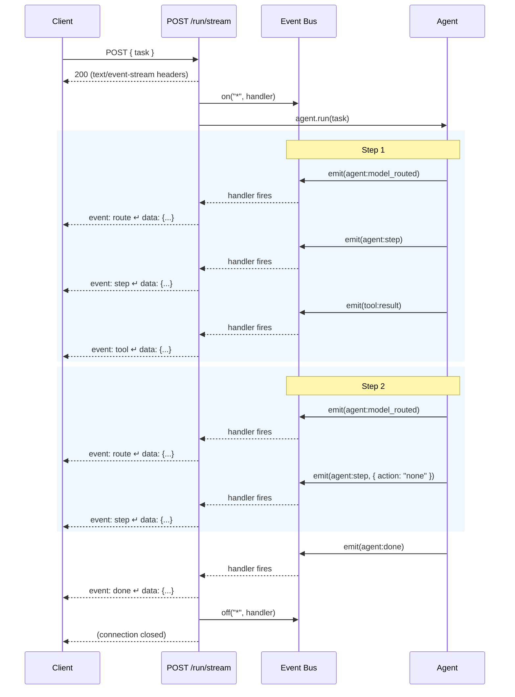

# Example: Streaming a Response

::: tip TL;DR
`POST /run/stream` returns the same result as `POST /run`, but you see each step **as it happens** via [Server-Sent Events](/glossary#sse). Great for UIs that want real-time progress indicators.
:::

## The Request

Same task as any `/run` call, just hit the `/run/stream` endpoint and add `-N` (no buffer):

```bash
curl -N -X POST http://localhost:3001/run/stream \
  -H "Content-Type: application/json" \
  -d '{
    "task": "What npm scripts are available in this project?"
  }'
```

The `-N` flag disables curl's output buffering so you see events in real time.

---

## What Happens Under the Hood



### Exact SSE output

This is what arrives on the wire, byte for byte:

```
event: route
data: {"profile":"default","model":"llama3.1:8b-instruct-q8_0","reason":"no_forced_profile"}

event: step
data: {"step":0,"action":"read_file","thought":"I need to read package.json to find the available npm scripts."}

event: tool
data: {"tool":"read_file","result":"{\n  \"name\": \"my-project\",\n  \"scripts\": {\n    \"dev\": \"tsx watch src/index.ts\",\n    \"build\": \"tsc\",\n    \"typecheck\": \"tsc --noEmit\",\n    \"lint\": \"eslint .\",\n    \"test\": \"vitest run\",\n    \"docs:dev\": \"vitepress dev docs\"\n  }\n}"}

event: route
data: {"profile":"default","model":"llama3.1:8b-instruct-q8_0","reason":"no_forced_profile"}

event: step
data: {"step":1,"action":"none","thought":"The project has 6 npm scripts: dev, build, typecheck, lint, test, and docs:dev."}

event: done
data: {"result":"The project has 6 npm scripts:\n\n- **dev** — `tsx watch src/index.ts` (development server with hot reload)\n- **build** — `tsc` (TypeScript compilation)\n- **typecheck** — `tsc --noEmit` (type checking without output)\n- **lint** — `eslint .` (linting)\n- **test** — `vitest run` (run tests)\n- **docs:dev** — `vitepress dev docs` (documentation dev server)"}

```

Each SSE message follows the standard format:
```
event: <event-type>\n
data: <JSON payload>\n
\n
```

The blank line after `data:` signals the end of that event.

### SSE event types

| SSE event | Triggered by | Payload |
| --------- | ------------ | ------- |
| `route` | `agent:model_routed` | `{ profile, model, reason }` |
| `step` | `agent:step` | `{ step, action, thought }` |
| `tool` | `tool:result` or `tool:error` | `{ tool, result }` or `{ tool, error }` |
| `done` | `agent:done` | `{ result }` |
| `error` | `agent:error` | `{ error }` |
| `max_steps` | `agent:max_steps` | `{ task, summary }` |

The connection closes automatically when the agent completes (`done`, `error`, or `max_steps`).

---

## Streaming vs Non-Streaming: Side-by-Side

| | `POST /run` | `POST /run/stream` |
| --- | --- | --- |
| Response type | Single JSON object | SSE event stream |
| When you get data | After all steps complete | Each step as it happens |
| Content-Type | `application/json` | `text/event-stream` |
| Request body | Identical | Identical |
| Final result | `data.result` | Last `done` event's `result` |
| Use case | Scripts, CI, simple integrations | UIs, progress indicators, debugging |

### Non-streaming (for comparison)

```bash
curl -X POST http://localhost:3001/run \
  -H "Content-Type: application/json" \
  -d '{ "task": "What npm scripts are available in this project?" }'
```

You wait ~2 seconds, then get the full response at once:

```json
{
  "success": true,
  "status": 200,
  "message": "",
  "data": {
    "result": "The project has 6 npm scripts: ..."
  },
  "meta": {
    "startedAt": "2026-04-15T18:00:00.000Z",
    "durationMs": 1953,
    "steps": 2,
    "toolCalls": 1
  }
}
```

With streaming, you'd see the `route` event at ~0ms, the `step` event at ~400ms, the `tool` event at ~500ms, the second `step` at ~1,500ms, and `done` at ~1,950ms. Same total time — but the UI can show progress along the way.

---

## Key Takeaway

> Streaming doesn't change what the agent does — it changes **when you see it**. Same request body, same logic, same result. The difference is real-time visibility into each step.

---

**Related docs:**
[SSE](/glossary#sse) · [Pub/Sub](/glossary#pub-sub) · [Events & Observability](/theory/events-observability) · [Endpoint Map — POST /run/stream](/endpoint-map) · [events package](/packages/events)

← [Back to Examples](index.md)
