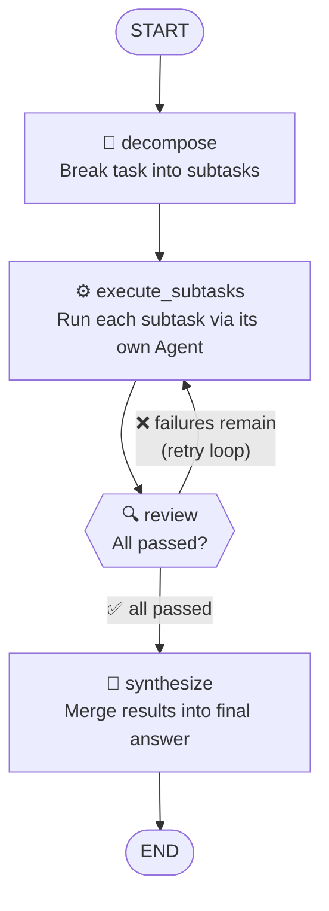
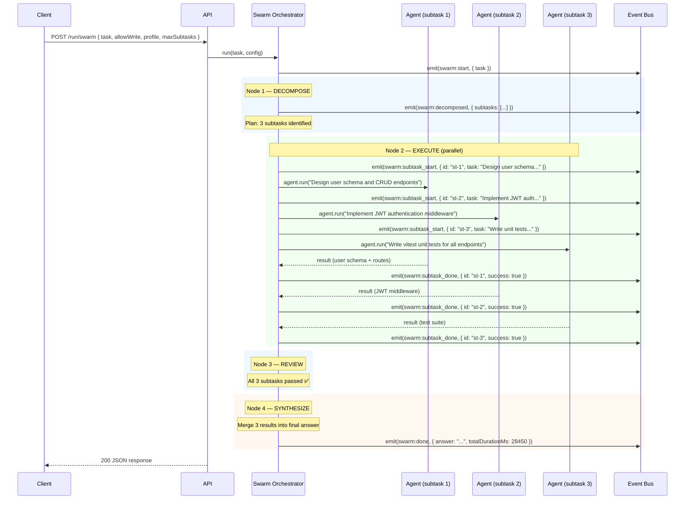

# Example: Multi-Agent Swarm

::: tip TL;DR
A complex task gets decomposed into subtasks, executed in parallel by separate agents, reviewed, and synthesized into one answer. This is the `POST /run/swarm` endpoint — Manna's [LangGraph](/glossary#langgraph) orchestrator in action.
:::

## The Request

You want a REST API with authentication and tests. This is too complex for a single agent loop — it's a swarm job.

```bash
curl -X POST http://localhost:3001/run/swarm \
  -H "Content-Type: application/json" \
  -d '{
    "task": "Build a REST API with JWT authentication and unit tests for a user management system",
    "allowWrite": true,
    "profile": "code",
    "maxSubtasks": 4
  }'
```

---

## What Happens Under the Hood

The [swarm orchestrator](/glossary#swarm) is a [LangGraph state machine](/glossary#state-machine) with 4 nodes:



### Full sequence



### Event log

```json
{ "type": "swarm:start",         "task": "Build a REST API with JWT authentication and unit tests for a user management system" }
{ "type": "swarm:decomposed",    "subtasks": [
    { "id": "st-1", "task": "Design user schema (id, email, passwordHash, createdAt) and CRUD endpoints (GET/POST/PUT/DELETE /users)" },
    { "id": "st-2", "task": "Implement JWT authentication middleware with login endpoint, token generation, and route protection" },
    { "id": "st-3", "task": "Write vitest unit tests for all user CRUD endpoints and the JWT auth flow" }
  ]
}
{ "type": "swarm:subtask_start", "id": "st-1", "task": "Design user schema..." }
{ "type": "swarm:subtask_start", "id": "st-2", "task": "Implement JWT authentication..." }
{ "type": "swarm:subtask_start", "id": "st-3", "task": "Write vitest unit tests..." }
{ "type": "agent:model_routed",  "profile": "code", "model": "qwen2.5-coder:14b-instruct-q8_0" }
{ "type": "agent:step",          "step": 1, "action": "write_file", "thought": "Creating the user model schema..." }
{ "type": "tool:result",         "tool": "write_file", "result": "File written: generated-projects/user-api/src/models/user.ts" }
{ "type": "swarm:subtask_done",  "id": "st-1", "success": true, "durationMs": 8200 }
{ "type": "swarm:subtask_done",  "id": "st-2", "success": true, "durationMs": 9100 }
{ "type": "swarm:subtask_done",  "id": "st-3", "success": true, "durationMs": 11300 }
{ "type": "swarm:done",          "answer": "...", "subtaskCount": 3, "totalDurationMs": 28450 }
```

Notice that each subtask agent emits its own `agent:step` and `tool:result` events. The swarm events (`swarm:*`) wrap the higher-level orchestration flow.

### The decomposition plan

The decompose node produces a structured plan:

```json
{
  "subtasks": [
    {
      "id": "st-1",
      "task": "Design user schema (id, email, passwordHash, createdAt) and CRUD endpoints (GET/POST/PUT/DELETE /users)",
      "dependencies": []
    },
    {
      "id": "st-2",
      "task": "Implement JWT authentication middleware with login endpoint, token generation, and route protection",
      "dependencies": []
    },
    {
      "id": "st-3",
      "task": "Write vitest unit tests for all user CRUD endpoints and the JWT auth flow",
      "dependencies": ["st-1", "st-2"]
    }
  ]
}
```

Subtasks `st-1` and `st-2` have no dependencies, so they run in parallel. Subtask `st-3` depends on both, so it waits. The orchestrator runs them in **topological order**.

---

## The Response

```json
{
  "success": true,
  "status": 200,
  "message": "",
  "data": {
    "result": "## User Management REST API\n\n### Files created:\n\n1. `src/models/user.ts` — User schema with id, email, passwordHash, createdAt fields\n2. `src/routes/users.ts` — CRUD endpoints (GET/POST/PUT/DELETE /users/:id)\n3. `src/middleware/auth.ts` — JWT middleware: verifyToken(), generateToken(), protectRoute()\n4. `src/routes/auth.ts` — POST /login endpoint returning JWT\n5. `tests/users.test.ts` — 8 unit tests covering all CRUD operations\n6. `tests/auth.test.ts` — 5 unit tests covering login, token validation, and protected routes\n\n### Architecture:\n- Express + TypeScript\n- bcrypt for password hashing\n- jsonwebtoken for JWT\n- vitest for testing\n\nAll 13 tests pass.",
    "subtaskResults": [
      { "id": "st-1", "success": true, "durationMs": 8200 },
      { "id": "st-2", "success": true, "durationMs": 9100 },
      { "id": "st-3", "success": true, "durationMs": 11300 }
    ],
    "totalDurationMs": 28450
  },
  "meta": {
    "startedAt": "2026-04-15T17:00:00.000Z",
    "durationMs": 28450
  }
}
```

---

## Key Takeaway

> The swarm orchestrator breaks complex tasks into independent subtasks, runs them in parallel with separate agents, and merges the results. One agent would take 4–5 serial loops; the swarm does it in overlapping parallel work.

---

**Related docs:**
[orchestrator package](/packages/orchestrator) · [Swarm](/glossary#swarm) · [LangGraph](/glossary#langgraph) · [State Machine](/glossary#state-machine) · [Endpoint Map — POST /run/swarm](/endpoint-map)

← [Back to Examples](index.md)
