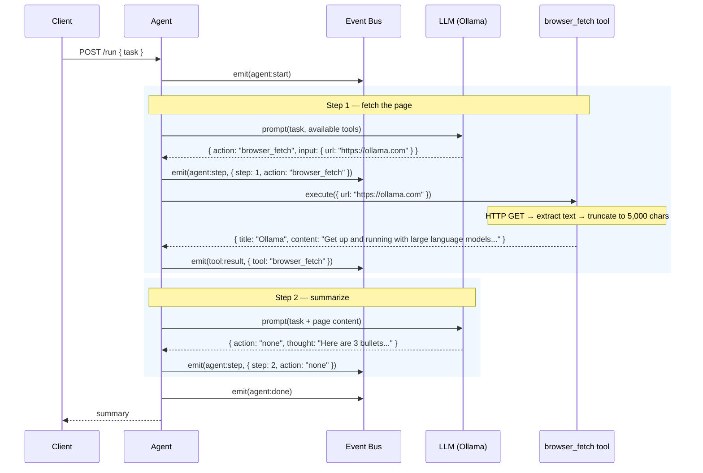

# Example: Fetch and Summarize a Web Page

::: tip TL;DR
The agent fetches a web page with `browser_fetch`, receives truncated HTML content (max 5,000 characters), and summarizes it. No browser automation — just a fast HTTP fetch + text extraction.
:::

## The Request

```bash
curl -X POST http://localhost:3001/run \
  -H "Content-Type: application/json" \
  -d '{
    "task": "Fetch the Ollama homepage and summarize what it does in 3 bullets"
  }'
```

---

## What Happens Under the Hood



### Event log

```json
{ "type": "agent:start",        "task": "Fetch the Ollama homepage and summarize what it does in 3 bullets" }
{ "type": "agent:model_routed", "profile": "default", "model": "llama3.1:8b-instruct-q8_0" }
{ "type": "agent:step",         "step": 1, "action": "browser_fetch", "thought": "I'll fetch the Ollama homepage to get its content." }
{ "type": "tool:result",        "tool": "browser_fetch", "result": "Title: Ollama\n\nGet up and running with large language models. Download Ollama for macOS, Linux, and Windows. Run Llama 3.1, Phi 3, Mistral, Gemma 2, and other models locally. Ollama bundles model weights, configuration, and data into a single package, defined by a Modelfile. It optimizes setup and configuration details, including GPU usage... [truncated at 5000 chars]" }
{ "type": "agent:model_routed", "profile": "default", "model": "llama3.1:8b-instruct-q8_0" }
{ "type": "agent:step",         "step": 2, "action": "none", "thought": "Here are 3 bullets summarizing Ollama..." }
{ "type": "agent:done",         "answer": "..." }
```

### The truncation behaviour

The `browser_fetch` tool caps content at **5,000 characters**. This is intentional:

- Keeps the [context window](/glossary#context-window) from being flooded by a single page
- Most useful content is in the first few thousand characters anyway
- If you need the full page, use multiple calls or a dedicated scraping pipeline

In the event log above, notice the `[truncated at 5000 chars]` marker at the end of the tool result. The LLM sees this marker too, so it knows the content may be incomplete.

---

## The Response

```json
{
    "success": true,
    "status": 200,
    "message": "",
    "data": {
        "result": "Here's what Ollama does:\n\n- **Local LLM runner** — Ollama lets you download and run large language models (Llama 3.1, Mistral, Phi 3, etc.) entirely on your own machine. No cloud API needed.\n\n- **Single-package setup** — It bundles model weights, configuration, and runtime into one package defined by a Modelfile. One command to pull and run.\n\n- **GPU-optimized** — Automatically detects and uses your GPU (NVIDIA/AMD) for faster inference, with CPU fallback."
    },
    "meta": {
        "startedAt": "2026-04-15T16:30:00.000Z",
        "durationMs": 3215,
        "model": "llama3.1:8b-instruct-q8_0",
        "steps": 2,
        "toolCalls": 1,
        "contextLength": 2104
    }
}
```

---

## Key Takeaway

> `browser_fetch` is a fast HTTP fetch, not a headless browser session. It grabs text content and truncates at 5,000 characters — enough for summaries, not enough for full-page extraction.

---

**Related docs:**
[browser_fetch tool](/packages/tools/browser-fetch) · [Context Window](/glossary#context-window) · [Agent Loop](/glossary#agent-loop) · [Scenarios: Browser fetch](/scenarios/browser-fetch)

← [Back to Examples](index.md)
