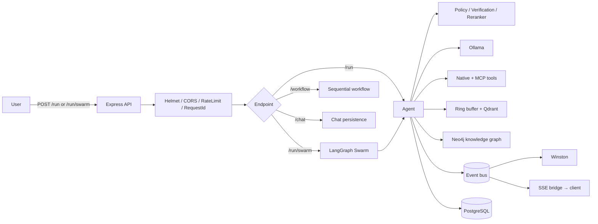

# Manna — Application Identity Card

::: tip TL;DR
**Manna** is a local-first, extensible **personal AI agent platform** written in **TypeScript (ESM, Node.js ≥ 18)**. It exposes an **Express HTTP API** that runs an **agent reason→act→observe loop** on top of a **local Ollama LLM**, augmented by a **tool registry** (filesystem, shell, web, vision, audio, SQL/NoSQL, semantic search, knowledge graph, MCP), a **LangGraph swarm orchestrator**, **Qdrant** vector memory, **Neo4j** knowledge graph, **PostgreSQL** persistence, processor middleware, SSE streaming and a full **VitePress documentation site**.
:::

This page is a single-glance "identity card" — a deliberately redundant, exhaustive summary of _what Manna is, how it is built, and which patterns, tools and strategies it uses_. It is meant to be the first page someone reads when they need to understand the whole application at once.

For deep dives, every topic links to the canonical documentation pages.

---

## 1. Product identity

| Field                    | Value                                                                         |
| ------------------------ | ----------------------------------------------------------------------------- |
| **Name**                 | Manna                                                                         |
| **Package**              | `@guebbit/manna`                                                              |
| **Version**              | `0.15.0-alpha` (private monorepo)                                             |
| **Tagline**              | Personal AI Agent Platform — local-first and extensible (TypeScript + Ollama) |
| **License model**        | Private repository                                                            |
| **Primary author / org** | `Guebbit`                                                                     |
| **Runtime target**       | Node.js ≥ 18 (ESM, `"type": "module"`)                                        |
| **Primary language**     | TypeScript (`strict`, project references)                                     |
| **Entry point**          | `apps/api/index.ts` — Express HTTP server (default port `3001`)               |
| **Default deployment**   | Docker / Podman Compose (`docker-compose.yml`)                                |
| **Documentation site**   | VitePress in `docs/`                                                          |
| **Philosophy**           | Local-first, no-magic, observable, fail-open, extensible                      |

---

## 2. What the application does

Manna is an **agentic backend service**. It accepts a natural-language task over HTTP and returns a final answer after the agent has reasoned, called the right tools and (optionally) coordinated multiple sub-agents. Concretely it can:

- Run an **autonomous agent loop** (`POST /run`) that picks tools, executes them, observes results and iterates until done.
- Stream the same loop token-by-token via **Server-Sent Events** (`POST /run/stream`).
- Decompose complex tasks into subtasks handled by specialised worker agents through a **LangGraph swarm orchestrator** (`POST /run/swarm[/stream]`).
- Execute **ordered multi-step workflows** with controlled context carry (`POST /workflow[/stream]`).
- Power **IDE features** (`/autocomplete`, `/lint-conventions`, `/page-review`) with direct single-LLM-call endpoints.
- Manage **chat conversations** persisted in PostgreSQL (`/chat/conversations/...`).
- Ingest and query **knowledge** through vector semantic search (Qdrant) and a graph store (Neo4j).
- Accept **file uploads** (image, audio, PDF) via `/upload/*`.
- Expose **instance metadata** (`/info/modes`, `/info/models`, `/help`, `/health`).
- Plug in arbitrary external **MCP (Model Context Protocol) servers** as additional tools at startup.

The platform is explicitly **local-first**: every dependency (LLM, vector DB, graph DB, relational DB) is meant to run on the user's own machine via Docker/Podman.

---

## 3. Tech stack (runtime)

### 3.1 Core language & runtime

- **TypeScript 5.8** with `tsc --noEmit` typecheck as the build gate.
- **Node.js ≥ 18**, pure **ESM** modules.
- **tsx** for dev-mode execution (`npm run dev`).

### 3.2 HTTP server

- **Express 4** — routing.
- **Helmet** — security headers.
- **CORS** — configurable via `CORS_ORIGIN`.
- **express-rate-limit** — global IP-based rate limiting (`middlewares/security.ts`).
- **Multer** — multipart file uploads.
- Custom **request-ID** middleware for log correlation.

### 3.3 LLM stack

- **Ollama** local runtime (`packages/llm/ollama.ts`) — `generate` + `chat` APIs, with `…WithMetadata` variants returning token counts and durations.
- **Embeddings** via Ollama embedding models (`packages/llm/embeddings.ts`).
- **Per-profile model resolution** (`fast | reasoning | code`) with sampling overrides (temperature, top-p, top-k, num_ctx, repeat_penalty) from env vars.

### 3.4 Agent orchestration

- **LangChain Core** (`@langchain/core`) — message types.
- **LangGraph** (`@langchain/langgraph`) — `StateGraph` powering the cyclic swarm orchestrator (`decompose → execute_subtasks → review ⇄ synthesize`).

### 3.5 Storage layers

- **Qdrant** (`@qdrant/js-client-rest`) — vector store for semantic memory & search.
- **Neo4j** (`neo4j-driver`) — knowledge graph (entities/relationships).
- **PostgreSQL** (`pg`) — primary persistence: agent runs, swarm runs, chat conversations, messages, evaluations. SQL migrations in `packages/persistence/migrations/`.
- **MySQL** (`mysql2`) and **MongoDB** (`mongodb`) — supported as _tool targets_ (the agent can query them), not as Manna's own store.
- Pluggable **base DB tool** (`packages/tools/base-db-tool.ts`) shared by all SQL/NoSQL query tools.

### 3.6 Validation, observability & utilities

- **Zod** + **zod-to-json-schema** — all LLM-facing schemas, tool inputs, configuration files, MCP server configs.
- **Winston** — structured logging (`packages/logger/logger.ts`), JSON by default, pretty mode via `LOG_PRETTY`.
- **i18next** — runtime translations for user-facing strings.
- **MCP SDK** (`@modelcontextprotocol/sdk`) — connects to stdio and SSE MCP servers.
- **Playwright** + **Chromium** — headless browsing for the `browser_fetch` tool.
- **pdf-parse** — PDF reader tool.
- **Nodemailer** — outbound mail helper (`packages/shared/mailer.ts`).

### 3.7 Dev tooling

- **Vitest 4** (unit, integration, eval suites; separate `vitest.eval.config.ts`).
- **@vitest/coverage-v8**.
- **ESLint 10** flat config + **typescript-eslint** + **eslint-plugin-unicorn** + **eslint-plugin-oxlint** (delegating overlapping rules to oxlint).
- **Prettier 3** + **eslint-config-prettier**.
- **@stoplight/spectral-cli** — OpenAPI linting against `openapi.yaml`.
- **Husky** + **commitlint** (`@commitlint/config-conventional`) — pre-commit gate runs the full `complete` script.
- **VitePress 1** + **vitepress-plugin-mermaid** + **@mermaid-js/mermaid-cli** — documentation site & diagrams.
- **openapi-typescript-codegen** — generates typed API client into `api/`.
- **Custom docs validators** — `scripts/check-tool-doc-coverage.mjs` and `scripts/check-doc-links.mjs`.

### 3.8 Container stack (`docker-compose.yml`)

Services brought up together:

- `ollama` (GPU-accelerated LLM runtime)
- `qdrant` (vector DB)
- `postgres` (persistence)
- `neo4j` (knowledge graph)
- `manna` (this app)

---

## 4. Repository layout

```
apps/
└── api/                       Express HTTP layer (routes, middlewares, SSE bridge)
packages/
├── agent/                     Reason→act→observe loop, model router, vision capability
├── orchestrator/              LangGraph swarm graph, nodes, state
├── swarm/                     Task decomposer + swarm result types
├── llm/                       Ollama client, embeddings, model config
├── memory/                    Hybrid ring buffer + Qdrant semantic memory
├── graph/                     Neo4j knowledge graph client + NER extractor
├── mcp/                       MCP loader + health check (tool discovery)
├── tools/                     Native tool implementations (read/write/exec/...)
├── processors/                Middleware: policy, verification, tool-reranker
├── persistence/               PostgreSQL pool, SQL migrations, run history
├── events/                    Synchronous in-process event bus
├── logger/                    Winston root logger
├── diagnostics/               Per-run Markdown diagnostic logs
├── evals/                     Mastra-style scorers + eval persistence
└── shared/                    Cross-cutting helpers (env, i18n, sse, path-safety,
                               request-validation, response envelope, operating-mode,
                               chunker, math, mailer, llm-response, model-resolution,
                               language detection, errors, safe-read-file)
tests/
├── unit/                      Per-package unit tests
├── integration/               End-to-end agent / swarm / chat API
└── evals/                     Behavioural quality scorers (separate vitest config)
docs/                          Canonical VitePress documentation
api/                           Generated typed API client (from openapi.yaml)
scripts/                       Docs coverage and link checkers
.ai/                           AI-only navigation context (brief)
data/                          Runtime data (e.g. mcp-servers.json)
openapi.yaml                   Source of truth for the REST contract
Dockerfile, docker-compose.yml Container deployment
```

---

## 5. HTTP API surface

| Method | Path                                             | Purpose                                       |
| ------ | ------------------------------------------------ | --------------------------------------------- |
| `POST` | `/run`                                           | Run the full agent loop on a task.            |
| `POST` | `/run/stream`                                    | Same as `/run` over Server-Sent Events.       |
| `POST` | `/run/swarm`                                     | Decompose + orchestrate a swarm of agents.    |
| `POST` | `/run/swarm/stream`                              | Swarm orchestration with SSE streaming.       |
| `POST` | `/workflow`                                      | Run an explicit ordered list of steps.        |
| `POST` | `/workflow/stream`                               | Workflow over SSE.                            |
| `POST` | `/autocomplete`                                  | IDE code completion (direct single LLM call). |
| `POST` | `/lint-conventions`                              | IDE convention lint (direct single LLM call). |
| `POST` | `/page-review`                                   | IDE page review (direct single LLM call).     |
| `POST` | `/upload/image`, `/upload/audio`, `/upload/pdf`  | Multipart uploads.                            |
| `GET`  | `/chat/conversations` (+ CRUD on items/messages) | Chat persistence.                             |
| `GET`  | `/info/modes`, `/info/models`, `/help`           | Instance metadata, no LLM.                    |
| `GET`  | `/health`                                        | Liveness probe.                               |

All JSON responses follow a **shared envelope** built by `successResponse` / `rejectResponse`:

```json
{
    "success": true,
    "status": 200,
    "message": "",
    "data": {},
    "meta": { "startedAt": "...", "durationMs": 42, "requestId": "..." }
}
```

The contract is also formalised in [`openapi.yaml`](./endpoint-map.md) and linted by Spectral.

---

## 6. The agent loop

Implemented in `packages/agent/agent.ts`. For each request the `Agent`:

1. Loads relevant **memory** (ring buffer + Qdrant semantic recall).
2. Runs up to **`MAX_STEPS`** iterations (capped by the active **operating mode**):
    1. `processInputStep` middleware hooks fire (may inject context, filter tools, hard-stop).
    2. A prompt is built from task + accumulated context + memory + tool catalogue.
    3. The **model router** selects the best profile (or uses a forced one).
    4. The LLM is called; the response is parsed with **Zod** (`agentStepSchema`).
    5. `processOutputStep` hooks fire (may rewrite or block the chosen action).
    6. If `action === "none"` → return; otherwise execute the chosen tool.
    7. `processToolResult` hooks fire (update error budgets etc.).
    8. The result (and any **tool citations**) are appended to context.
3. The final answer, citations and run metadata are returned and the run is persisted in PostgreSQL.

Key supporting modules:

- `packages/agent/model-router.ts` — small-LLM classifier routes to `fast | reasoning | code`; budget overrides downgrade to `fast` near time limits or upgrade to `reasoning` near context limits.
- `packages/agent/vision-capability.ts` + `vision-description.ts` — auto-detects multimodal models and pre-describes images.
- `packages/agent/schemas.ts` — Zod schema for each LLM step output (`thought`, `action`, `input`).
- `packages/tools/tool-call-deduplicator.ts` — prevents repeated identical tool invocations.
- `packages/tools/citations.ts` — typed citation buffer accumulated across steps.

---

## 7. Swarm orchestration (LangGraph)

Implemented in `packages/orchestrator/`. A `StateGraph` wires four nodes:

```
START → decompose → execute_subtasks → review ─► synthesize → END
                          ▲                │
                          └── retry ◄──────┘
```

- **decompose** — single reasoning-profile LLM call (`packages/swarm/decomposer.ts`) returns structured subtasks.
- **execute_subtasks** — runs each subtask through a fresh worker `Agent` with the same shared tools and processors.
- **review** — decides whether to retry failed subtasks (up to `SWARM_MAX_REVIEW_RETRIES`) or proceed.
- **synthesize** — combines subtask outputs into the final answer.

The cyclic review→retry loop replaces the older linear `SwarmOrchestrator`.

---

## 8. Workflows

`apps/api/workflow-endpoints.ts` runs a **client-provided sequence of steps**. Each step is bounded independently. The user picks a **carry mode** that controls how much context flows from one step to the next:

- `none` — each step is isolated.
- `summary` (default) — only a short summary is carried.
- `full` — full previous context is appended.

Workflows are deterministic and ideal for predictable pipelines; `/run` is the open-ended cousin.

---

## 9. Processor middleware

Inspired by Mastra. Defined in `packages/processors/`. Three lifecycle hooks:

- `processInputStep` — before each LLM call.
- `processOutputStep` — after the LLM response, before the tool runs.
- `processToolResult` — after the tool (success or failure).

Three processors are available today; **PolicyProcessor is always first**:

| Processor         | Module                        | Always on?                        | Role                                                                                                                                                                                                                  |
| ----------------- | ----------------------------- | --------------------------------- | --------------------------------------------------------------------------------------------------------------------------------------------------------------------------------------------------------------------- |
| **Policy**        | `processors/policy.ts`        | Yes                               | Capability gates (block write tools without `allowWrite`); consecutive-error budget; hard-stop on terminal errors (`E_PATH_OUTSIDE_ROOT`, `E_PERMISSION_DENIED`); per-mode limits via `resolveOperatingModeConfig()`. |
| **Verification**  | `processors/verification.ts`  | `AGENT_VERIFICATION_ENABLED=true` | Cheap fast-model LLM asks "did the agent pick the right tool?" and injects corrective feedback.                                                                                                                       |
| **Tool reranker** | `processors/tool-reranker.ts` | `TOOL_RERANKER_ENABLED=true`      | Embeds tool descriptions once and uses cosine similarity to pass only the top-N most relevant tools per step.                                                                                                         |

Errors are typed: `PolicyViolationError` (with codes like `E_PERMISSION_DENIED`, `E_CONSECUTIVE_ERRORS`, `E_HARD_STOP_BUDGET`) and `PathSafetyError`.

---

## 10. Native tool catalogue

Tools are first-class objects implementing the `ITool` interface (`packages/tools/types.ts`). Each tool declares a `name`, `description`, optional Zod `inputSchema` / `outputSchema`, and an `async execute()`. Some tools opt into `directOutput: true` to short-circuit further LLM rounds.

Read-only tools (always registered):

| Category             | Tools                                                                                              |
| -------------------- | -------------------------------------------------------------------------------------------------- |
| System & code        | `read_file`, `shell`, `code_autocomplete`, `generate_diagram`                                      |
| Document readers     | `read_csv`, `read_json`, `read_markdown`, `read_html`, `read_docx`, `read_pdf`                     |
| Database (query)     | `mysql_query`, `pg_query`, `mongo_query` (share `base-db-tool.ts`)                                 |
| Web / vision / audio | `browser_fetch` (Playwright), `image_classify`, `image_sketch`, `image_colorize`, `speech_to_text` |
| Retrieval & graph    | `semantic_search`, `query_knowledge_graph`                                                         |

Write tools (registered only when `allowWrite: true`):

- `write_file`, `scaffold_project`, `document_ingest`, `knowledge_graph` (ingest entities/edges).

Shared helpers next to the tools:

- `tool-builder.ts` — `createTool()` factory with Zod input validation.
- `tool-reranker.ts` — embedding-based reranker backend.
- `tool-call-deduplicator.ts` — guards against loops.
- `citations.ts` — typed citation buffer accumulated by retrieval tools.
- `image.processor.shared.ts` — shared image-pipeline helpers.

External tools are added at startup via **MCP**: `packages/mcp/loader.ts` reads `data/mcp-servers.json`, connects to stdio and SSE servers, validates configs with Zod, and wraps each MCP tool as a native `ITool`. Discovery is **fail-open** — if MCP is unreachable the agent still boots with only native tools.

---

## 11. Memory & retrieval strategy

`packages/memory/memory.ts` implements a **hybrid store**:

1. An **in-process ring buffer** (`MAX_ENTRIES = 20`) for fast continuity.
2. A **Qdrant** collection (`agent_memory` by default) for semantic recall across runs.

Memory writes go through `addMemory()`; reads through `getMemory(query, k)` which uses **Ollama embeddings** and falls back silently to the ring buffer when Qdrant is unavailable.

Retrieval-Augmented Generation (RAG) is built on top through:

- `semantic_search` tool (vector retrieval).
- `document_ingest` tool (chunks documents via `shared/chunker.ts`, embeds, stores).
- `knowledge_graph` + `query_knowledge_graph` tools (Neo4j GraphRAG layer, with NER extraction in `packages/graph/extractor.ts`).

---

## 12. Cross-cutting patterns

The codebase converges on a small number of repeated strategies:

- **Fail-open infrastructure** — every external dependency (Qdrant, Postgres, Neo4j, MCP, Ollama for non-critical calls) catches errors, logs a warning and degrades gracefully.
- **Single response envelope** — `successResponse` / `rejectResponse` always produce the same JSON shape with `meta` enrichment.
- **Zod-validated boundaries** — all LLM outputs, tool inputs, MCP configs and API payloads pass through Zod schemas; `zod-to-json-schema` exposes them when needed.
- **Event-driven observability** — a tiny in-process **event bus** (`packages/events/bus.ts`) emits `agent:start | step | done | error | max_steps | hard_stop | model_routed | tool:result | tool:error | tool:verification_failed`. The API subscribes with `on('*')` and forwards everything to Winston.
- **SSE streaming bridge** — `apps/api/sse-event-bridge.ts` + `shared/sse.ts` translate bus events into typed SSE events (including `hard_stop`) for streaming endpoints.
- **Per-run diagnostics** — `packages/diagnostics` writes a Markdown trace per run with cleanup of old logs.
- **Operating modes** — `AGENT_OPERATING_MODE = low-spec | standard | high-trust` resolves to `{ maxSteps, maxToolCalls, consecutiveErrorLimit, selfDebugEnabled }`; individual env vars can override any field.
- **Profile-based model routing** — three named profiles (`fast`, `reasoning`, `code`) with per-profile sampling parameters; resolution chain `AGENT_MODEL_<PROFILE>` → `OLLAMA_MODEL` → error.
- **Capability gating by request** — write tools are only exposed when the request body has `allowWrite: true`; the **PolicyProcessor** enforces this even if the LLM hallucinates a write call.
- **Path safety** — `shared/path-safety.ts` (`resolveSafePath`, `resolveInsideRoot`) and `safe-read-file.ts` constrain every filesystem operation; violations throw `PathSafetyError` and immediately consume hard-stop budget.
- **Lazy initialisation** — pool/client objects (Postgres pool, Qdrant client, MCP clients) connect on first use.
- **Middleware-style processors** — registration order matters; processors can mutate args or throw `PolicyViolationError` to short-circuit.
- **No magic** — every decision is traceable through structured logs and typed events; bad JSON and unknown tools are recovered, not crashed.
- **Documentation as a first-class artifact** — VitePress site is the canonical source of truth; `.ai/*` files are deliberately brief navigation aids for AI agents working on the repo.

---

## 13. Configuration

All configuration is environment-driven. The full catalogue is documented at [`docs/use-the-application`](./use-the-application.md), [`docs/model-selection`](./model-selection.md) and `.env.example`. Key knobs:

| Variable                                                         | Purpose                              |
| ---------------------------------------------------------------- | ------------------------------------ | -------- | ------------ |
| `OLLAMA_BASE_URL`, `OLLAMA_MODEL`, `OLLAMA_EMBED_MODEL`          | LLM runtime.                         |
| `AGENT_MODEL_FAST`, `AGENT_MODEL_REASONING`, `AGENT_MODEL_CODE`  | Per-profile model overrides.         |
| `AGENT_MODEL_ROUTER_MODEL`                                       | Classifier used by the model router. |
| `AGENT_OPERATING_MODE`                                           | `low-spec                            | standard | high-trust`. |
| `AGENT_BUDGET_MAX_DURATION_MS`, `AGENT_BUDGET_MAX_CONTEXT_CHARS` | Router downgrade/upgrade budgets.    |
| `AGENT_VERIFICATION_ENABLED`, `AGENT_VERIFICATION_MODEL`         | Verification processor.              |
| `TOOL_RERANKER_ENABLED`, `TOOL_RERANKER_TOP_N`                   | Tool reranker processor.             |
| `QDRANT_URL`, `QDRANT_COLLECTION`                                | Vector memory.                       |
| `MANNA_DB_*`                                                     | PostgreSQL connection.               |
| `NEO4J_URI`, `NEO4J_USER`, `NEO4J_PASSWORD`                      | Knowledge graph.                     |
| `LOG_ENABLED`, `LOG_LEVEL`, `LOG_PRETTY`, `LOG_ERROR_FILE`       | Logging.                             |
| `RATE_LIMIT_WINDOW_MS`, `RATE_LIMIT_MAX`                         | Rate limiter.                        |
| `CORS_ORIGIN`, `PORT`                                            | HTTP server.                         |
| `SWARM_DECOMPOSER_MODEL`, `SWARM_MAX_REVIEW_RETRIES`             | Swarm tuning.                        |
| `GRAPH_NER_MODEL`                                                | Knowledge-graph entity extractor.    |

`shared/validateRequiredEnvironment()` runs on startup and exits the process if a mandatory variable is missing.

---

## 14. Quality gates & developer workflow

NPM scripts (defined in `package.json`):

| Script                                          | What it does                                                    |
| ----------------------------------------------- | --------------------------------------------------------------- |
| `npm run dev`                                   | Watch-mode dev server via `tsx`.                                |
| `npm run build`                                 | `tsc --noEmit` typecheck.                                       |
| `npm run start`                                 | Production start of compiled output.                            |
| `npm run test` / `:watch` / `:coverage`         | Vitest unit + integration.                                      |
| `npm run test:eval`                             | Mastra-style eval scorers (separate vitest config).             |
| `npm run lint` / `:fix`                         | ESLint flat config.                                             |
| `npm run lint:openapi`                          | Spectral on `openapi.yaml`.                                     |
| `npm run prettier` / `:check` / `:fix`          | Prettier.                                                       |
| `npm run docs:dev` / `:build` / `:preview`      | VitePress site.                                                 |
| `npm run docs:check`                            | Tool-doc coverage + internal docs link check.                   |
| `npm run db:migrate`                            | Apply SQL migrations.                                           |
| `npm run genapi`                                | Regenerate the typed API client from `openapi.yaml`.            |
| `npm run complete`                              | `build && test && lint:fix && prettier:fix` — pre-commit gate.  |
| `npm run complete:check`                        | Strict CI gate (adds OpenAPI lint, Prettier check, docs check). |
| `npm run podman:restart` / `:rebuild` / `:nuke` | Container helpers.                                              |

A **Husky** pre-commit hook runs `npm run complete`. **commitlint** enforces conventional commits.

---

## 15. Mental model in one diagram



---

## 16. Where to go next

- Setup & first request: [Quickstart](./quickstart.md) and [Use the Application](./use-the-application.md).
- HTTP surface: [Endpoint Map](./endpoint-map.md) and `openapi.yaml`.
- Architecture deep dive: [How It Works (Layered)](./theory/how-it-works-layered.md), [Agent Loop](./theory/agent-loop.md), [Operating Modes](./theory/operating-modes.md), [Error Taxonomy](./theory/error-taxonomy.md), [Events & Observability](./theory/events-observability.md).
- Models: [Model Selection & Routing](./model-selection.md), [Ollama Models](./infra/ollama-models.md).
- Packages: [Packages overview](./packages/index.md), with per-package pages for `agent`, `orchestrator`, `llm`, `memory`, `mcp`, `graph`, `events`, and every tool in [`docs/packages/tools`](./packages/tools/index.md).
- Glossary of every term used above: [Glossary](./glossary.md).
