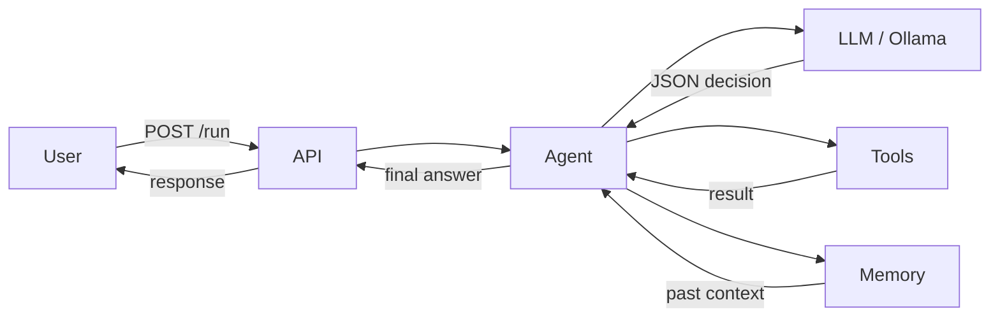

# AI Coding Assistant Documentation

::: tip TL;DR
Local-first AI agent API — send a task, get an answer. Ollama models, tool execution, semantic memory.
:::

This documentation is now organized into **5 clear tracks**:

1. **Getting Started** → [/use-the-application](/use-the-application)
2. **API Surface** → [/endpoint-map](/endpoint-map)
3. **Architecture** → [/theory/how-it-works-layered](/theory/how-it-works-layered)
4. **Modeling & Routing** → [/model-selection](/model-selection)
5. **Package Reference** → [/packages/](/packages/)

---

## What this project is

- Local-first TypeScript agent API (`POST /run`)
- Agentic loop with tool execution and memory
- Ollama backend with per-step model routing profiles

### System overview

## If you only read one flow

1. Start here: [/use-the-application](/use-the-application)
2. Explore the API surface: [/endpoint-map](/endpoint-map)
3. Understand internals: [/theory/how-it-works-layered](/theory/how-it-works-layered)
4. Configure models and routing: [/model-selection](/model-selection)
5. Dive into package/tool contracts: [/packages/](/packages/)

## Fast links

- Endpoint Map: [/endpoint-map](/endpoint-map)
- Scenarios: [/scenarios](/scenarios)
- Agent package: [/packages/agent](/packages/agent)
- LLM package: [/packages/llm](/packages/llm)
- Tools catalog: [/packages/tools/](/packages/tools/)
