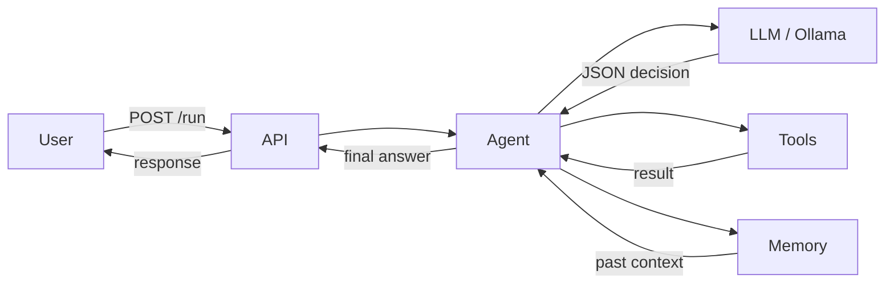

# Manna — AI Coding Assistant Documentation

::: tip TL;DR
Local-first AI agent API — send a task, get an answer. [Ollama](/glossary#ollama) models, tool execution, [semantic memory](/glossary#semantic-search). New to LLM concepts? Start with the [Glossary](/glossary).
:::

## Documentation tracks

| Track                     | What you'll find                                                            | Start here                                   |
| ------------------------- | --------------------------------------------------------------------------- | -------------------------------------------- |
| **Getting Started**       | Setup, use cases, first request                                             | [Use the Application](/use-the-application)  |
| **Practical Examples**    | Request → under-the-hood → response walkthroughs                            | [Examples](/examples/)                       |
| **Scenarios**             | Hands-on drills (10 min each)                                               | [Scenarios](/scenarios/)                     |
| **Architecture & Theory** | How the system works, [RAG](/glossary#rag), [LoRA](/glossary#lora), vectors | [How It Works](/theory/how-it-works-layered) |
| **API Surface**           | All HTTP endpoints                                                          | [Endpoint Map](/endpoint-map)                |
| **Package Reference**     | Code contracts per package                                                  | [Packages](/packages/)                       |
| **Glossary**              | Every technical term explained                                              | [Glossary](/glossary)                        |

---

## What this project is

- Local-first TypeScript agent API (`POST /run`)
- [Agent loop](/glossary#agent-loop) with tool execution and [memory](/glossary#ring-buffer)
- [Ollama](/glossary#ollama) backend with per-step [model routing](/glossary#model-router)

## Quick-start path

1. [Set up & run your first request](/use-the-application)
2. [See a full example walkthrough](/examples/read-and-answer)
3. [Explore the API endpoints](/endpoint-map)
4. [Understand the internals](/theory/how-it-works-layered)
5. [Try a hands-on scenario](/scenarios/)
6. [Look up any term you don't know](/glossary)

## Fast links

| Area               | Links                                                                                                                                               |
| ------------------ | --------------------------------------------------------------------------------------------------------------------------------------------------- |
| **Learn**          | [Examples](/examples/) · [Scenarios](/scenarios/) · [Glossary](/glossary)                                                                           |
| **Theory**         | [Agent Loop](/theory/agent-loop) · [RAG](/theory/RAG) · [Vectors](/theory/VECTOR_DATABASES) · [LoRA](/theory/lora-fine-tuning) · [MCP](/theory/MCP) |
| **Reference**      | [Endpoint Map](/endpoint-map) · [Packages](/packages/) · [Tools](/packages/tools/) · [Model Selection](/model-selection)                            |
| **Infrastructure** | [Ollama Setup](/infra/ollama-notes) · [Ollama Models](/infra/ollama-models) · [Library Ingestion](/library-ingestion)                               |
