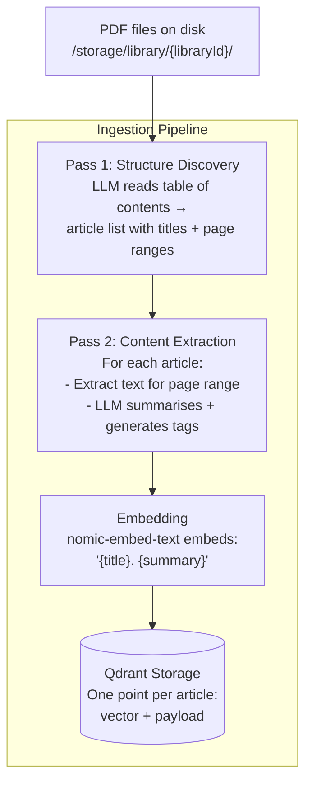
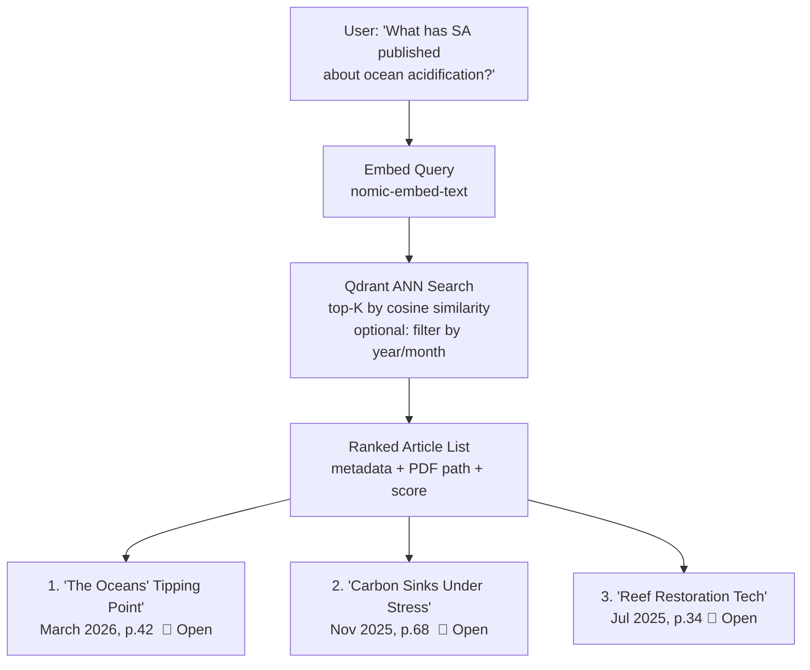

# Library Ingestion & Semantic Search

::: tip TL;DR
Build a semantic search engine over a collection of PDFs. One [embedding](/glossary#embedding) per article summary → instant, fully-cited article discovery. No hallucination — you read the original source, the AI just finds it.
:::

## Overview

This page documents the **multi-library ingestion and search** architecture: a system for importing PDF collections (magazines, books, research papers), indexing them by article summary, and exposing semantic search over the index.

The design emerged from a use-case discussion around building a local knowledge assistant for **Scientific American** back-issues. The core idea: instead of full [RAG](/glossary#rag) (embed every paragraph and let the LLM synthesise an answer), store a **summary + metadata per article** and return a ranked list of articles for the user to read directly.

**Related theory pages:**

- [RAG theory](/theory/RAG) — what RAG is, when full RAG is appropriate
- [Vector Databases](/theory/VECTOR_DATABASES) — how [Qdrant](/glossary#qdrant) and ANN search work

---

## Design Rationale: Summary Index vs Full RAG

| Full RAG                                   | Summary Index (this approach)                         |
| ------------------------------------------ | ----------------------------------------------------- |
| Needs perfect PDF text extraction          | Only needs "good enough" extraction for summarisation |
| Thousands of [chunks](/glossary#chunk) to embed & search      | One embedding per article (50–100 / year)             |
| LLM synthesises answers from fragments     | **You** read the original article — no synthesis risk |
| Complex chunking & retrieval tuning        | Simple summary + metadata store                       |
| Citation is approximate ("around page 84") | Citation is **exact** (stored at ingestion time)      |
| Expensive at scale                         | Extremely lightweight                                 |

**When to prefer full RAG instead:** if you need the system to _synthesise_ an answer from across multiple articles (e.g. "summarise 10 years of coverage on CRISPR"), the summary-index approach won't serve you — you'd need to load full article text into the LLM prompt. For pure _discovery_ ("which articles cover X?"), the summary index is superior.

---

## System Architecture

### Ingestion Pipeline



### Query Pipeline



---

## Data Model

### ArticleEntry

```typescript
// Stored in Qdrant payload + optional SQLite/JSON mirror
interface ArticleEntry {
    /** Unique identifier (UUID or slugified title+date). */
    id: string;

    /** Article headline as it appears in the table of contents. */
    title: string;

    /** 2–4 sentence LLM-generated summary of the article's main argument. */
    summary: string;

    /** LLM-generated topic tags (e.g. ["climate", "oceanography", "CO2"]). */
    topics: string[];

    /** Publication year (numeric, e.g. 2026). */
    year: number;

    /** Publication month as a string (e.g. "March"). */
    month: string;

    /** First printed page number of the article. */
    startPage: number;

    /** Last printed page number (undefined if single-page). */
    endPage?: number;

    /**
     * Absolute path to the PDF on disk.
     * Example: "/storage/sa/2026/03.pdf"
     */
    pdfPath: string;

    /**
     * Offset between printed page number and PDF page index (0-based).
     * Needed when cover pages, ads, etc. shift the internal page count.
     */
    pdfPageOffset?: number;

    /** 768-dimensional embedding vector (nomic-embed-text output). */
    embedding: number[];
}
```

---

## Two-Pass Ingestion Strategy

Manual data entry (title + page range per article) is error-prone and time-consuming for large back-issue collections. The two-pass strategy automates this entirely.

### Pass 1 — Structure Discovery

The LLM reads only the table of contents pages of each issue to extract article structure. Table of contents pages are typically pages 1–4 and are dense with structured information (title, page number, sometimes a teaser sentence).

```typescript
async function discoverStructure(
    pdfPath: string,
    tocPages: [number, number] = [1, 4]
): Promise<ArticleStub[]> {
    // Extract only the TOC pages — fast, minimal text
    const tocText = await extractPdfText(pdfPath, tocPages[0], tocPages[1]);

    const response = await ollama.chat({
        model: 'llama3.1:8b',
        messages: [
            {
                role: 'user',
                content: `You are reading the table of contents of a magazine issue.
Extract every article entry. Return a JSON array:
[{ "title": "...", "startPage": N, "endPage": N or null }]

Table of contents text:
${tocText}`
            }
        ],
        format: 'json'
    });

    return JSON.parse(response.message.content) as ArticleStub[];
}
```

**Output example (Pass 1):**

```json
[
    { "title": "The Oceans' Tipping Point", "startPage": 42, "endPage": 51 },
    { "title": "Carbon Sinks Under Stress", "startPage": 52, "endPage": 61 },
    { "title": "Reef Restoration Tech", "startPage": 62, "endPage": 69 }
]
```

### Pass 2 — Content Extraction

For each article stub from Pass 1, extract the article's text and ask the LLM to summarise it and generate tags.

```typescript
async function extractArticleContent(
    pdfPath: string,
    stub: ArticleStub,
    meta: { year: number; month: string }
): Promise<ArticleEntry> {
    // Extract only the article's page range
    const articleText = await extractPdfText(
        pdfPath,
        stub.startPage,
        stub.endPage ?? stub.startPage + 5
    );

    // Limit input to 6000 chars to stay within context window
    const truncated = articleText.slice(0, 6000);

    const response = await ollama.chat({
        model: 'llama3.1:8b',
        messages: [
            {
                role: 'user',
                content: `Summarise this magazine article in 2–3 sentences.
Also list 3–5 topic tags (single words or short phrases).
Return JSON: { "summary": "...", "topics": ["..."] }

Article text:
${truncated}`
            }
        ],
        format: 'json'
    });

    const { summary, topics } = JSON.parse(response.message.content);

    // Embed title + summary for semantic search
    const textToEmbed = `${stub.title}. ${summary}`;
    const embeddingResult = await ollama.embeddings({
        model: 'nomic-embed-text',
        prompt: textToEmbed
    });

    return {
        id: crypto.randomUUID(),
        title: stub.title,
        summary,
        topics,
        year: meta.year,
        month: meta.month,
        startPage: stub.startPage,
        endPage: stub.endPage,
        pdfPath,
        embedding: embeddingResult.embedding
    };
}
```

**Why two passes?**

- Pass 1 is fast (TOC pages only) and produces the _structure_ used by Pass 2.
- Pass 2 uses the structure to precisely extract each article's text, avoiding content from adjacent articles bleeding in.
- If Pass 1 fails on a particular issue (unusual TOC layout), you can manually supply the stubs and still run Pass 2 automatically.
- Each pass can be retried independently without redoing the other.

---

## Folder-Based Batch Import

For importing an entire archive of PDFs at once (starting from scratch):

```typescript
async function importFolder(libraryId: string, folderPath: string): Promise<ImportResult> {
    const pdfPaths = await glob(`${folderPath}/**/*.pdf`);
    let imported = 0;
    let skipped = 0;
    const errors: string[] = [];

    for (const pdfPath of pdfPaths) {
        try {
            // Derive year/month from folder structure or file name
            // Expected: /storage/sa/2026/03.pdf → year=2026, month="March"
            const meta = inferMetaFromPath(pdfPath);

            const stubs = await discoverStructure(pdfPath);
            for (const stub of stubs) {
                const entry = await extractArticleContent(pdfPath, stub, meta);
                await saveToQdrant(libraryId, entry);
                imported++;
            }
        } catch (err) {
            errors.push(`${pdfPath}: ${String(err)}`);
            skipped++;
        }
    }

    return { imported, skipped, errors };
}
```

This process is **fully unattended**. It can run overnight and process hundreds of issues without human intervention. Failed issues are logged to `errors` and can be retried in isolation.

---

## Search Implementation

```typescript
async function searchLibrary(
    libraryId: string,
    query: string,
    topK = 5,
    filters?: { year?: number; month?: string }
): Promise<RankedArticle[]> {
    // Embed the user's query
    const { embedding: queryVector } = await ollama.embeddings({
        model: 'nomic-embed-text',
        prompt: query
    });

    // Build optional Qdrant filter
    const filter = buildQdrantFilter(filters);

    // ANN search
    const results = await qdrant.search(`library-${libraryId}`, {
        vector: queryVector,
        limit: topK,
        filter,
        with_payload: true
    });

    return results.map((hit) => ({
        score: hit.score,
        ...(hit.payload as ArticleEntry)
    }));
}
```

**Example response:**

```json
[
  {
    "score": 0.91,
    "title": "The Oceans' Tipping Point",
    "summary": "Examines how rising CO₂ is dissolving coral structures at an accelerating pace.",
    "topics": ["ocean", "climate", "CO2", "coral"],
    "year": 2026,
    "month": "March",
    "startPage": 42,
    "endPage": 51,
    "pdfPath": "/storage/sa/2026/03.pdf"
  },
  ...
]
```

---

## API Endpoints

These endpoints are documented in the OpenAPI spec (`openapi.yaml`).

### `GET /library`

List all libraries with their metadata and status.

```
GET /library

Response 200:
[
  {
    "id": "scientific-american",
    "name": "Scientific American",
    "articleCount": 1247,
    "lastImport": "2026-04-01T12:00:00Z"
  }
]
```

### `POST /library/{libraryId}/import`

Import PDFs into a library. Accepts either an array of individual PDF paths or a folder path for bulk import.

```bash
# Import specific PDFs (e.g. to update with new issues)
curl -X POST http://localhost:3001/library/scientific-american/import \
  -H "Content-Type: application/json" \
  -d '{
    "pdfs": [
      { "path": "/storage/sa/2026/04.pdf", "year": 2026, "month": "April" }
    ]
  }'

# Import an entire folder (start from scratch)
curl -X POST http://localhost:3001/library/scientific-american/import \
  -H "Content-Type: application/json" \
  -d '{
    "folder": "/storage/sa"
  }'
```

**Response:**

```json
{ "imported": 12, "skipped": 0, "errors": [] }
```

### `POST /library/{libraryId}/search`

Semantic search over the library's article index.

```bash
curl -X POST http://localhost:3001/library/scientific-american/search \
  -H "Content-Type: application/json" \
  -d '{
    "query": "ocean acidification and coral bleaching",
    "topK": 5,
    "filters": { "year": 2025 }
  }'
```

**Response:** ranked list of articles with metadata and PDF paths.

### `GET /library/{libraryId}/export`

Export the full article metadata index as JSON (for human review, editing, or backup).

```bash
curl http://localhost:3001/library/scientific-american/export \
  > sa-index.json
```

---

## Hardware Requirements

For the recommended hardware (RTX 4090, Ryzen 9 9950X3D, 32 GB RAM):

| Component         | Model / Tool                    | VRAM / RAM Usage                      |
| ----------------- | ------------------------------- | ------------------------------------- |
| Summarisation LLM | `llama3.1:8b-instruct-q8_0`     | ~8 GB VRAM                            |
| Embedding model   | `nomic-embed-text` (via Ollama) | CPU only, ~300 MB RAM                 |
| Vector DB         | Qdrant (local)                  | ~100–500 MB RAM for typical libraries |
| PDF parsing       | `pdf.read.ts` (existing tool)   | CPU, < 200 MB RAM                     |
| PDF storage       | Local filesystem                | Disk only                             |

The GPU is used only during LLM summarisation. Embedding runs on CPU. A typical issue (10 articles) takes approximately:

- Pass 1: ~5 seconds (TOC extraction + LLM parse)
- Pass 2: ~30–90 seconds (10 articles × 3–9 s per article at 8B model speed)

A 20-year archive (240 issues, ~2 400 articles) would take approximately **2–8 hours** unattended. The wide range reflects:

- **Model quantisation**: a Q4 model is roughly 2× faster than Q8 at the cost of some summary quality.
- **PDF complexity**: issues with heavy multi-column layouts or many short articles take longer per page to extract.
- **GPU utilisation**: if the GPU is shared with other processes during ingestion, throughput drops accordingly.

---

## Limits and Edge Cases

| Limit                          | Severity | Notes                                                                                                                      |
| ------------------------------ | -------- | -------------------------------------------------------------------------------------------------------------------------- |
| **Complex PDF layouts**        | Medium   | Multi-column, ads, sidebars can confuse page extraction. Mitigated by the two-pass approach — Pass 1 only reads TOC.       |
| **Non-standard TOC formats**   | Medium   | Older issues may not have a machine-readable TOC. Fallback: manual stub list for those issues.                             |
| **Image/chart-heavy articles** | Medium   | Text extraction misses infographic content. Summary will focus on caption/body text only.                                  |
| **Cross-article questions**    | Medium   | "How has coverage of AI evolved over 10 years?" requires a separate meta-analysis mode.                                    |
| **Scale**                      | Very Low | 20 years × 12 issues × 10 articles = 2 400 embeddings. Trivially small for Qdrant.                                         |
| **Copyright**                  | Legal    | Storing summaries for personal use is generally fair use. Distributing the index or generated answers commercially is not. |

---

## Related Pages

- [RAG Theory](/theory/RAG) — when and why to use full RAG vs. summary index
- [Vector Databases](/theory/VECTOR_DATABASES) — how Qdrant works, scaling considerations
- [OpenAPI Spec](/endpoint-map) — complete API documentation
- [semantic_search tool](/packages/tools/semantic-search) — existing semantic search tool
- [read_pdf tool](/packages/tools/read-pdf) — PDF text extraction tool
