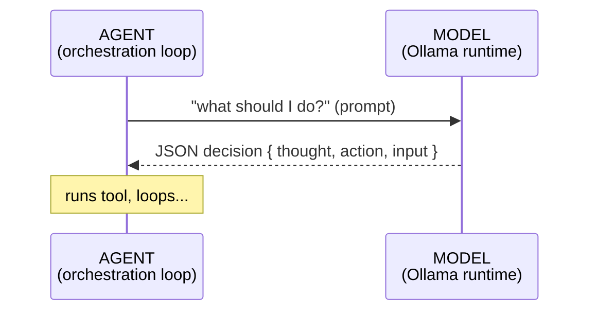
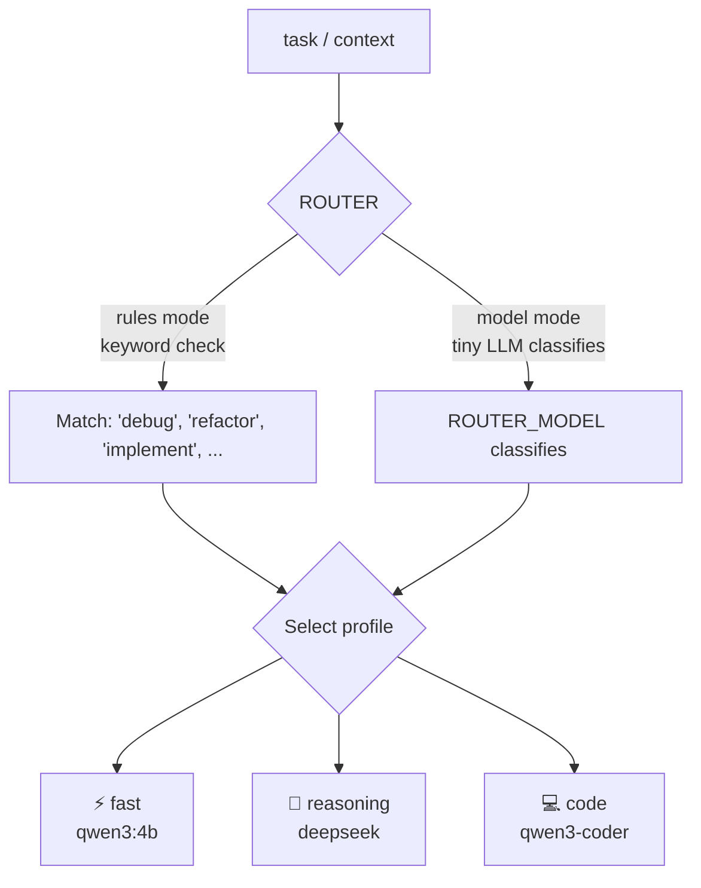
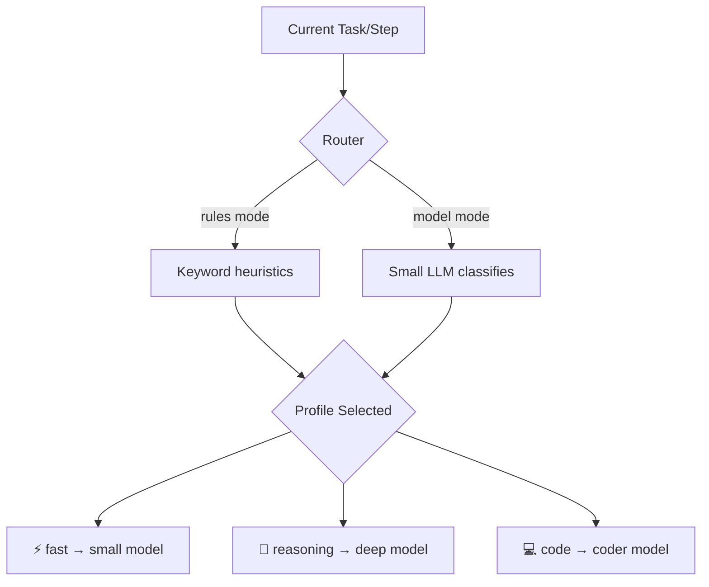

# Model Selection & Routing

::: tip TL;DR
Each agent step is routed to the best [model profile](/glossary#model-profile) (fast / reasoning / code / default) via keyword rules or a small classifier model.
:::

## The one-sentence version

> Instead of using one model for everything, this project picks the best model for each step of the agent loop based on what kind of task it is.

---

## Agent vs model -- what is the difference?



- **Agent** = the loop that runs up to 5 steps
- **Router** = picks which model to use for this step
- **Model** = the Ollama model that does the actual thinking

`OLLAMA_MODEL` is NOT "the agent". It is just the final fallback when no profile model is configured.

---

## Per-step routing profiles

At each step, the router assigns the current task to one of three profiles:

| Profile     | When it is used                  | Goal                      |
| ----------- | -------------------------------- | ------------------------- |
| `fast`      | Simple Q&A, quick lookups        | Low latency, small model  |
| `reasoning` | Logic, math, multi-step analysis | Best reasoning capability |
| `code`      | Coding, debugging, refactoring   | Best code understanding   |

### Visual: how routing works



---

Defined by the user OR via a small LLM (the router model) reads the task and outputs a JSON profile choice. More accurate but adds ~200ms latency:

```bash
export AGENT_MODEL_ROUTER_MODEL=phi4-mini:latest
```

When `model` mode fails (model unreachable, bad response), it automatically falls back to `default`.

---

## Runtime options (per-profile)

Each agent routing profile supports fine-grained generation parameter control via environment variables. These override any defaults baked into the model (including Modelfile parameters).

### Parameter cheat sheet

| Parameter        | Low value =                     | High value =                    | Recommended for precision |
| ---------------- | ------------------------------- | ------------------------------- | ------------------------- |
| `temperature`    | Precise, deterministic          | Creative, varied                | **Low (0.1–0.3)**         |
| `top_p`          | Narrow probability range        | Wider range                     | **Low-ish (0.7–0.85)**    |
| `top_k`          | Fewer token candidates          | More candidates                 | **Low (10–30)**           |
| `num_ctx`        | Less context, faster, less VRAM | More context, slower, more VRAM | **High (4096–8192)**      |
| `repeat_penalty` | Allows repetition               | Penalizes repetition            | **Medium-high (1.2–1.3)** |

### Per-profile env vars

**fast profile** — optimised for low latency:

| Variable                          | Default | Description                  |
| --------------------------------- | ------- | ---------------------------- |
| `AGENT_MODEL_FAST_TEMPERATURE`    | `0.3`   | Sampling temperature         |
| `AGENT_MODEL_FAST_TOP_P`          | `0.85`  | Nucleus sampling probability |
| `AGENT_MODEL_FAST_TOP_K`          | `30`    | Top-K token candidates       |
| `AGENT_MODEL_FAST_NUM_CTX`        | `4096`  | Context window size (tokens) |
| `AGENT_MODEL_FAST_REPEAT_PENALTY` | `1.2`   | Repetition penalty           |

**code profile** — optimised for precise code generation:

| Variable                          | Default | Description                  |
| --------------------------------- | ------- | ---------------------------- |
| `AGENT_MODEL_CODE_TEMPERATURE`    | `0.2`   | Sampling temperature         |
| `AGENT_MODEL_CODE_TOP_P`          | `0.8`   | Nucleus sampling probability |
| `AGENT_MODEL_CODE_TOP_K`          | `20`    | Top-K token candidates       |
| `AGENT_MODEL_CODE_NUM_CTX`        | `8192`  | Context window size (tokens) |
| `AGENT_MODEL_CODE_REPEAT_PENALTY` | `1.3`   | Repetition penalty           |

**reasoning profile** — optimised for accuracy and depth:

| Variable                               | Default | Description                  |
| -------------------------------------- | ------- | ---------------------------- |
| `AGENT_MODEL_REASONING_TEMPERATURE`    | `0.2`   | Sampling temperature         |
| `AGENT_MODEL_REASONING_TOP_P`          | `0.8`   | Nucleus sampling probability |
| `AGENT_MODEL_REASONING_TOP_K`          | `20`    | Top-K token candidates       |
| `AGENT_MODEL_REASONING_NUM_CTX`        | `8192`  | Context window size (tokens) |
| `AGENT_MODEL_REASONING_REPEAT_PENALTY` | `1.3`   | Repetition penalty           |


These options are resolved at startup from env vars and passed through to Ollama's `/api/generate` endpoint on every call. Runtime options take priority over any Modelfile defaults — see [Modelfile Example](/infra/modelfile-example) for the relationship between the two approaches.

---

## Environment variables (full reference)

| Variable                   | Default | Description                                    |
| -------------------------- | ------- | ---------------------------------------------- |
| `AGENT_MODEL_ROUTER_MODE`  | `rules` | `rules` or `model`                             |
| `AGENT_MODEL_ROUTER_MODEL` | --      | Classifier model (model mode only)             |
| `AGENT_MODEL_FAST`         | --      | Model for `fast` profile                       |
| `AGENT_MODEL_REASONING`    | --      | Model for `reasoning` profile                  |
| `AGENT_MODEL_CODE`         | --      | Model for `code` profile                       |
| `OLLAMA_MODEL`             | --      | Global fallback — **required** if any profile var is unset; throws if missing |

### Priority order for model selection

```
1. Profile-specific var (e.g. AGENT_MODEL_CODE)
2. OLLAMA_MODEL (global fallback)
3. throw Error — no hardcoded fallback; OLLAMA_MODEL must be set
```

### How the router selects a profile



---

## Recommended profile mapping

Based on the locally installed model set:

```bash
# .env or shell exports

# Required: global fallback when a profile var is not set
export OLLAMA_MODEL=llama3.1:8b

# Fast profile -- small and quick
export AGENT_MODEL_FAST=qwen3:4b

# Reasoning profile -- best logical/analytical model
export AGENT_MODEL_REASONING=deepseek-r1:32b

# Code profile -- best coding model
export AGENT_MODEL_CODE=qwen2.5-coder:32b

# Router model (only needed for model mode)
export AGENT_MODEL_ROUTER_MODEL=qwen3:4b
```

---

## Tool-specific model variables

Some tools have their own model vars (separate from the agent routing profiles):

| Variable             | Default            | Tool                       |
| -------------------- | ------------------ | -------------------------- |
| `TOOL_VISION_MODEL`  | `llava-llama3`     | `image_classify`           |
| `TOOL_STT_MODEL`     | `whisper`          | `speech_to_text`           |
| `TOOL_IDE_MODEL`     | `starcoder2`       | `code_autocomplete`        |
| `OLLAMA_EMBED_MODEL` | `nomic-embed-text` | `semantic_search` + memory |

---

## Runtime constraints (hardware guide)

### Constrained hardware (8-16 GB RAM)

```bash
# Only one model loaded at a time
export OLLAMA_MAX_LOADED_MODELS=1
export OLLAMA_NUM_PARALLEL=1

# Use small models
export OLLAMA_MODEL=llama3.1:8b                # 4.9 GB — global fallback
export AGENT_MODEL_FAST=phi4-mini:latest       # 2.5 GB
export AGENT_MODEL_CODE=deepseek-r1:14b        # 9.0 GB
```

### Powerful hardware (32+ GB RAM or GPU VRAM)

```bash
# Allow multiple models loaded simultaneously
export OLLAMA_MAX_LOADED_MODELS=3

# Use larger, higher quality models
export OLLAMA_MODEL=qwen3:32b                  # global fallback
export AGENT_MODEL_FAST=qwen3:4b
export AGENT_MODEL_REASONING=deepseek-r1:32b
export AGENT_MODEL_CODE=qwen2.5-coder:32b
```

### Sizing strategy

```
Start small -> test quality -> increase only if needed

1. Begin with 4B-8B models for all profiles
2. If reasoning is weak: upgrade AGENT_MODEL_REASONING to 14B-32B
3. If code quality is low: upgrade AGENT_MODEL_CODE to a coder model
4. Prefer coder-specific models for repo work (qwen2.5-coder > llama for code tasks)
5. Prefer reasoning models for logic/math/analysis (deepseek-r1 > general models)
```

---

## Real-life examples of routing in action

### Example 1 -- A "fast" step

```
Task: "What is the current date?"

Router: no code keywords, no reasoning keywords -> profile: fast
Model: qwen3:4b
LLM: { thought: "I can answer this directly", action: "none", input: {} }
Answer: "I don't have real-time access, but you can check with 'date'."
```

No tools needed, fast model handles it instantly.

### Example 2 -- A "code" step

```
Task: "Debug this TypeScript error: Type 'string' is not assignable to type 'number'"

Router: "typescript", "debug" keywords -> profile: code
Model: qwen2.5-coder:32b
LLM: { thought: "I should look at the file", action: "read_file", input: { path: "src/index.ts" } }
```

Code model selected for better language understanding.

### Example 3 -- A "reasoning" step

```
Task: "Analyse the tradeoffs between using Qdrant vs in-memory storage for agent memory"

Router: "analyse", "tradeoffs" keywords -> profile: reasoning
Model: deepseek-r1:32b
```

Best reasoning model selected for deep analysis.
