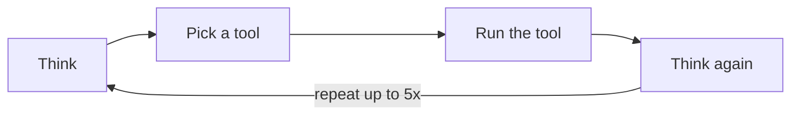
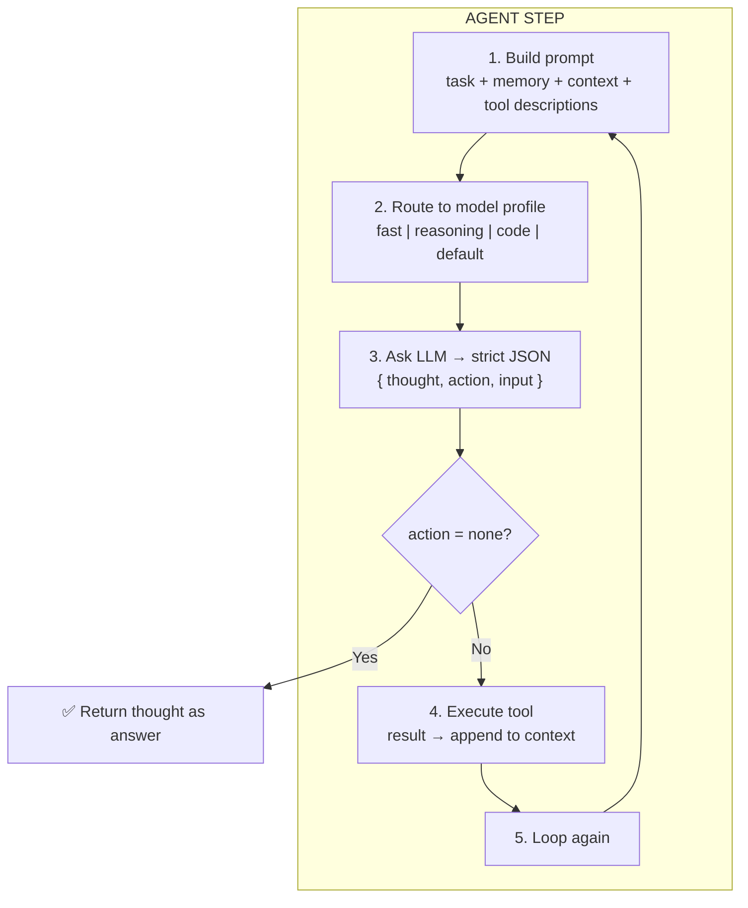
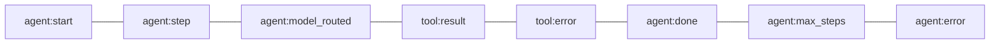
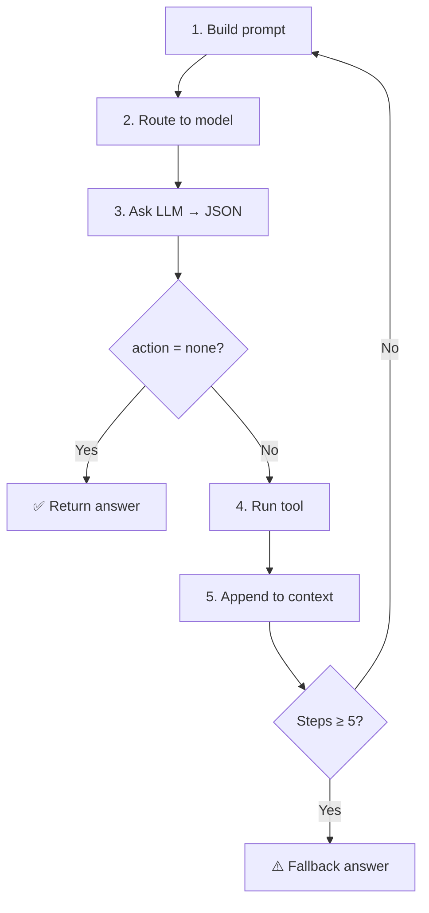

# agent -- The Brain

::: tip TL;DR
The orchestration loop — builds prompt, routes to model, asks LLM, runs tool, repeats up to 5 times.
:::

## What

The agent is the orchestration loop. It makes decisions in a loop and routes each step to the most appropriate [model profile](/glossary#model-profile).

> Think of it as a manager that knows what tools are available, asks "what should I do next?", and delegates the actual work.

## Role



## Where in code

- `packages/agent/agent.ts` -- the loop
- `packages/agent/src/model-router.ts` -- the per-step model selector

---

## Visual: what happens on each loop step



---

## Uses

- `packages/llm` -- sends prompts, gets model responses
- `packages/agent/src/model-router.ts` -- selects model per step
- `packages/memory` -- reads recent/relevant context, saves outcomes
- `packages/tools` -- executes registered tools
- `packages/events` -- emits lifecycle events

---

## Input/Output contract

### Input

A task string from the API:

```
"Read package.json and tell me all npm scripts."
```

### Each LLM step must return strict JSON:

```json
{
    "thought": "I should read package.json to find the scripts.",
    "action": "read_file",
    "input": { "path": "package.json" }
}
```

Or when done:

```json
{
    "thought": "I have all the information to answer.",
    "action": "none",
    "input": {}
}
```

### Output

A final answer string returned to the API caller.

---

## Stop conditions

| Condition             | What happens                                               |
| --------------------- | ---------------------------------------------------------- |
| `action: "none"`      | Task is done -- return the `thought` as the answer         |
| Max steps reached (5) | Return: `"Max steps reached without a conclusive answer."` |
| Unrecoverable error   | Emit `agent:error`, return error message                   |

---

## Events emitted



---

## Concrete example: 2-step run

```
Task: "What TypeScript version does this project use?"

---  Step 1  ---
Prompt: task + [] memory + [] context + tool list
LLM:    { thought: "Check package.json", action: "read_file", input: { path: "package.json" } }
Tool:   read_file -> returns package.json content (includes "typescript": "^5.4.5")
Event:  tool:result
Context appended: [package.json text]

---  Step 2  ---
Prompt: task + [] memory + [package.json text] context + tool list
LLM:    { thought: "I see typescript 5.4.5", action: "none", input: {} }
Event:  agent:done
Answer: "This project uses TypeScript version 5.4.5 (defined in devDependencies)."
```


