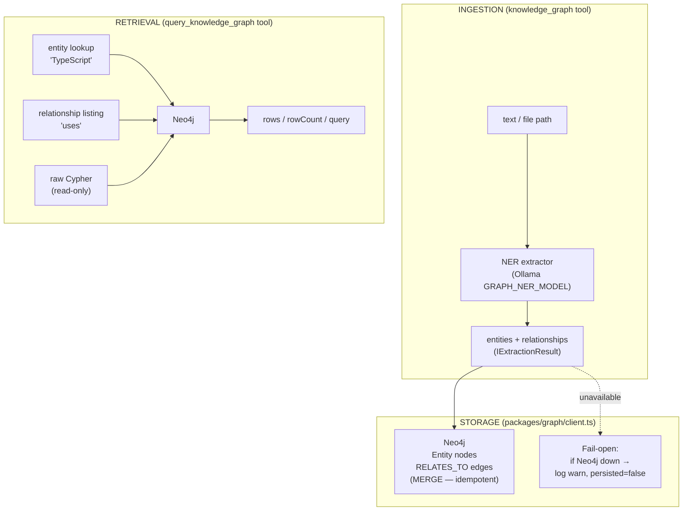
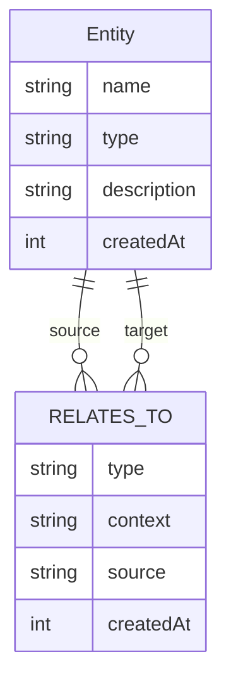

# graph — Knowledge Graph (Neo4j)

::: tip TL;DR
[GraphRAG](/glossary#graphrag) layer: entity/relationship extraction via Ollama [NER](/glossary#ner) → persisted to Neo4j. Two tools: `knowledge_graph` (ingest) and `query_knowledge_graph` (traverse). Fails open — if Neo4j is down, the agent continues uninterrupted.
:::

## What

The knowledge graph is a **complementary retrieval channel** alongside Qdrant vector search and the ring-buffer memory. While Qdrant finds _similar_ text, the knowledge graph finds _related_ entities — enabling multi-hop reasoning such as:

> "What documents mention a concept that TypeScript uses?"

Knowledge is stored in **Neo4j** as typed `Entity` nodes and directed `RELATES_TO` edges. Entities and relationships are extracted from text using a fast Ollama LLM call (the NER extractor in `packages/graph/extractor.ts`).

---

## Architecture



---

## Entity / Relationship Schema



### Entity types

| Type           | Description                                       |
| -------------- | ------------------------------------------------- |
| `Person`       | A named individual (real or fictional)            |
| `Organization` | A company, institution, or team                   |
| `Concept`      | An abstract idea, principle, or theme             |
| `Technology`   | A software tool, language, framework, or protocol |
| `Location`     | A geographic or virtual place                     |
| `Document`     | A file, article, spec, or other artefact          |
| `Topic`        | A high-level subject area or domain               |
| `Other`        | Anything else                                     |

### Relationship types

Relationship types are free-form short strings (e.g. `"uses"`, `"part_of"`, `"authored_by"`, `"related_to"`). The NER model decides these contextually.

---

## Tools

### `knowledge_graph` (write — requires `allowWrite: true`)

Extracts entities and relationships from raw text or a file, then MERGEs them into Neo4j.

```json
{
    "action": "knowledge_graph",
    "input": {
        "text": "TypeScript is a statically typed superset of JavaScript, developed by Microsoft.",
        "sourcePath": "docs/intro.md"
    }
}
```

Response:

```json
{
    "entitiesMerged": 3,
    "relationshipsMerged": 2,
    "persisted": true
}
```

When `persisted` is `false`, Neo4j was unreachable — extraction ran but data was not saved.

---

### `query_knowledge_graph` (read — always available)

Three query modes:

#### Mode 1 — Entity lookup

```json
{
    "action": "query_knowledge_graph",
    "input": { "entity": "TypeScript" }
}
```

Returns the node and all its outgoing `RELATES_TO` edges.

#### Mode 2 — Relationship listing

```json
{
    "action": "query_knowledge_graph",
    "input": { "relationship": "uses", "limit": 10 }
}
```

Returns all `(from)–[uses]→(to)` pairs.

#### Mode 3 — Raw read-only Cypher

```json
{
    "action": "query_knowledge_graph",
    "input": {
        "cypher": "MATCH (a:Entity { type: 'Technology' })-[r:RELATES_TO]->(b) RETURN a.name, r.type, b.name LIMIT 20"
    }
}
```

Write operations (`CREATE`, `MERGE`, `DELETE`, `SET`, `REMOVE`, `DROP`) are blocked; the tool returns a `warning` field instead.

---

## Example query chains

### Chain 1 — "What documents mention a concept related to TypeScript?"

This chain demonstrates multi-hop reasoning: find a technology, walk its relationships, then surface source documents.

```cypher
// Step 1: find TypeScript and its directly related concepts
MATCH (ts:Entity { name: "TypeScript" })-[:RELATES_TO]->(related:Entity { type: "Concept" })
RETURN related.name AS concept

// Step 2: find documents that MENTION those concepts
MATCH (doc:Entity { type: "Document" })-[:RELATES_TO]->(concept:Entity)
WHERE concept.name IN ["static typing", "type safety"]
RETURN doc.name AS document, collect(concept.name) AS relatedConcepts
```

**Agent benefit**: links documents to conceptual topics without requiring a keyword match — works even when the document never uses the exact phrase "TypeScript".

---

### Chain 2 — "Who are the key people related to a given organization?"

```cypher
// Step 1: find the organization
MATCH (org:Entity { name: "Microsoft", type: "Organization" })
      -[:RELATES_TO]-(person:Entity { type: "Person" })
RETURN person.name AS person, person.description AS role

// Step 2: find what technologies those people authored or use
MATCH (person:Entity { type: "Person" })-[r:RELATES_TO]->(tech:Entity { type: "Technology" })
WHERE person.name IN ["Anders Hejlsberg"]
RETURN person.name, r.type AS relationship, tech.name AS technology
```

**Agent benefit**: surfaces the human network behind a technology stack — useful for understanding ownership, expertise, and historical context when navigating a codebase or research corpus.

---

## When to use graph traversal vs vector search

| Use case                                 | Best tool                               |
| ---------------------------------------- | --------------------------------------- |
| "Find documents similar to this text"    | `semantic_search` (Qdrant)              |
| "What is X related to?"                  | `query_knowledge_graph` (Neo4j)         |
| "List all entities of type Technology"   | `query_knowledge_graph` ([Cypher](/glossary#cypher))        |
| "Find everything about a topic"          | Both — combine semantic + graph results |
| "Multi-hop: A relates to B relates to C" | `query_knowledge_graph` (Cypher)        |
| "Recall what I did in a past run"        | Memory ring buffer / Qdrant             |

---

## Configuration

| Variable          | Default                 | Description                        |
| ----------------- | ----------------------- | ---------------------------------- |
| `NEO4J_URI`       | `bolt://localhost:7687` | Neo4j Bolt endpoint                |
| `NEO4J_USER`      | `neo4j`                 | Neo4j username                     |
| `NEO4J_PASSWORD`  | `manna`                 | Neo4j password                     |
| `NEO4J_DATABASE`  | `neo4j`                 | Neo4j database name                |
| `GRAPH_NER_MODEL` | `AGENT_MODEL_FAST`      | Ollama model for entity extraction |

---

## Fail-open guarantees

- If Neo4j is unreachable, `knowledge_graph` logs a warning and returns `persisted: false`.
- If Neo4j is unreachable, `query_knowledge_graph` returns `{ rows: [], warning: "..." }`.
- Neither tool throws; the agent loop continues normally.
- Document ingestion (`document_ingest`) is **not** affected by Neo4j availability.

---

## Starting Neo4j locally

Neo4j is included in `docker-compose.yml`:

```bash
docker compose up neo4j -d
```

The Neo4j Browser UI is available at [http://localhost:7474](http://localhost:7474) once the container is healthy. Use credentials `neo4j` / `manna` (or whatever you set in `.env`).
