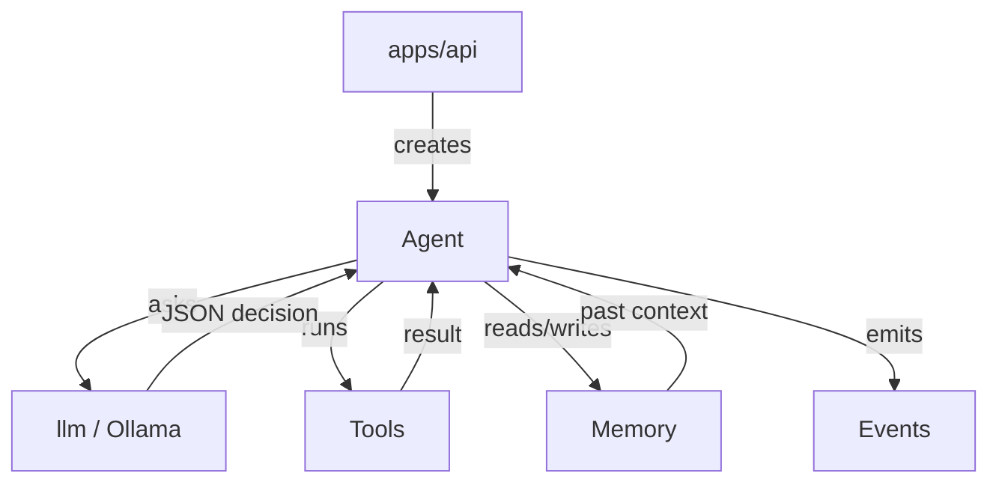

# Packages Overview

::: tip TL;DR
5 packages: agent (loop), llm (Ollama), memory (Qdrant + buffer), events (pub/sub), tools (actions). API wires them together.
:::

The API app wires small focused packages. Each package has a single responsibility.

---

## Fast mental map

```text
                          ┌────────────────┐
  POST /run  -----------> │   apps/api     │
  { task: "..." }         └───────┬────────┘
                                  |
                     creates and wires:
                                  |
          ┌───────────────────────┼───────────────────────┐
          |                       |                       |
    ┌─────v──────┐         ┌──────v──────┐        ┌──────v──────┐
    │   agent    │         │   memory    │        │   events    │
    │  (loop)    │         │  (context)  │        │   (logs)    │
    └─────┬──────┘         └─────────────┘        └─────────────┘
          |
    ┌─────v──────┐
    │    llm     │  <-- agent asks llm what to do
    │  (Ollama)  │
    └────────────┘
          |
    ┌─────v──────┐
    │   tools    │  <-- agent runs tools
    │  (actions) │
    └────────────┘
```

---

## Package descriptions

### `agent` -- The Brain

Makes decisions in a loop. For each step: builds a prompt, routes to a model, asks LLM, runs the chosen tool, repeats.

**Role**: orchestration  
**Key method**: `agent.run(task) -> Promise<string>`  
[Full docs ->](/packages/agent)

---

### `llm` -- Model Connection

Thin HTTP wrapper around Ollama. Sends prompts, gets text responses.

**Role**: model I/O  
**Key method**: `llm.generate(prompt, options) -> Promise<string>`  
[Full docs ->](/packages/llm)

---

### `memory` -- Short-term Storage

Hybrid memory: local ring buffer (20 entries) + Qdrant semantic vector search.

**Role**: context continuity across runs  
**Key methods**: `addMemory(entry)`, `getMemory(query, n)`  
[Full docs ->](/packages/memory)

---

### `events` -- Notification System

In-process pub/sub bus. Components emit events; API subscribes for logging.

**Role**: observability and loose coupling  
**Key methods**: `on(type, handler)`, `emit(event)`, `off(type, handler)`  
[Full docs ->](/packages/events)

---

### `tools` -- The Toolbox

All the actions the agent can take. Each tool is `{ name, description, execute(input) }`.

**Role**: real-world execution (files, shell, DB, browser, etc.)  
[Full docs ->](/packages/tools/)

---

## How they interact (sequence for one run)

```
1. API receives POST /run { task: "List npm scripts" }
2. API creates: agent(llm, memory, tools, events)
3. API subscribes: events.on("*", logger.info)

4. agent.run(task):
   a. events.emit(agent:start)
   b. context = memory.getMemory(task)
   c. prompt = build(task, context, tools)
   d. profile = router.route(task)
   e. response = llm.generate(prompt, { model: profile.model })
   f. { action, input } = JSON.parse(response)
   g. result = tools[action].execute(input)
   h. events.emit(tool:result)
   i. context.append(result)
   j. repeat b-i until action:"none" or max steps

5. memory.addMemory({ task, result: finalAnswer })
6. events.emit(agent:done)
7. API returns finalAnswer
```

---

## Package pages

- [agent -- The Brain](/packages/agent)
- [llm -- Model Connection](/packages/llm)
- [memory -- Short-term Storage](/packages/memory)
- [events -- Notifications](/packages/events)
- [tools -- Toolbox](/packages/tools/)


