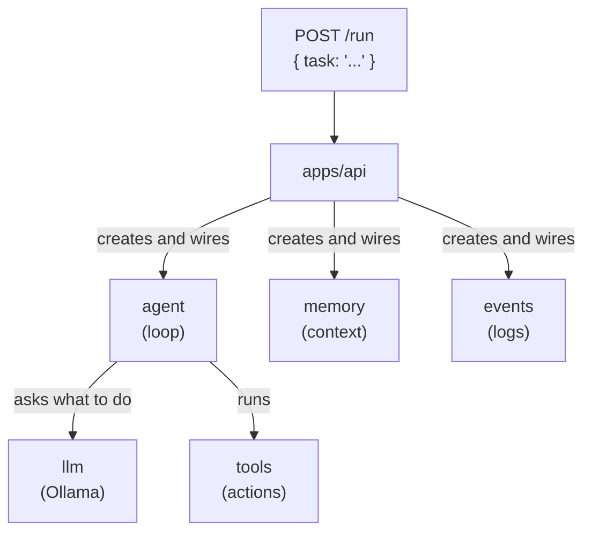
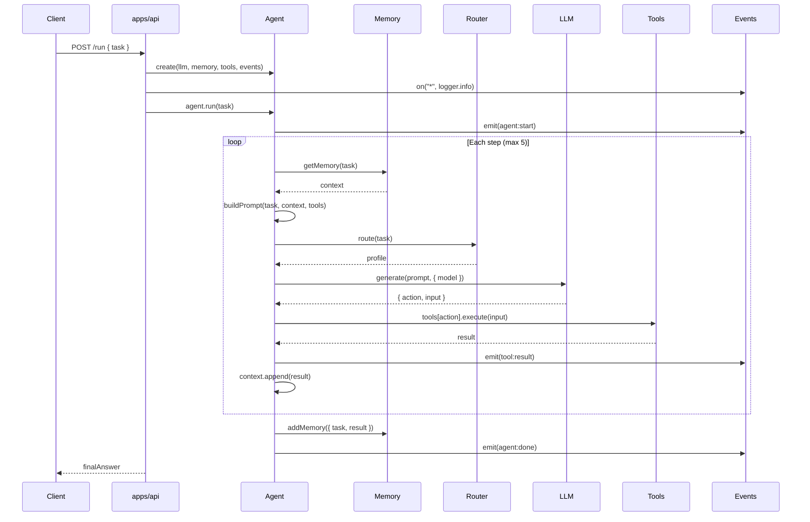
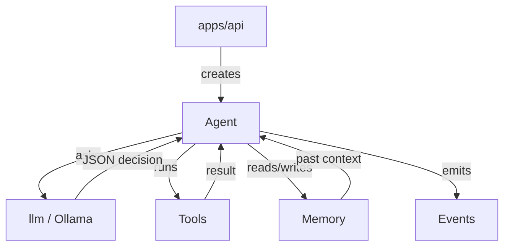

# Packages Overview

::: tip TL;DR
5 packages: agent (loop), llm (Ollama), memory (Qdrant + buffer), events (pub/sub), tools (actions). API wires them together.
:::

The API app wires small focused packages. Each package has a single responsibility.

---

## Fast mental map

---

## Package descriptions

### `agent` -- The Brain

Makes decisions in a loop. For each step: builds a prompt, routes to a model, asks LLM, runs the chosen tool, repeats.

**Role**: orchestration  
**Key method**: `agent.run(task) -> Promise<string>`  
[Full docs ->](/packages/agent)

---

### `orchestrator` -- LangGraph Swarm

Coordinates multiple `Agent` instances to solve a complex task via a LangGraph state machine.
Supports cyclic review→retry workflows. Replaces the legacy `SwarmOrchestrator`.

**Role**: multi-agent swarm orchestration  
**Key method**: `orchestrator.run(task, config) -> Promise<ISwarmResult>`  
[Full docs ->](/packages/orchestrator)

---

### `llm` -- Model Connection

Thin HTTP wrapper around Ollama. Sends prompts, gets text responses.

**Role**: model I/O  
**Key method**: `llm.generate(prompt, options) -> Promise<string>`  
[Full docs ->](/packages/llm)

---

### `memory` -- Short-term Storage

Hybrid memory: local ring buffer (20 entries) + Qdrant semantic vector search.

**Role**: context continuity across runs  
**Key methods**: `addMemory(entry)`, `getMemory(query, n)`  
[Full docs ->](/packages/memory)

---

### `events` -- Notification System

In-process pub/sub bus. Components emit events; API subscribes for logging.

**Role**: observability and loose coupling  
**Key methods**: `on(type, handler)`, `emit(event)`, `off(type, handler)`  
[Full docs ->](/packages/events)

---

### `tools` -- The Toolbox

All the actions the agent can take. Each tool is `{ name, description, execute(input) }`.

**Role**: real-world execution (files, shell, DB, browser, etc.)  
[Full docs ->](/packages/tools/)

---

## How they interact (sequence for one run)

---

## Package pages

- [agent -- The Brain](/packages/agent)
- [orchestrator -- LangGraph Swarm](/packages/orchestrator)
- [llm -- Model Connection](/packages/llm)
- [memory -- Short-term Storage](/packages/memory)
- [events -- Notifications](/packages/events)
- [tools -- Toolbox](/packages/tools/)

