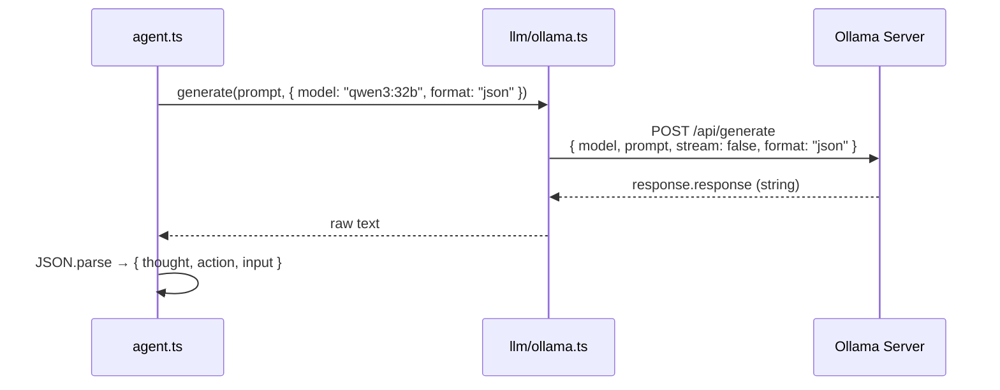
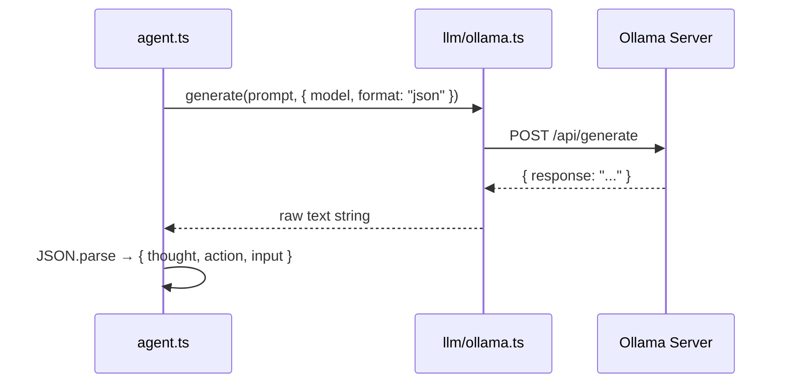

# llm -- The AI Model Connection

::: tip TL;DR
Thin HTTP wrapper around [Ollama](/glossary#ollama). Sends prompts, gets text. Forces [JSON](/glossary#json-contract) format for reliable parsing.
:::

## What

Talks to Ollama via HTTP. Sends a prompt and gets a model response.

> Think of it as a very thin phone call wrapper: you dial the prompt in, Ollama answers with text.

## Why simple matters

This package is intentionally thin. It keeps model I/O isolated so the rest of the system stays clean.

- Agent does not know about HTTP
- Tools do not know about models
- Only `llm` knows how to talk to Ollama

---

## Visual: what happens when generate() is called



---

## API

```typescript
generate(prompt: string, options?: GenerateOptions): Promise<string>
```

### Options

| Option   | Type               | Default                         | Description                                 |
| -------- | ------------------ | ------------------------------- | ------------------------------------------- |
| `model`  | string             | `OLLAMA_MODEL` or `llama3.1:8b` | Which model to use                          |
| `stream` | boolean            | `false`                         | Stream tokens as they arrive                |
| `suffix` | string             | --                              | For fill-in-the-middle / infill completions |
| `system` | string             | --                              | System prompt override                      |
| `format` | `"json"` or schema | --                              | Force JSON output                           |
| `images` | string[]           | --                              | Base64 images for multimodal models         |

### format: "json" -- why it matters

Without format:

```
Model might respond: "Sure! The result is: { action: read_file, ... } hope that helps!"
```

With `format: "json"`:

```
Model must respond: { "action": "read_file", ... }
```

The agent always uses `format: "json"` to get clean, parseable responses.

---

## Environment variables

| Variable          | Default                  | Description                       |
| ----------------- | ------------------------ | --------------------------------- |
| `OLLAMA_BASE_URL` | `http://localhost:11434` | Ollama server URL                 |
| `OLLAMA_MODEL`    | `llama3.1:8b`            | Default model when none specified |

---

## Real-life examples

### Standard agent call (JSON decision)

```typescript
const response = await llm.generate(
    'Given this task and context, what should I do next? Return JSON.',
    {
        model: 'qwen3:32b',
        format: 'json'
    }
);
// response: '{"thought":"...","action":"read_file","input":{"path":"package.json"}}'
```

### Vision call (multimodal)

```typescript
const response = await llm.generate('Describe this image.', {
    model: 'llava-llama3',
    images: [base64EncodedImageString]
});
// response: "The image shows a coastal scene with..."
```

### Code infill (fill-in-the-middle)

```typescript
const response = await llm.generate(
    'function add(a, b) {', // prefix
    {
        model: 'starcoder2',
        suffix: '}' // suffix -- model fills the middle
    }
);
// response: "  return a + b;\n"
```

---

## Where in code

- `packages/llm/ollama.ts`


