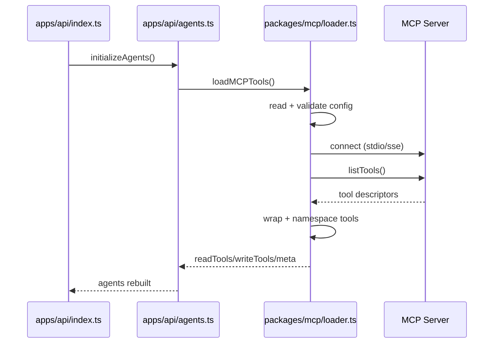
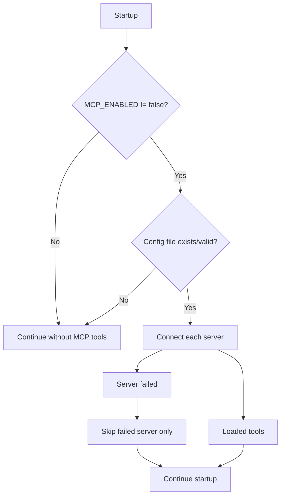

# MCP in Manna: Setup, Use, and Examples

::: tip TL;DR
Add servers to `data/mcp-servers.json`, restart API, and MCP tools appear automatically as `mcp_{server}__{tool}`.
:::

## 30-second setup checklist

- [ ] Create `<project-root>/data/mcp-servers.json`
- [ ] Add at least one server entry
- [ ] Set any required environment variables/tokens
- [ ] Start/restart API
- [ ] Call `POST /run` and ask for an MCP-backed action

---

## File locations

- Runtime config: `data/mcp-servers.json` (gitignored)
- Example config: `data/mcp-servers.json.example`
- Loader code: `packages/mcp/loader.ts`
- Startup integration: `apps/api/agents.ts`

---

## Minimal config example

```json
{
    "servers": [
        {
            "name": "github",
            "transport": "stdio",
            "command": "npx",
            "args": ["-y", "@modelcontextprotocol/server-github"],
            "env": {
                "GITHUB_PERSONAL_ACCESS_TOKEN": "${GITHUB_TOKEN}"
            }
        }
    ]
}
```

---

## Startup flow in Manna



---

## How tool naming works

Manna prefixes every MCP tool to avoid collisions:

```text
mcp_{serverName}__{originalToolName}
```

Examples:

- `mcp_github__create_issue`
- `mcp_github__list_pull_requests`
- `mcp_filesystem__read_file`

Descriptions are also prefixed:

```text
[MCP:{server}] {original description}
```

---

## Environment variables

| Variable                 | Default                 | What it does                                      |
| ------------------------ | ----------------------- | ------------------------------------------------- |
| `MCP_ENABLED`            | `true`                  | Global kill switch (`false` disables MCP loading) |
| `MCP_CONFIG_PATH`        | `data/mcp-servers.json` | Config path override                              |
| `MCP_CONNECT_TIMEOUT_MS` | `5000`                  | Connect/list/call timeout per server              |

---

## Real examples you can try

### Example 1 — GitHub issue creation (write-enabled)

Prompt:

```text
Create a GitHub issue titled "Bug: API timeout" with body "Intermittent timeout in /run route".
```

Likely MCP tool:

```text
mcp_github__create_issue
```

### Example 2 — GitHub PR listing (read-only)

Prompt:

```text
List open pull requests in Guebbit/manna and summarize their titles.
```

Likely MCP tool:

```text
mcp_github__list_pull_requests
```

---

## Copy/paste quickstart (3 ready scenarios)

Use these prompts as-is in `POST /run`.

### 1) GitHub scenario

```text
List the 5 most recent open pull requests in Guebbit/manna and return: PR number, title, author, and URL.
```

Expected MCP tool family:

```text
mcp_github__*
```

### 2) Filesystem scenario

```text
Read package.json and tsconfig.json from this repository and summarize the scripts, TypeScript target, and module settings in 6 bullet points.
```

Expected MCP tool family:

```text
mcp_filesystem__*
```

### 3) Browser scenario

```text
Open https://modelcontextprotocol.io and summarize what MCP is in 5 simple bullets for a beginner.
```

Expected MCP tool family:

```text
mcp_browser__*
```

---

## Troubleshooting (fast)

### "No MCP tools loaded"

Check:

1. `MCP_ENABLED` is not `false`
2. config file exists at expected path
3. config JSON is valid
4. server command/URL is reachable

### "Server failed to connect"

Check:

1. `npx` command exists (for stdio servers)
2. tokens/env variables are present
3. timeout is high enough (`MCP_CONNECT_TIMEOUT_MS`)

### "Tool calls time out"

Try:

- increase `MCP_CONNECT_TIMEOUT_MS`
- reduce server load
- verify remote SSE server latency

---

## Safety behavior summary



---

## Good defaults for ADHD workflow

- Keep one server first (GitHub), verify, then add others.
- Use short prompts that explicitly mention desired action.
- Check logs for `mcp_server_connected` and `mcp_server_failed`.
- Avoid debugging 5 servers at once; add one at a time.

---

## Related docs

- [Theory: Model Context Protocol (MCP)](/theory/MCP)
- [Endpoint map](/endpoint-map)
