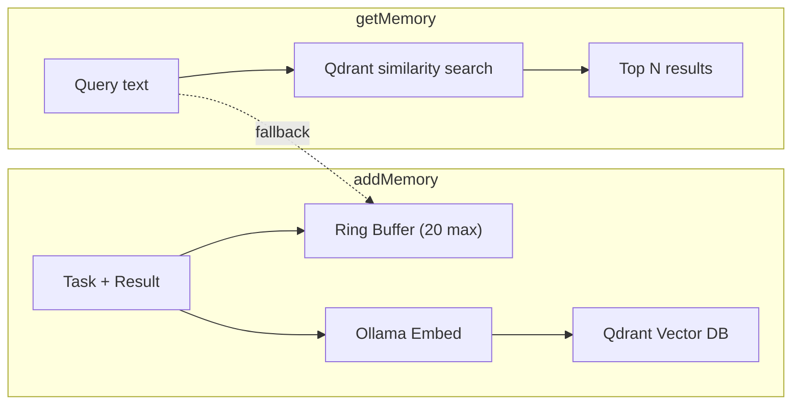

# memory -- Short-term Storage

::: tip TL;DR
Hybrid memory: local ring buffer (20 entries) + Qdrant vector search. Falls back to local-only if Qdrant is down.
:::

## What

Stores recent context with a hybrid strategy so the agent can remember things across runs.

> Think of it as the agent's short-term memory: it remembers what it did recently and can find relevant past results when given a new similar task.

---

## Two-layer architecture

```text
┌──────────────────────────────────────────────────────────┐
│                    MEMORY PACKAGE                        │
│                                                          │
│  ┌────────────────────┐    ┌────────────────────────┐    │
│  │  LOCAL RING BUFFER │    │      QDRANT (vector DB) │    │
│  │                    │    │                         │    │
│  │  Last 20 entries   │    │  All entries embedded   │    │
│  │  (oldest evicted)  │    │  Semantic similarity    │    │
│  │  Always available  │    │  search with Ollama     │    │
│  │                    │    │  embeddings             │    │
│  └────────────────────┘    └────────────────────────┘    │
│                                        |                 │
│              If Qdrant unavailable: falls back to        │
│              local ring buffer only                      │
└──────────────────────────────────────────────────────────┘
```

---

## API

```typescript
addMemory(entry: MemoryEntry): Promise<void>
getMemory(query: string, n?: number): Promise<MemoryEntry[]>
clearMemory(): Promise<void>
```

### addMemory

Called by the agent after a run completes. Saves the task + outcome.

```typescript
await memory.addMemory({
  task: "Read package.json and list npm scripts",
  result: "Found 6 scripts: dev, build, typecheck, lint, docs:dev, docs:build"
});
```

Both stores are updated:
1. Ring buffer: prepend, evict oldest if > 20
2. Qdrant: embed the entry with Ollama, store vector + text

### getMemory

Called by the agent when building a prompt. Retrieves relevant past entries.

```typescript
const memories = await memory.getMemory("npm scripts configuration", 5);
// Returns up to 5 entries semantically similar to the query
```

What Qdrant does:
1. Embed the query with Ollama (`OLLAMA_EMBED_MODEL`)
2. Find the closest stored vectors (cosine similarity)
3. Return top N results

### clearMemory

Clears both the ring buffer and the Qdrant collection.

---

## Why memory helps the agent

### Without memory (cold start every time):

```
Run 1: "What npm scripts exist?" -> reads package.json -> answers
Run 2: "What npm scripts exist?" -> reads package.json again -> answers
```

Every run starts from scratch.

### With memory (warm start):

```
Run 1: "What npm scripts exist?" -> reads package.json -> answers
       -> addMemory({ task, result: "6 scripts: dev, build, ..." })

Run 2: "What build commands are available?"
       -> getMemory("build commands") -> finds Run 1 result
       -> prompt includes: "Previously: npm scripts include dev, build, ..."
       -> agent can answer without re-reading package.json
```

---

## Why memory is capped

Unbounded memory = massive prompts = slower, more expensive, confused model.

Current limits:
- Ring buffer: 20 entries (recency)
- Qdrant recall: top N by similarity (relevance)

This keeps prompts focused and the model sharp.

---

## Environment variables

| Variable | Default | Description |
|---|---|---|
| `QDRANT_URL` | `http://localhost:6333` | Qdrant server URL |
| `QDRANT_COLLECTION` | -- | Collection name (e.g. `agent_memory`) |
| `OLLAMA_EMBED_MODEL` | `nomic-embed-text` | Embedding model |

---

## Setup: starting Qdrant

```bash
docker run -d \
  --name qdrant \
  -p 6333:6333 \
  -v $(pwd)/data/qdrant:/qdrant/storage \
  qdrant/qdrant
```

Then configure:
```bash
export QDRANT_URL="http://localhost:6333"
export QDRANT_COLLECTION="agent_memory"
export OLLAMA_EMBED_MODEL="nomic-embed-text"
```

If Qdrant is not running, the app continues using only the local ring buffer.

---

## Used by

- `packages/agent/agent.ts` -- calls `getMemory` when building prompts, `addMemory` when done

## Where in code

- `packages/memory/memory.ts`


