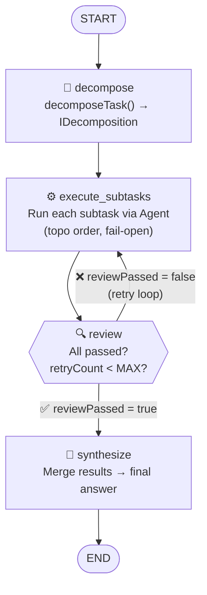

# Orchestrator — LangGraph Swarm State Machine

::: tip TL;DR
LangGraph-powered swarm orchestrator. Decomposes tasks into subtasks, executes them via specialised agents, reviews results, and optionally retries before synthesising a final answer.
:::

## What

The orchestrator coordinates multiple `Agent` instances to solve a complex task collaboratively.
It is implemented as a **LangGraph `StateGraph`** — an explicit, inspectable state machine —
replacing the earlier imperative `SwarmOrchestrator` class.

Key advantages over the legacy orchestrator:

- Graph topology is **explicit and declarative** (nodes + edges).
- **Cyclic review→retry loops** are first-class citizens.
- Future features (human-in-the-loop, checkpointing, streaming steps) are supported by LangGraph's built-in primitives.

---

## Graph topology



---

## Nodes

| Node               | File                             | Responsibility                                                                                            |
| ------------------ | -------------------------------- | --------------------------------------------------------------------------------------------------------- |
| `decompose`        | `packages/orchestrator/nodes.ts` | Calls `decomposeTask()`, emits `swarm:start` + `swarm:decomposed`                                         |
| `execute_subtasks` | `packages/orchestrator/nodes.ts` | Runs each pending subtask in topological order via a fresh `Agent`; on retry re-runs only failed subtasks |
| `review`           | `packages/orchestrator/nodes.ts` | Checks success rate; triggers retry if failures exist and retries remain; sets `reviewPassed`             |
| `synthesize`       | `packages/orchestrator/nodes.ts` | Merges all subtask results into a final answer via a single LLM call; emits `swarm:done`                  |

---

## State

Defined in `packages/orchestrator/state.ts` using `Annotation.Root()`:

```typescript
{
  task: string;              // original user task
  config: ISwarmConfig;      // maxSubtasks, allowWrite, profileOverride
  decomposition?: IDecomposition; // plan produced by decompose node
  subtaskResults: ISubtaskResult[]; // accumulated results (including retries)
  answer: string;            // final synthesised answer
  retryCount: number;        // number of review→retry cycles so far
  reviewPassed: boolean;     // whether latest review approved the results
  startTime: Date;           // wall-clock start; used for totalDurationMs
  totalDurationMs: number;   // set by synthesize node
}
```

---

## Review & retry behaviour

The `review` node applies the following decision logic:

1. **All subtasks succeeded** → `reviewPassed = true`, proceed to `synthesize`.
2. **Some subtasks failed AND `retryCount < SWARM_MAX_REVIEW_RETRIES`** → `reviewPassed = false`, `retryCount++`, loop back to `execute_subtasks` (only failed subtasks are re-run).
3. **Retries exhausted** → `reviewPassed = true` (force synthesis with partial results).

> **TODO — Human-in-the-loop**: A future PR can wire a LangGraph `interrupt()` call inside the `review` node to pause the graph and await human approval before deciding whether to retry or proceed. This is a built-in LangGraph primitive — no structural changes to the graph are needed.

Control the retry limit:

```sh
SWARM_MAX_REVIEW_RETRIES=2   # default: 1
```

---

## Usage

```typescript
import { LangGraphSwarmOrchestrator } from './packages/orchestrator/graph';

const orchestrator = new LangGraphSwarmOrchestrator(tools, processors);
const result = await orchestrator.run('Build a REST API with auth and tests', {
    maxSubtasks: 5,
    allowWrite: false
});
// result: { answer, subtaskResults, totalDurationMs, decomposition }
```

---

## API endpoints (unchanged)

The endpoints are **backward-compatible** — no request or response shape changes.

| Endpoint                 | Purpose                                   |
| ------------------------ | ----------------------------------------- |
| `POST /run/swarm`        | Run swarm, return final JSON result       |
| `POST /run/swarm/stream` | Run swarm, stream lifecycle events as SSE |

---

## Events emitted

| Event                 | Emitted by              | Payload                                 |
| --------------------- | ----------------------- | --------------------------------------- |
| `swarm:start`         | `decompose` node        | `{ task }`                              |
| `swarm:decomposed`    | `decompose` node        | `{ subtaskCount, reasoning, subtasks }` |
| `swarm:subtask_start` | `execute_subtasks` node | `{ subtaskId, profile }`                |
| `swarm:subtask_done`  | `execute_subtasks` node | `{ subtaskId, durationMs }`             |
| `swarm:subtask_error` | `execute_subtasks` node | `{ subtaskId, error }`                  |
| `swarm:done`          | `synthesize` node       | `{ answer, totalDurationMs }`           |

---

## Environment variables

| Variable                   | Default                 | Effect                                           |
| -------------------------- | ----------------------- | ------------------------------------------------ |
| `SWARM_MAX_REVIEW_RETRIES` | `1`                     | Max review→retry cycles before forcing synthesis |
| `SWARM_DECOMPOSER_MODEL`   | `AGENT_MODEL_REASONING` | LLM for task decomposition                       |
| `SWARM_SYNTHESIS_MODEL`    | `AGENT_MODEL_REASONING` | LLM for final answer synthesis                   |

---

## Files

```
packages/orchestrator/
├── state.ts    — swarmStateAnnotation (LangGraph Annotation.Root)
├── nodes.ts    — createDecomposeNode, createExecuteSubtasksNode,
│                 createReviewNode, createSynthesizeNode, reviewRouter
├── graph.ts    — buildSwarmGraph(), LangGraphSwarmOrchestrator class
└── index.ts    — re-exports all public symbols
```

---

## Migration from legacy SwarmOrchestrator

The legacy `SwarmOrchestrator` in `packages/swarm/orchestrator.ts` is **deprecated** and will be removed in a follow-up PR. It remains for reference only.

**Migration steps**:

```typescript
// Before
import { SwarmOrchestrator } from '../swarm/orchestrator';
const orchestrator = new SwarmOrchestrator(tools, processors);

// After
import { LangGraphSwarmOrchestrator } from '../orchestrator/graph';
const orchestrator = new LangGraphSwarmOrchestrator(tools, processors);
// run() interface is identical — no other changes needed
```

The `apps/api/agents.ts` factory (`createSwarmOrchestrator`) already returns the new orchestrator type. All other modules that call only `orchestrator.run()` are unaffected.

---

## How to add or modify graph nodes

To add a new node (e.g., an `enrich` step between `decompose` and `execute_subtasks`):

1. **Add a node factory** in `packages/orchestrator/nodes.ts`:

```typescript
export function createEnrichNode() {
    return async (state: ISwarmGraphState): Promise<Partial<ISwarmGraphState>> => {
        // ... enrich decomposition with extra context
        return { decomposition: enrichedDecomposition };
    };
}
```

2. **Wire it in** `packages/orchestrator/graph.ts`:

```typescript
const graph = new StateGraph(swarmStateAnnotation)
    .addNode('decompose', createDecomposeNode())
    .addNode('enrich', createEnrichNode()) // ← new
    .addNode('execute_subtasks', createExecuteSubtasksNode(tools, processors))
    // ...
    .addEdge('decompose', 'enrich') // ← new
    .addEdge('enrich', 'execute_subtasks'); // ← new (replaces old edge)
// ...
```

No other changes are needed — the graph is self-contained.
