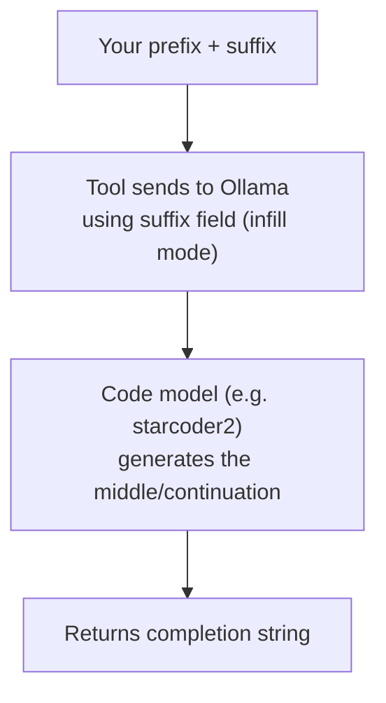

# Tool: `code_autocomplete`

::: tip TL;DR
IDE-style code completion. Sends prefix + suffix to a code model, gets the middle filled in.
:::

## What it does in plain English

> "I am typing code and my cursor is here — continue this for me."

This is the same concept as GitHub Copilot's inline completion: you give it what you have typed so far (`prefix`) and optionally what comes after the cursor (`suffix`), and it generates the most likely code continuation.

Unlike the agent loop, this tool is designed to be **fast and low-latency** — it is called from the `/autocomplete` endpoint directly, without going through the full agentic loop.

## Input

```json
{
    "prefix": "code before cursor",
    "suffix": "optional code after cursor",
    "language": "optional language hint",
    "model": "optional"
}
```

| Field      | Required | Default                                              | Notes                                                       |
| ---------- | -------- | ---------------------------------------------------- | ----------------------------------------------------------- |
| `prefix`   | ✅       | —                                                    | Everything typed before the cursor                          |
| `suffix`   | ❌       | —                                                    | Everything after the cursor (fill-in-the-middle)            |
| `language` | ❌       | —                                                    | Hint like `"typescript"`, `"python"` for better suggestions |
| `model`    | ❌       | `TOOL_IDE_MODEL` → `AGENT_MODEL_CODE` → `starcoder2` | Override completion model                                   |

## Output

The completed/suggested code as a plain string.

```typescript
// prefix: "function add(a: number, b: number) {"
// output:
  return a + b;
}
```

## How it works internally



## Model defaults (priority order)

1. `model` field in input (explicit override)
2. `TOOL_IDE_MODEL` env var
3. `AGENT_MODEL_CODE` env var
4. `starcoder2` (hardcoded fallback)

## Runtime option env vars

| Variable                  | Default      | Description                                                           |
| ------------------------- | ------------ | --------------------------------------------------------------------- |
| `TOOL_IDE_MODEL`          | `starcoder2` | Code completion model                                                 |
| `TOOL_IDE_TEMPERATURE`    | `0.1`        | Sampling temperature — very low for deterministic completions         |
| `TOOL_IDE_TOP_P`          | `0.7`        | Nucleus sampling probability                                          |
| `TOOL_IDE_TOP_K`          | `10`         | Top-K token candidates — narrow for code precision                    |
| `TOOL_IDE_NUM_CTX`        | `8192`       | Context window size (tokens) — large to accommodate full file context |
| `TOOL_IDE_REPEAT_PENALTY` | `1.2`        | Repetition penalty                                                    |

These defaults are tuned for precise, cursor-time code completion: very low temperature and narrow sampling ensure the model picks the most likely correct token rather than exploring alternatives.

## Real-life use cases

### Use case 1 -- Complete a function signature

You are typing a TypeScript function and want the body filled in.

**Request to `/autocomplete`:**

```json
{
    "prefix": "function calculateTax(income: number, rate: number) {",
    "suffix": "}",
    "language": "typescript"
}
```

**Response:**

```typescript
return income * (rate / 100);
```

---

### Use case 2 -- Fill in the middle (infill mode)

You have the start and end of a function but the middle is missing.

```json
{
    "prefix": "async function fetchUser(id: string) {\n  const response = await fetch(",
    "suffix": "\n  return response.json();\n}",
    "language": "typescript"
}
```

Model fills in the URL argument.

---

### Use case 3 -- Complete a class method

```json
{
    "prefix": "class EventBus {\n  private handlers: Map<string, Function[]> = new Map();\n\n  on(type: string, handler: Function) {",
    "language": "typescript"
}
```

Model suggests the method body.

---

### Use case 4 -- Complete a SQL query

```json
{
    "prefix": "SELECT u.id, u.name, COUNT(o.id) as order_count\nFROM users u\nLEFT JOIN orders o ON",
    "language": "sql"
}
```

---

## Calling the endpoint directly (no agent loop)

```bash
curl -X POST http://localhost:3001/autocomplete \
  -H "Content-Type: application/json" \
  -d '{
    "prefix": "function add(a, b) {",
    "suffix": "}",
    "language": "javascript"
  }'
```

This is **separate from `/run`** and does not involve the agentic loop — it is optimised for fast, cursor-time responses.

## Good test prompts (via `/run`)

| What you type                                                       | What the agent does     |
| ------------------------------------------------------------------- | ----------------------- |
| `Complete this function: function multiply(a: number, b: number) {` | Returns completion      |
| `Suggest the next line after: const result = await db.query(`       | Returns likely argument |
