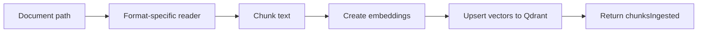

# Tool: `document_ingest`

::: tip TL;DR
Ingests local documents into Qdrant: detect format → extract text → chunk → embed → upsert vectors.
:::

## At a glance

- **Input:** `{ "path": "docs/spec.md", "collection": "agent_memory" }`
- **Output:** `{ chunksIngested, collection }`
- **When to use:** preload documentation so `semantic_search` can retrieve it later.

## Purpose

Convert document files into retrievable vector memory.

## Input

```json
{ "path": "data/library/guide.docx", "collection": "docs" }
```

Supported file types: `.txt`, `.md`, `.json`, `.html/.htm`, `.csv`, `.docx`.

## Output

```json
{ "chunksIngested": 37, "collection": "docs" }
```

## Safety

- **Write tool**: available only when `allowWrite: true`.
- File path is resolved with project-root safety checks.
- Writes only to configured Qdrant collections (no source-code mutation).

## Environment variables

| Variable             | Default                  | Description        |
| -------------------- | ------------------------ | ------------------ |
| `QDRANT_URL`         | `http://localhost:6333`  | Qdrant endpoint    |
| `QDRANT_COLLECTION`  | `agent_memory`           | Default collection |
| `OLLAMA_BASE_URL`    | `http://localhost:11434` | Embedding backend  |
| `OLLAMA_EMBED_MODEL` | `nomic-embed-text`       | Embedding model    |

## How the agent uses it



## Good test prompts

| What you type                                              | What the agent does                        |
| ---------------------------------------------------------- | ------------------------------------------ |
| `Ingest docs/architecture.md into collection engineering.` | Calls `document_ingest`                    |
| `Load data/contracts/*.docx so we can search later.`       | Ingests docs before retrieval tasks        |
| `Index this CSV and then answer questions from it.`        | Uses `document_ingest` + `semantic_search` |

## Further reading

- [Qdrant docs](https://qdrant.tech/documentation/)
- [RAG theory](/theory/RAG)

## Related

- [semantic_search](/packages/tools/semantic-search)
- [knowledge_graph](/packages/tools/knowledge-graph)
- [Library Ingestion](/library-ingestion)
- [Embedding](/glossary#embedding)
