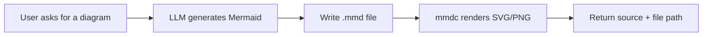

# Tool: `generate_diagram`

::: tip TL;DR
Generates Mermaid from a description, then renders it to SVG/PNG with Mermaid CLI (`mmdc`).
:::

## At a glance

- **Input:** `{ "description": "...", "type": "flowchart", "format": "svg" }`
- **Output:** `{ mermaidSource, outputPath, format }`
- **When to use:** quickly create architecture/flow diagrams from natural language.

## Purpose

Automate diagram creation from textual descriptions.

## Input

```json
{
    "description": "API receives request, validates input, stores in DB, returns response",
    "type": "flowchart",
    "format": "svg"
}
```

## Output

```json
{
    "mermaidSource": "flowchart LR\nA[Request] --> B[Validate] --> C[Store] --> D[Respond]",
    "outputPath": "/repo/data/diagrams/diagram-1715980800000.svg",
    "format": "svg"
}
```

## Safety

- Diagram files are written only to `DIAGRAM_OUTPUT_DIR`.
- Rendering failures return explicit errors (for invalid Mermaid, missing CLI, etc.).

## Environment variables

| Variable             | Default                 | Description                                  |
| -------------------- | ----------------------- | -------------------------------------------- |
| `TOOL_DIAGRAM_MODEL` | resolved `code` profile | Model used to produce Mermaid markup         |
| `DIAGRAM_OUTPUT_DIR` | `data/diagrams`         | Output folder for `.mmd` + rendered diagrams |

## How the agent uses it



## Good test prompts

| What you type                                     | What the agent does                       |
| ------------------------------------------------- | ----------------------------------------- |
| `Create a sequence diagram for login with MFA.`   | Builds Mermaid sequence and renders image |
| `Generate an ER diagram for users/orders schema.` | Produces `erDiagram` and output file      |
| `Draw a deployment flowchart and save as PNG.`    | Uses `format: "png"`                      |

## Further reading

- [Mermaid docs](https://mermaid.js.org/)
- [Mermaid Live Editor](https://mermaid.live/)
- [Mermaid CLI (`mmdc`)](https://github.com/mermaid-js/mermaid-cli)

## Related

- [orchestrator](/packages/orchestrator)
- [How It Works (Layered)](/theory/how-it-works-layered)
- [Prompt](/glossary#prompt)
