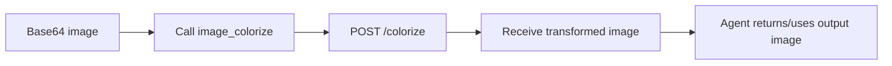

# Tool: `image_colorize`

::: tip TL;DR
Sends a base64 image to the image-processor service (`/colorize`) to produce a colorized version.
:::

## At a glance

- **Input:** `{ image, prompt?, negative_prompt? }`
- **Output:** `{ image, duration_ms, model }`
- **When to use:** colorize grayscale/sketch visuals as part of creative or restoration workflows.

## Purpose

Generate a colorized version of an input image via the external image processor.

## Input

```json
{
    "image": "<base64>",
    "prompt": "natural daylight colors"
}
```

## Output

```json
{
    "image": "<base64>",
    "duration_ms": 1320,
    "model": "sdxl-colorize-v1"
}
```

## Safety

- Tool only calls the configured image-processor endpoint.
- Input/output are data blobs; no filesystem write access.

## Environment variables

| Variable              | Default                                   | Description                          |
| --------------------- | ----------------------------------------- | ------------------------------------ |
| `IMAGE_PROCESSOR_URL` | `http://localhost:3002` (service default) | Base URL for image processor service |

## How the agent uses it



## Good test prompts

| What you type                             | What the agent does                      |
| ----------------------------------------- | ---------------------------------------- |
| `Colorize this scanned grayscale sketch.` | Calls `image_colorize` with base64 image |
| `Make it warm and cinematic.`             | Passes style hint in `prompt`            |

## Related

- [image_sketch](/packages/tools/image-sketch)
- [image_classify](/packages/tools/image-classify)
- [Vision](/scenarios/vision-classification)
