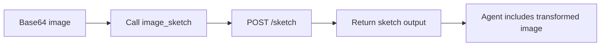

# Tool: `image_sketch`

::: tip TL;DR
Sends a base64 image to the image-processor service (`/sketch`) to produce line-art/sketch output.
:::

## At a glance

- **Input:** `{ image, prompt?, negative_prompt? }`
- **Output:** `{ image, duration_ms, model }`
- **When to use:** simplify visuals into sketches for ideation or preprocessing.

## Purpose

Generate a sketch/ink-style transformation of an image.

## Input

```json
{
    "image": "<base64>",
    "prompt": "clean line art"
}
```

## Output

```json
{
    "image": "<base64>",
    "duration_ms": 980,
    "model": "sketch-model-v1"
}
```

## Safety

- Restricted to the configured image-processor service.
- No shell/database/filesystem write access.

## Environment variables

| Variable              | Default                                   | Description                          |
| --------------------- | ----------------------------------------- | ------------------------------------ |
| `IMAGE_PROCESSOR_URL` | `http://localhost:3002` (service default) | Base URL for image processor service |

## How the agent uses it



## Good test prompts

| What you type                                 | What the agent does     |
| --------------------------------------------- | ----------------------- |
| `Turn this product photo into line-art.`      | Calls `image_sketch`    |
| `Keep strong edges, remove background noise.` | Uses prompt constraints |

## Related

- [image_colorize](/packages/tools/image-colorize)
- [generate_diagram](/packages/tools/generate-diagram)
- [Vision](/scenarios/vision-classification)
