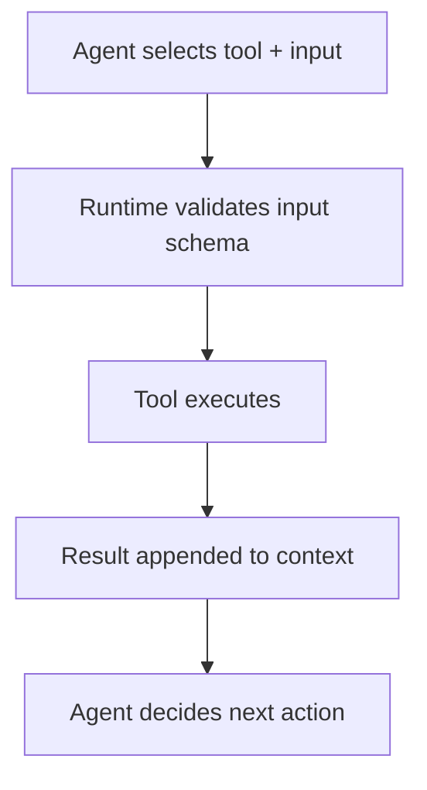

# tools — The Toolbox

::: tip TL;DR
25+ tools power the agent. Most are read-only by default; write tools require `allowWrite: true`.
:::

## What

Tools are how the agent takes action in the real world: reading files, querying data, rendering diagrams, browsing web pages, and writing generated outputs.

## Role



## Tool contract (`createTool`)

Runtime tools are built with `createTool({ id, description, inputSchema, execute })`.

```typescript
{
  id: string;
  description: string;
  inputSchema?: z.ZodType;
  execute(input): Promise<unknown>;
}
```

- `id` becomes the tool name shown to the model.
- `description` is prompt-visible and strongly impacts tool selection.
- `inputSchema` (Zod) validates LLM input before execution.
- `execute` performs the real operation.

Further reading: [Zod documentation](https://zod.dev/)

## Which tools are available by default

```text
Always enabled (read-only, safe by default):
  read_file              read files inside project root
  read_csv               parse delimited text files
  read_json              read/parse JSON files
  read_markdown          read markdown files
  read_html              extract text/title from local HTML
  read_docx              extract text from .docx files
  shell                  run allowlisted shell commands
  mysql_query            run read-only SELECT queries against MySQL
  pg_query               run read-only SELECT queries against PostgreSQL
  mongo_query            run read-only find/aggregate against MongoDB
  browser_fetch          fetch and summarise web pages with headless browser
  image_classify         classify/describe images (vision model)
  image_sketch           transform image to line-art/sketch
  image_colorize         colorize grayscale/sketch images
  semantic_search        rank files/text by semantic similarity
  speech_to_text         transcribe audio files
  read_pdf               extract text from PDF files
  code_autocomplete      generate IDE-style code completions
  generate_diagram       produce Mermaid + rendered diagram image
  query_knowledge_graph  read/traverse Neo4j graph memory

Only enabled when allowWrite: true:
  write_file             write files to generated-projects root
  scaffold_project       copy boilerplate template to generated-projects
  document_ingest        chunk+embed docs into Qdrant vector store
  knowledge_graph        extract entities/relations and persist to Neo4j
```

::: tip Database tools are conditionally loaded
`mysql_query`, `pg_query`, and `mongo_query` are passed to the agent only when relevant env vars are configured (`MYSQL_HOST`, `PG_HOST`, `MONGO_URI`).
:::

## Document readers

| Extension / format             | Tool                                             |
| ------------------------------ | ------------------------------------------------ |
| Any text/source file           | [`read_file`](/packages/tools/read-file)         |
| `.csv`, `.tsv`, delimited text | [`read_csv`](/packages/tools/read-csv)           |
| `.json`                        | [`read_json`](/packages/tools/read-json)         |
| `.md`                          | [`read_markdown`](/packages/tools/read-markdown) |
| `.html`, `.htm`                | [`read_html`](/packages/tools/read-html)         |
| `.docx`                        | [`read_docx`](/packages/tools/read-docx)         |
| `.pdf`                         | [`read_pdf`](/packages/tools/read-pdf)           |

## Tool selection controls in the agent loop

- **Tool reranker** narrows candidate tools with embedding similarity before each step.
- **Tool-call deduplicator** blocks repeated identical tool calls in the same run.
- **Citation buffer** collects retrieval evidence from tools for downstream answers.

See also: [Agent Loop](/theory/agent-loop) · [Error Taxonomy](/theory/error-taxonomy)

## Database adapter abstraction

All SQL/NoSQL query tools share a common base in `base-db-tool.ts`.

- [Database Adapters](/packages/tools/db-adapters)

## Security boundaries (at a glance)

| Tool                          | What it can access                             | What it cannot touch                                            |
| ----------------------------- | ---------------------------------------------- | --------------------------------------------------------------- |
| `read_file` family (`read_*`) | Files under project root                       | Paths outside project root                                      |
| `shell`                       | Allowlisted commands                           | Dangerous/non-allowlisted commands (`rm`, `curl`, `bash`, etc.) |
| `mysql_query` / `pg_query`    | `SELECT` queries                               | Mutating SQL (`INSERT`, `UPDATE`, `DELETE`, `DROP`, ...)        |
| `mongo_query`                 | `find` and `aggregate`                         | Mutating operations                                             |
| `browser_fetch`               | `http(s)` URLs                                 | `file://`, `ftp://`, `javascript:`                              |
| `write_file`                  | Files inside `PROJECT_OUTPUT_ROOT`             | Repository source tree                                          |
| `scaffold_project`            | `BOILERPLATE_ROOT` → `PROJECT_OUTPUT_ROOT`     | Anything outside those roots                                    |
| `document_ingest`             | Vector upserts to configured Qdrant collection | Arbitrary filesystem writes                                     |
| `knowledge_graph`             | Graph writes to configured Neo4j DB            | Filesystem/shell writes                                         |
| `query_knowledge_graph`       | Read-only Cypher traversal                     | Mutating Cypher (`CREATE`, `MERGE`, `DELETE`, `SET`, ...)       |

## Tool pages

### System & codebase

- [read_file](/packages/tools/read-file)
- [shell](/packages/tools/shell)
- [code_autocomplete](/packages/tools/code-autocomplete)
- [generate_diagram](/packages/tools/generate-diagram)

### Document readers

- [read_csv](/packages/tools/read-csv)
- [read_json](/packages/tools/read-json)
- [read_markdown](/packages/tools/read-markdown)
- [read_html](/packages/tools/read-html)
- [read_docx](/packages/tools/read-docx)
- [read_pdf](/packages/tools/read-pdf)

### Database

- [Database Adapters](/packages/tools/db-adapters)
- [mysql_query](/packages/tools/mysql-query)
- [pg_query](/packages/tools/pg-query)
- [mongo_query](/packages/tools/mongo-query)

### Web / vision / audio

- [browser_fetch](/packages/tools/browser-fetch)
- [image_classify](/packages/tools/image-classify)
- [image_sketch](/packages/tools/image-sketch)
- [image_colorize](/packages/tools/image-colorize)
- [speech_to_text](/packages/tools/speech-to-text)

### Retrieval & graph

- [semantic_search](/packages/tools/semantic-search)
- [document_ingest](/packages/tools/document-ingest)
- [knowledge_graph](/packages/tools/knowledge-graph)
- [query_knowledge_graph](/packages/tools/query-knowledge-graph)

### Write mode

- [write_file](/packages/tools/write-file)
- [scaffold_project](/packages/tools/scaffold-project)

## Quick reference: which tool for which task?

| What you want to do                                | Tool                                                                                |
| -------------------------------------------------- | ----------------------------------------------------------------------------------- |
| Read project files                                 | `read_file`                                                                         |
| Read structured docs (`csv/json/md/html/docx/pdf`) | `read_csv` / `read_json` / `read_markdown` / `read_html` / `read_docx` / `read_pdf` |
| Run local inspections (`ls`, `git`, `npm`)         | `shell`                                                                             |
| Query databases                                    | `mysql_query` / `pg_query` / `mongo_query`                                          |
| Fetch rendered web pages                           | `browser_fetch`                                                                     |
| Analyse images                                     | `image_classify`                                                                    |
| Transform images                                   | `image_sketch` / `image_colorize`                                                   |
| Semantic retrieval                                 | `semantic_search`                                                                   |
| Ingest documents into vector memory                | `document_ingest`                                                                   |
| Build/traverse relational graph memory             | `knowledge_graph` / `query_knowledge_graph`                                         |
| Produce code completions                           | `code_autocomplete`                                                                 |
| Generate diagrams                                  | `generate_diagram`                                                                  |
| Write generated files                              | `write_file`                                                                        |
| Scaffold from templates                            | `scaffold_project`                                                                  |

```mermaid
flowchart LR
    Agent --> Tool[Selected tool]
    Tool --> Validate[Validate input schema]
    Validate --> Execute[Run execute(input)]
    Execute --> Result[Result appended to context]
    Result --> Agent
```
