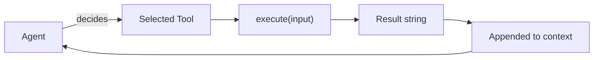

# tools — The Toolbox

::: tip TL;DR
11 tools the agent can use. Read-only by default; write tools require `allowWrite: true`.
:::

## What

Tools are the things the agent can **do**, not just think about.

The model can reason, plan, and summarise on its own — but tools let it **act on the real world**: read files, query databases, browse the web, classify images, run commands, and more.

## Role

```text
Agent decides:   "I should use tool X with input Y"
                        |
Runtime:         Executes tool X(Y)
                        |
Result:          Appended to agent context
                        |
Agent decides:   next action (or "none" = done)
```

## Tool contract

Every tool provides exactly three things:

```typescript
{
  name: string,          // e.g. "read_file"
  description: string,   // what the model sees in the prompt
  execute(input): Promise<string>  // returns result as string
}
```

The `description` is critical — it is what the LLM reads to decide whether to use this tool.

## Which tools are available by default

```text
Always enabled (read-only, safe by default):
  read_file        read files inside project root
  shell            run allowlisted shell commands
  mysql_query      run read-only SELECT queries
  browser_fetch    fetch and summarise web pages
  image_classify   classify/describe images (vision model)
  semantic_search  rank files/text by semantic similarity
  speech_to_text   transcribe audio files
  read_pdf         extract text from PDF files
  code_autocomplete  generate IDE-style code completions

Only enabled when allowWrite: true:
  write_file       write files to generated-projects root
  scaffold_project copy a boilerplate template to generated-projects
```

## Security boundaries (at a glance)

| Tool | What it can access | What it cannot touch |
|---|---|---|
| `read_file` | Any file under project root | Files outside project root |
| `shell` | Allowlisted commands only | `rm`, `curl`, `bash`, etc. |
| `mysql_query` | Any `SELECT` query | `INSERT`, `UPDATE`, `DELETE`, `DROP` |
| `browser_fetch` | `http://` and `https://` URLs | `file://`, `ftp://`, `javascript:` |
| `write_file` | Files inside `PROJECT_OUTPUT_ROOT` | Your actual source code |
| `scaffold_project` | `BOILERPLATE_ROOT` → `PROJECT_OUTPUT_ROOT` | Anything outside those two |

## Tool pages

Each tool has a dedicated page with input/output spec, how-it-works diagram, and real-life use cases:

- [read_file](/packages/tools/read-file) — Read any file under project root
- [shell](/packages/tools/shell) — Run allowlisted shell commands
- [mysql_query](/packages/tools/mysql-query) — Read-only SQL queries
- [browser_fetch](/packages/tools/browser-fetch) — Headless browser page fetch
- [image_classify](/packages/tools/image-classify) — Vision model image description
- [semantic_search](/packages/tools/semantic-search) — Embedding-based semantic ranking
- [speech_to_text](/packages/tools/speech-to-text) — Audio transcription
- [read_pdf](/packages/tools/read-pdf) — PDF text extraction
- [code_autocomplete](/packages/tools/code-autocomplete) — IDE-style code completion
- [write_file](/packages/tools/write-file) — Write files (write mode only)
- [scaffold_project](/packages/tools/scaffold-project) — Copy boilerplate templates (write mode only)

## Quick reference: which tool for which task?

| What you want to do | Tool to use |
|---|---|
| Read a config file or source file | `read_file` |
| List files, check git log, run npm | `shell` |
| Query your database | `mysql_query` |
| Scrape a web page | `browser_fetch` |
| Describe or classify an image | `image_classify` |
| Find relevant text/files by meaning | `semantic_search` |
| Transcribe audio to text | `speech_to_text` |
| Extract text from a PDF | `read_pdf` |
| Get code completion at cursor | `code_autocomplete` |
| Create/edit a file in generated-projects | `write_file` |
| Scaffold a new project from template | `scaffold_project` |


