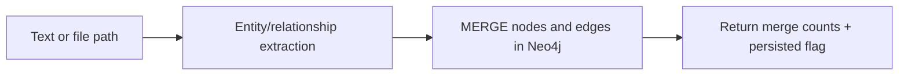

# Tool: `knowledge_graph`

::: tip TL;DR
Extracts entities/relationships from text or a file and persists them into Neo4j as a graph.
:::

## At a glance

- **Input:** `{ text?: string, path?: string, sourcePath?: string }`
- **Output:** `{ entitiesMerged, relationshipsMerged, persisted }`
- **When to use:** build relational memory for multi-hop retrieval and reasoning.

## Purpose

Populate the Neo4j knowledge graph from natural-language content.

## Input

```json
{
    "text": "TypeScript is maintained by Microsoft and compiles to JavaScript.",
    "sourcePath": "docs/ts-notes.md"
}
```

You can pass either `text` or `path`.

## Output

```json
{
    "entitiesMerged": 3,
    "relationshipsMerged": 2,
    "persisted": true
}
```

If Neo4j is unavailable, extraction still runs and returns `persisted: false` (fail-open).

## Safety

- **Write tool**: available only with `allowWrite: true`.
- Uses idempotent Cypher `MERGE` operations.
- Fail-open behavior avoids blocking full agent execution.

## Environment variables

| Variable          | Default                  | Description          |
| ----------------- | ------------------------ | -------------------- |
| `NEO4J_URI`       | `bolt://localhost:7687`  | Neo4j connection URI |
| `NEO4J_USER`      | `neo4j`                  | Neo4j username       |
| `NEO4J_PASSWORD`  | `put-your-password-here` | Neo4j password       |
| `NEO4J_DATABASE`  | `neo4j`                  | Database name        |
| `GRAPH_NER_MODEL` | `AGENT_MODEL_FAST`       | Extraction model     |

## How the agent uses it



## Good test prompts

| What you type                                         | What the agent does                                 |
| ----------------------------------------------------- | --------------------------------------------------- |
| `Ingest entities from docs/design.md into the graph.` | Reads content and persists extracted graph elements |
| `Create graph memory from this architecture summary.` | Uses text mode                                      |

## Further reading

- [Neo4j Cypher manual](https://neo4j.com/docs/cypher-manual/current/)
- [Neo4j JavaScript driver](https://neo4j.com/docs/javascript-manual/current/)

## Related

- [query_knowledge_graph](/packages/tools/query-knowledge-graph)
- [graph package](/packages/graph)
- [Cypher](/glossary#cypher)
- [GraphRAG](/glossary#graphrag)
