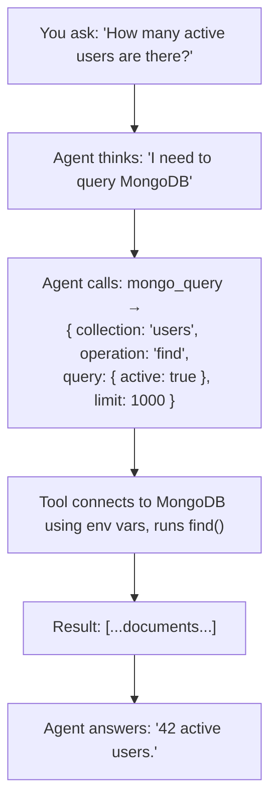

# Tool: `mongo_query`

::: tip TL;DR
Runs read-only `find` and `aggregate` operations against MongoDB. Write operations are not exposed.
:::

## Purpose

Execute read-only queries or aggregation pipelines against MongoDB.

## What it does in plain English

> "Search this collection or run this aggregation pipeline and give me back the matching documents."

The agent uses this to explore MongoDB collections — filtering documents, counting, grouping, or running complex analytics pipelines — without any ability to modify data.

## Operations

### `find` — Filter documents

```json
{
    "collection": "users",
    "operation": "find",
    "query": { "active": true },
    "limit": 10
}
```

`query` is a standard MongoDB filter document. `limit` caps results (default 100, max 1 000).

### `aggregate` — Run a pipeline

```json
{
    "collection": "orders",
    "operation": "aggregate",
    "query": [
        { "$match": { "status": "completed" } },
        { "$group": { "_id": "$customerId", "total": { "$sum": "$amount" } } },
        { "$sort": { "total": -1 } },
        { "$limit": 10 }
    ]
}
```

`query` is an array of MongoDB aggregation pipeline stages.

## Input

| Field        | Type                      | Required | Description                                                    |
| ------------ | ------------------------- | -------- | -------------------------------------------------------------- |
| `collection` | `string`                  | ✅       | Target collection name                                         |
| `operation`  | `"find"` \| `"aggregate"` | ✅       | Type of operation                                              |
| `query`      | `object` or `array`       | ❌       | Filter (find) or pipeline (aggregate). Defaults to `{}` / `[]` |
| `limit`      | `number`                  | ❌       | Max documents to return for `find` (default 100, max 1 000)    |

## Output

An array of matching documents.

```json
[
    { "_id": "663a1b2c...", "name": "Alice", "active": true },
    { "_id": "663a1b2d...", "name": "Bob", "active": true }
]
```

## Safety

- Only `find` and `aggregate` operations are exposed — no `insert`, `update`, `delete`, `drop`, or any other write/admin operation.
- Result sets are capped at 1 000 documents to prevent runaway memory usage.

## Environment variables

| Variable         | Default                         | Description               |
| ---------------- | ------------------------------- | ------------------------- |
| `MONGO_URI`      | `mongodb://localhost:27017`     | MongoDB connection string |
| `MONGO_DATABASE` | _(empty — uses server default)_ | Database name             |

## How the agent uses it (step-by-step)



## Good test prompts

| What you type                                   | What the agent will call                                        |
| ----------------------------------------------- | --------------------------------------------------------------- |
| `Show me 5 active users.`                       | `find` on `users` with `{ active: true }`, limit 5              |
| `Count orders per status.`                      | `aggregate` on `orders` with `$group` by `status`               |
| `Find the 3 highest-value orders.`              | `find` on `orders` with `$sort` by `amount` descending, limit 3 |
| `What is the average order value per customer?` | `aggregate` with `$group` + `$avg`                              |
