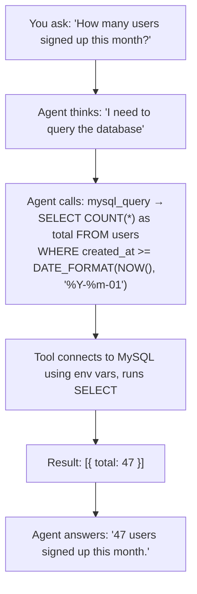

# Tool: `mysql_query`

::: tip TL;DR
Runs read-only SELECT queries against MySQL. All other SQL statements are rejected.
:::

## Purpose

Execute read-only SQL against MySQL.

## What it does in plain English

> "Run this SELECT query against your database and give me back the results."

The agent uses this when you want to explore or inspect your database — counting rows, listing records, checking table structure — without ever being able to modify data.

## Input

```json
{ "sql": "SELECT * FROM users LIMIT 5", "params": [] }
```

`params` is optional (used for parameterised queries, e.g. `WHERE id = ?`).

## Output

An array of rows returned by the query.

```json
[
    { "id": 1, "name": "Alice", "email": "alice@example.com" },
    { "id": 2, "name": "Bob", "email": "bob@example.com" }
]
```

## Safety

Only statements starting with `SELECT` are accepted. Any attempt to run `INSERT`, `UPDATE`, `DELETE`, `DROP`, or any other statement is **immediately rejected** before it reaches the database.

```
"SELECT * FROM users"        → ✅ allowed
"SELECT COUNT(*) FROM logs"  → ✅ allowed
"DELETE FROM users WHERE id=1" → ❌ rejected (starts with DELETE)
"DROP TABLE sessions"          → ❌ rejected (starts with DROP)
```

## Environment variables

Configure the database connection:

| Variable         | Default     | Description              |
| ---------------- | ----------- | ------------------------ |
| `MYSQL_HOST`     | `localhost` | Database server hostname |
| `MYSQL_PORT`     | `3306`      | Database server port     |
| `MYSQL_USER`     | `root`      | Database user            |
| `MYSQL_PASSWORD` | _(empty)_   | Database password        |
| `MYSQL_DATABASE` | _(empty)_   | Default database to use  |

## How the agent uses it (step-by-step)



## Real-life use cases

### Use case 1 — Explore table structure

**Prompt:**

```
What columns does the orders table have?
```

**What happens inside:**

```sql
SELECT COLUMN_NAME, COLUMN_TYPE, IS_NULLABLE
FROM INFORMATION_SCHEMA.COLUMNS
WHERE TABLE_NAME = 'orders'
AND TABLE_SCHEMA = DATABASE()
```

Returns the column names, types, and nullable flags.

---

### Use case 2 — Quick data audit

**Prompt:**

```
Show me the 5 most recently created user accounts.
```

**What happens inside:**

```sql
SELECT id, name, email, created_at
FROM users
ORDER BY created_at DESC
LIMIT 5
```

---

### Use case 3 — Parameterised query (safe interpolation)

**Prompt:**

```
Find all orders for customer ID 42.
```

**Agent builds:**

```json
{
    "sql": "SELECT * FROM orders WHERE customer_id = ? LIMIT 20",
    "params": [42]
}
```

Using `params` keeps user data out of the SQL string and prevents SQL injection.

---

### Use case 4 — Aggregation

**Prompt:**

```
What is the total revenue per product category this year?
```

```sql
SELECT category, SUM(price * quantity) as revenue
FROM order_items
WHERE YEAR(created_at) = YEAR(NOW())
GROUP BY category
ORDER BY revenue DESC
```

---

## Good test prompts

| What you type                                      | What the agent will query                            |
| -------------------------------------------------- | ---------------------------------------------------- |
| `Show me 3 rows from table users.`                 | `SELECT * FROM users LIMIT 3`                        |
| `Count rows in table orders.`                      | `SELECT COUNT(*) FROM orders`                        |
| `What are the column names in the products table?` | `SHOW COLUMNS FROM products`                         |
| `Which product has the highest price?`             | `SELECT * FROM products ORDER BY price DESC LIMIT 1` |
