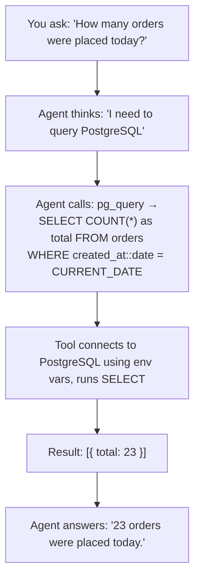

# Tool: `pg_query`

::: tip TL;DR
Runs read-only SELECT queries against PostgreSQL. All other SQL statements are rejected.
:::

## Purpose

Execute read-only SQL against PostgreSQL.

## What it does in plain English

> "Run this SELECT query against your PostgreSQL database and give me back the results."

The agent uses this when you want to explore or inspect a PostgreSQL database — counting rows, listing records, checking table structure — without ever being able to modify data.

## Input

```json
{ "sql": "SELECT * FROM users LIMIT 5", "params": [] }
```

`params` is optional. Use numbered placeholders (`$1`, `$2`, …) for parameterised queries:

```json
{
    "sql": "SELECT * FROM orders WHERE customer_id = $1 LIMIT 20",
    "params": [42]
}
```

::: warning PostgreSQL placeholder style
PostgreSQL uses `$1`, `$2`, … placeholders — **not** `?` like MySQL. Make sure the agent generates the correct style.
:::

## Output

An array of rows returned by the query.

```json
[
    { "id": 1, "name": "Alice", "email": "alice@example.com" },
    { "id": 2, "name": "Bob", "email": "bob@example.com" }
]
```

## Safety

Only statements starting with `SELECT` are accepted. Any attempt to run `INSERT`, `UPDATE`, `DELETE`, `DROP`, or any other statement is **immediately rejected** before it reaches the database.

```
"SELECT * FROM users"           → ✅ allowed
"SELECT COUNT(*) FROM logs"     → ✅ allowed
"DELETE FROM users WHERE id=1"  → ❌ rejected (starts with DELETE)
"DROP TABLE sessions"           → ❌ rejected (starts with DROP)
```

## Environment variables

Configure the database connection:

| Variable      | Default     | Description              |
| ------------- | ----------- | ------------------------ |
| `PG_HOST`     | `localhost` | Database server hostname |
| `PG_PORT`     | `5432`      | Database server port     |
| `PG_USER`     | `postgres`  | Database user            |
| `PG_PASSWORD` | _(empty)_   | Database password        |
| `PG_DATABASE` | _(empty)_   | Default database to use  |

## How the agent uses it (step-by-step)



## Good test prompts

| What you type                                      | What the agent will query                                                                     |
| -------------------------------------------------- | --------------------------------------------------------------------------------------------- |
| `Show me 3 rows from table users.`                 | `SELECT * FROM users LIMIT 3`                                                                 |
| `Count rows in table orders.`                      | `SELECT COUNT(*) FROM orders`                                                                 |
| `What are the column names in the products table?` | `SELECT column_name, data_type FROM information_schema.columns WHERE table_name = 'products'` |
| `Which product has the highest price?`             | `SELECT * FROM products ORDER BY price DESC LIMIT 1`                                          |
