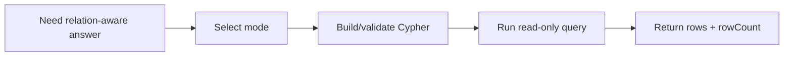

# Tool: `query_knowledge_graph`

::: tip TL;DR
Reads from Neo4j knowledge graph by entity lookup, relationship lookup, or read-only Cypher.
:::

## At a glance

- **Input:** `{ entity? | relationship? | cypher?, limit? }`
- **Output:** `{ rows, rowCount, query, warning? }`
- **When to use:** answer relational questions and perform graph traversal.

## Purpose

Query graph memory without allowing destructive graph writes.

## Input

### Entity mode

```json
{ "entity": "TypeScript", "limit": 25 }
```

### Relationship mode

```json
{ "relationship": "uses", "limit": 25 }
```

### Raw Cypher mode (read-only)

```json
{ "cypher": "MATCH (a:Entity)-[r:RELATES_TO]->(b:Entity) RETURN a, r, b LIMIT 10" }
```

## Output

```json
{
  "rows": [{ "from": "TypeScript", "relationship": "uses", "to": "JavaScript" }],
  "rowCount": 1,
  "query": "MATCH ...",
  "warning": "..."
}
```

`warning` appears for fail-open cases (e.g., Neo4j unreachable or blocked mutating Cypher).

## Safety

- Blocks mutating Cypher keywords (`CREATE`, `MERGE`, `DELETE`, `SET`, `REMOVE`, `DROP`, etc.).
- Fail-open behavior returns empty rows with warning instead of crashing the run.

## How the agent uses it



## Good test prompts

| What you type | What the agent does |
| --- | --- |
| `What relates to TypeScript in the graph?` | Uses entity mode |
| `List all uses relationships.` | Uses relationship mode |
| `Run MATCH query for top 10 technology links.` | Uses read-only Cypher mode |

## Further reading

- [Cypher query language](https://neo4j.com/docs/cypher-manual/current/)
- [Neo4j Browser](https://neo4j.com/product/neo4j-browser/)

## Related

- [knowledge_graph](/packages/tools/knowledge-graph)
- [graph package](/packages/graph)
- [Theory: MCP](/theory/MCP)
- [Cypher](/glossary#cypher)
