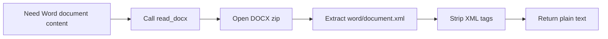

# Tool: `read_docx`

::: tip TL;DR
Extracts plain text from `.docx` files by reading `word/document.xml` inside the DOCX archive.
:::

## At a glance

- **Input:** `{ "path": "docs/spec.docx" }`
- **Output:** `{ text: string }`
- **When to use:** analyse Word documents without manual copy/paste.

## Purpose

Turn DOCX content into clean text the agent can reason over.

## Input

```json
{ "path": "data/contracts/nda.docx" }
```

## Output

```json
{
    "text": "Mutual Non-Disclosure Agreement\nThis agreement..."
}
```

## Safety

- Path must stay inside project boundaries.
- Output is plain text only (XML tags removed).

## How the agent uses it



## Good test prompts

| What you type                                    | What the agent does                     |
| ------------------------------------------------ | --------------------------------------- |
| `Read data/proposal.docx and list milestones.`   | Extracts text and summarises milestones |
| `Find payment terms in data/contracts/msa.docx.` | Searches extracted document text        |
| `Compare data/spec.docx with docs/spec.md.`      | Reads both and contrasts                |

## Further reading

- [Office Open XML overview](https://learn.microsoft.com/openspecs/office_standards/ms-docx/)
- [ZIP file format](https://pkware.cachefly.net/webdocs/casestudies/APPNOTE.TXT)

## Related

- [read_pdf](/packages/tools/read-pdf)
- [read_markdown](/packages/tools/read-markdown)
- [document_ingest](/packages/tools/document-ingest)
- [RAG](/glossary#rag)
