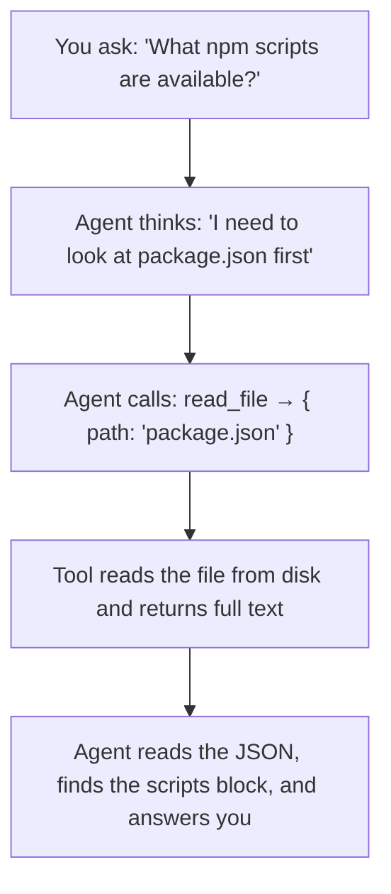

# Tool: `read_file`

::: tip TL;DR
Reads UTF-8 files from disk. Path must stay inside the project root.
:::

## Purpose

Read UTF-8 file content from disk.

## What it does in plain English

> "Open this file and give me its contents so I can work with them."

The agent uses this whenever it needs to know what is inside a file before it can answer you or take the next step.

## Input

```json
{ "path": "relative/or/absolute/path" }
```

## Output

UTF-8 file content string (the raw text of the file).

## Safety

Rejects any path that tries to escape the project root (for example `../../etc/passwd`). The tool resolves the full path and compares it against the allowed root — if it does not start with the project root, the call is rejected immediately.

## How the agent uses it (step-by-step)



## Real-life use cases

### Use case 1 — Understanding the project

You just cloned a new repo and want to know what it does without reading every file yourself.

**Prompt:**

```
Read README.md and give me a 3-sentence summary of what this project does.
```

**What happens inside:**

1. Agent calls `read_file` with `{ "path": "README.md" }`
2. Gets back the full README text
3. Summarises it into 3 sentences for you

---

### Use case 2 — Debugging a configuration file

Something in your app is broken and you think it is a config issue.

**Prompt:**

```
Read apps/api/index.ts and tell me which tools are currently registered.
```

**What happens inside:**

1. Agent calls `read_file` with `{ "path": "apps/api/index.ts" }`
2. Gets the source code
3. Scans for the tool registration block and lists the names for you

---

### Use case 3 — Multi-step reasoning (agent reads multiple files)

**Prompt:**

```
Find where the Agent class is defined and explain what its constructor does.
```

**What happens inside (up to 5 steps):**

```
Step 1: read_file  →  packages/agent/agent.ts     ← finds the class
Step 2: read_file  →  packages/agent/src/model-router.ts  ← follows an import
Step 3: action: "none"  →  gives final answer
```

---

## Good test prompts

| What you type                                          | What the agent does                                         |
| ------------------------------------------------------ | ----------------------------------------------------------- |
| `Read package.json and tell me all npm scripts.`       | Opens `package.json`, reads `scripts` block                 |
| `Open packages/agent/agent.ts and summarize the loop.` | Reads the file and describes the agentic loop               |
| `What TypeScript version is this project using?`       | Reads `package.json`, finds `typescript` in devDependencies |
| `Does this project have ESLint? Show me the rules.`    | Reads `eslint.config.ts`                                    |
