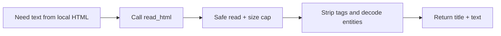

# Tool: `read_html`

::: tip TL;DR
Extracts plain text (+ optional `<title>`) from HTML files, removing scripts/styles/tags.
:::

## At a glance

- **Input:** `{ "path": "docs/page.html" }`
- **Output:** `{ text, title? }`
- **When to use:** parse local HTML exports, snapshots, or generated reports.

## Purpose

Convert local HTML into model-friendly plain text.

## Input

```json
{ "path": "data/report.html" }
```

## Output

```json
{
  "title": "Quarterly Report",
  "text": "Quarterly Report\nRevenue increased..."
}
```

## Safety

- Path is restricted to project-safe reads.
- Script/style tags are stripped.
- Very large HTML is truncated before parsing to reduce regex risk.

## How the agent uses it



## Good test prompts

| What you type | What the agent does |
| --- | --- |
| `Read data/site/index.html and summarise the content.` | Extracts readable page text |
| `What's the page title in data/report.html?` | Returns `title` |
| `Find headings in docs/export.html.` | Uses stripped text |

## Further reading

- [HTML Standard](https://html.spec.whatwg.org/)
- [MDN: HTML `<title>`](https://developer.mozilla.org/docs/Web/HTML/Element/title)

## Related

- [browser_fetch](/packages/tools/browser-fetch)
- [read_markdown](/packages/tools/read-markdown)
- [read_docx](/packages/tools/read-docx)
- [MCP](/glossary#mcp)
