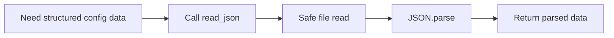

# Tool: `read_json`

::: tip TL;DR
Reads and parses a JSON file, returning the parsed object/array as structured data.
:::

## At a glance

- **Input:** `{ "path": "config/app.json" }`
- **Output:** `{ data: unknown }`
- **When to use:** inspect configs, manifests, API snapshots, or machine-readable docs.

## Purpose

Load JSON from disk and make it directly usable by the agent.

## Input

```json
{ "path": "data/config.json" }
```

## Output

```json
{
    "data": {
        "name": "manna",
        "profiles": ["fast", "reasoning", "code"]
    }
}
```

## Safety

- Path resolution is sandboxed to the project root.
- Invalid JSON throws a parse error, which the agent can recover from in-loop.

## How the agent uses it



## Good test prompts

| What you type                                     | What the agent does                |
| ------------------------------------------------- | ---------------------------------- |
| `Read package.json and list scripts.`             | Parses JSON and extracts `scripts` |
| `Open config/routes.json and validate endpoints.` | Reads structured route data        |
| `Summarise keys in data/schema.json.`             | Traverses parsed object            |

## Further reading

- [JSON RFC 8259](https://www.rfc-editor.org/rfc/rfc8259)
- [Node.js fs/promises](https://nodejs.org/api/fs.html#fspromisesreadfilepath-options)

## Related

- [read_markdown](/packages/tools/read-markdown)
- [read_html](/packages/tools/read-html)
- [Prompt, Context, and Memory](/theory/prompt-context-memory)
- [Context Window](/glossary#context-window)
