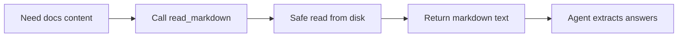

# Tool: `read_markdown`

::: tip TL;DR
Reads raw Markdown (`.md`) content from disk for summarisation, extraction, and reasoning.
:::

## At a glance

- **Input:** `{ "path": "README.md" }`
- **Output:** `{ text: string }`
- **When to use:** documentation QA, requirement extraction, changelog summarisation.

## Purpose

Give the agent exact Markdown source text (including headings/lists/code blocks).

## Input

```json
{ "path": "docs/index.md" }
```

## Output

```json
{ "text": "# Title\n\nSome markdown..." }
```

## Safety

- Read-only and sandboxed to the project root.
- No markdown rendering/execution; plain text only.

## How the agent uses it



## Good test prompts

| What you type | What the agent does |
| --- | --- |
| `Read docs/quickstart.md and summarise setup steps.` | Extracts ordered steps from Markdown |
| `Find TODO markers in README.md.` | Scans raw text |
| `List headings in docs/theory/RAG.md.` | Parses heading lines |

## Related

- [read_file](/packages/tools/read-file)
- [read_json](/packages/tools/read-json)
- [read_docx](/packages/tools/read-docx)
- [Prompt](/glossary#prompt)

## Further reading

- [CommonMark specification](https://spec.commonmark.org/)

