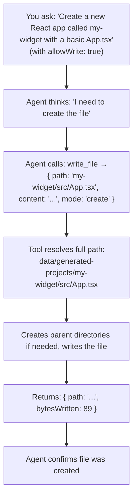

# Tool: `write_file`

::: tip TL;DR
Writes files inside PROJECT_OUTPUT_ROOT only. Requires `allowWrite: true`. Modes: create, overwrite, append.
:::

## Purpose

Write UTF-8 file content for generated projects.

## What it does in plain English

> "Create or update a file inside the generated-projects folder."

This is the write counterpart to `read_file`. While `read_file` can read from anywhere under the project root, `write_file` is **strictly confined** to `PROJECT_OUTPUT_ROOT` — it can never touch your actual source code.

## ⚠️ Write mode is opt-in

This tool is only available when the `/run` request body includes `"allowWrite": true`.

```bash
# This enables write_file and scaffold_project:
curl -X POST http://localhost:3001/run \
  -H "Content-Type: application/json" \
  -d '{"task":"Create a README.md for my-app","allowWrite":true}'
```

Without `allowWrite: true`, both `write_file` and `scaffold_project` are not registered — the agent cannot use them.

## Input

```json
{
    "path": "my-app/src/index.ts",
    "content": "console.log(\"hello\")\n",
    "mode": "create"
}
```

| Field     | Required | Default    | Notes                                      |
| --------- | -------- | ---------- | ------------------------------------------ |
| `path`    | ✅       | —          | Relative path inside `PROJECT_OUTPUT_ROOT` |
| `content` | ✅       | —          | UTF-8 text to write                        |
| `mode`    | ❌       | `"create"` | `create` / `overwrite` / `append`          |

### Modes explained

| Mode        | Behaviour                                                       |
| ----------- | --------------------------------------------------------------- |
| `create`    | Creates the file. **Fails if file already exists.**             |
| `overwrite` | Creates or replaces the file completely.                        |
| `append`    | Adds `content` to the end of the existing file (or creates it). |

## Output

```json
{
    "path": "data/generated-projects/my-app/src/index.ts",
    "mode": "create",
    "bytesWritten": 22,
    "outputRoot": "data/generated-projects"
}
```

## Safety

- Only writes under `PROJECT_OUTPUT_ROOT` (default `data/generated-projects`)
- Resolves the full path and rejects any traversal attempt (e.g. `../../src/index.ts`)
- Available only when `/run` body includes `"allowWrite": true`

## Environment variable

- `PROJECT_OUTPUT_ROOT` (default `data/generated-projects`)

## How the agent uses it (step-by-step)



## Real-life use cases

### Use case 1 -- Create a project README

**Request:**

```json
{
    "task": "Create a README.md for a project called my-api with a description and quick start section",
    "allowWrite": true
}
```

Agent writes `data/generated-projects/my-api/README.md` with the content.

---

### Use case 2 -- Generate a config file

**Request:**

```json
{
    "task": "Create a tsconfig.json for my-api project with strict mode enabled",
    "allowWrite": true
}
```

Agent writes a complete `tsconfig.json` to `data/generated-projects/my-api/tsconfig.json`.

---

### Use case 3 -- Append notes to an existing file

**Request:**

```json
{
    "task": "Add a 'Troubleshooting' section to the README in my-api",
    "allowWrite": true
}
```

Agent uses `mode: "append"` to add the section without overwriting the existing README.

---

### Use case 4 -- Multi-step file generation

**Request:**

```json
{
    "task": "Create a minimal Express TypeScript app called my-server with index.ts, package.json, and tsconfig.json",
    "allowWrite": true
}
```

**Steps:**

```
Step 1: write_file  ->  my-server/package.json
Step 2: write_file  ->  my-server/tsconfig.json
Step 3: write_file  ->  my-server/src/index.ts
Step 4: action: "none"  ->  Done
```

---

## Good test prompts

| What you type (with allowWrite: true)                    | What the agent creates                         |
| -------------------------------------------------------- | ---------------------------------------------- |
| `Create a hello-world/index.js that logs "Hello World".` | `data/generated-projects/hello-world/index.js` |
| `Write a .gitignore for a Node.js project in my-app/.`   | `data/generated-projects/my-app/.gitignore`    |
| `Append a CHANGELOG section to my-app/README.md.`        | Appends to existing file                       |
