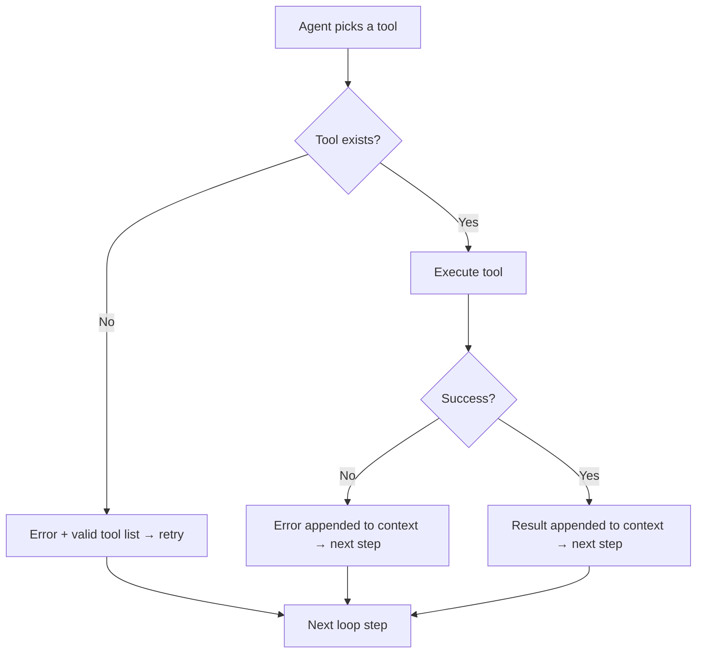

# Scenarios: Learn by Doing

::: tip TL;DR
10 hands-on scenarios — run one, check logs, note one insight, move on. Start with Scenario 1.
:::

Use these as practical drills. Run one scenario at a time and inspect logs.

> **ADHD tip**: timebox each scenario to 10 minutes.
>
> 1. Predict what tool(s) will be used
> 2. Run the task
> 3. Compare with actual event logs
> 4. Note one insight
> 5. Move on

---

## How tooling works (general rules to know first)

Before running scenarios, keep these runtime rules in mind:

1. The agent can only use tools that are registered at API startup.
2. At each step, the model sees a list of available tools in the prompt.
3. If the model asks for a tool that does not exist, the runtime does not crash:
    - it appends an error to context with the list of valid tools
    - it asks the model again on the next loop step
4. If a tool exists but fails (e.g. boundary/safety rejection), the error is added to context and the loop continues.
5. If the task cannot be completed with available tools, the run ends with either:
    - a limitation-aware answer (`action: "none"`), or
    - max-step fallback: `Max steps reached without a conclusive answer.`

Useful events while debugging:

- `agent:step` -- what decision the model made
- `tool:result` -- what the tool returned
- `tool:error` -- what went wrong
- `agent:max_steps` -- loop hit the limit

### Tool execution flow

---

## Scenarios

### Basics

| Scenario | Description |
| -------- | ----------- |
| [File reading](file-reading.md) | Verify `read_file` works and the agent can reason about file content |
| [Shell inspection](shell-inspection.md) | Verify `shell` tool runs commands and the agent interprets output |
| [Multi-step reasoning](multi-step-reasoning.md) | Verify the agent can chain multiple tool calls to answer a complex question |

### Data Sources

| Scenario | Description |
| -------- | ----------- |
| [SQL query](sql-query.md) | Verify `mysql_query` connects and returns results |
| [Browser fetch](browser-fetch.md) | Verify Playwright fetches a page and the agent summarises content |
| [Vision classification](vision-classification.md) | Verify `image_classify` sends an image to the vision model |
| [Speech transcription](speech-transcription.md) | Verify `speech_to_text` sends audio to Whisper and returns a transcript |
| [PDF reading](pdf-reading.md) | Verify `read_pdf` extracts text from a PDF |
| [Semantic search](semantic-search.md) | Verify `semantic_search` ranks files by meaning, not just keywords |

### Safety & Recovery

| Scenario | Description |
| -------- | ----------- |
| [Tool boundary](tool-boundary.md) | Verify the shell allowlist rejects dangerous commands |
| [Missing tool](missing-tool.md) | Observe what happens when the model tries to use a non-existent tool |

### Architecture

| Scenario | Description |
| -------- | ----------- |
| [End-to-end understanding](architecture-understanding.md) | Test your mental model of the full system |

### Write Mode

| Scenario | Description |
| -------- | ----------- |
| [Write file](write-file.md) | Verify `write_file` creates a file in the generated-projects folder |
| [Scaffold project](scaffold-project.md) | Verify `scaffold_project` copies a template to generated-projects |

---

## Summary: tool coverage matrix

| Scenario | Tool tested | Key thing to verify | Link |
| -------- | ----------- | ------------------- | ---- |
| 1 | `read_file` | File content returned + parsed | [File reading](file-reading.md) |
| 2 | `shell` | Command output returned | [Shell inspection](shell-inspection.md) |
| 3 | `read_file` x2 | Multi-step chaining | [Multi-step reasoning](multi-step-reasoning.md) |
| 4 | `mysql_query` | SELECT returns rows, unsafe SQL rejected | [SQL query](sql-query.md) |
| 5 | `browser_fetch` | Page title + content returned | [Browser fetch](browser-fetch.md) |
| 5.1 | `image_classify` | Vision model describes image | [Vision classification](vision-classification.md) |
| 5.2 | `speech_to_text` | Audio transcribed to text | [Speech transcription](speech-transcription.md) |
| 5.3 | `read_pdf` | PDF text + page count returned | [PDF reading](pdf-reading.md) |
| 5.4 | `semantic_search` | Results ranked by meaning | [Semantic search](semantic-search.md) |
| 6 | `shell` (rejected) | Allowlist blocks dangerous commands | [Tool boundary](tool-boundary.md) |
| 7 | `read_file` x3 | Agent explains itself from code | [Architecture understanding](architecture-understanding.md) |
| 8 | (unknown tool) | Error recovery and fallback | [Missing tool](missing-tool.md) |
| 9 | `write_file` | File created in generated-projects | [Write file](write-file.md) |
| 10 | `scaffold_project` | Template copied to generated-projects | [Scaffold project](scaffold-project.md) |
