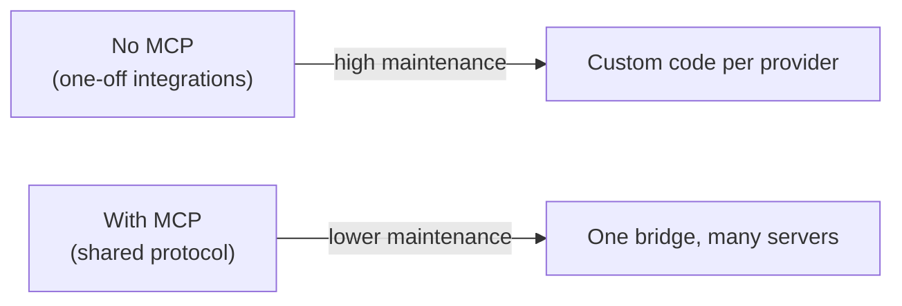
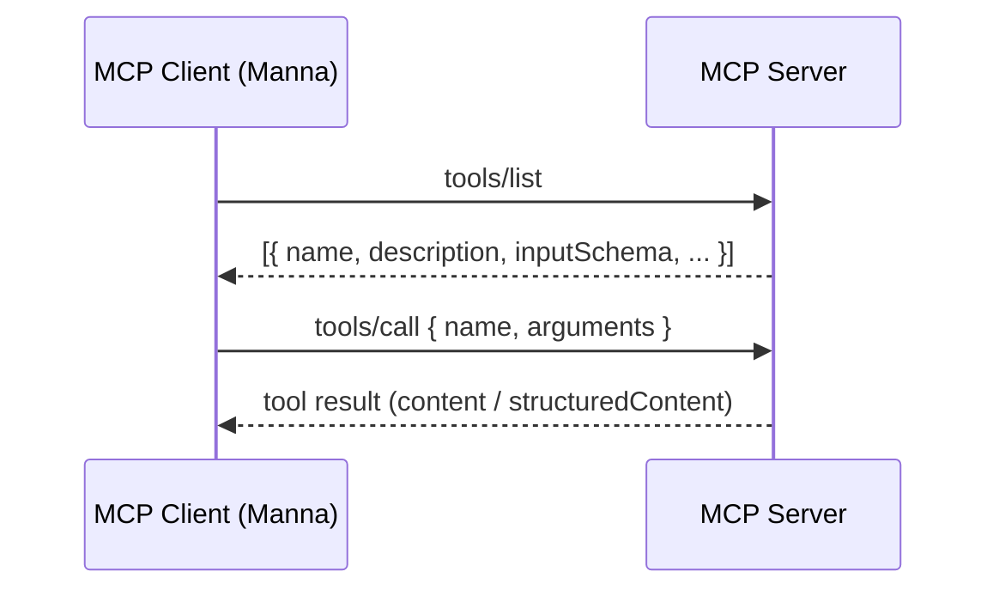
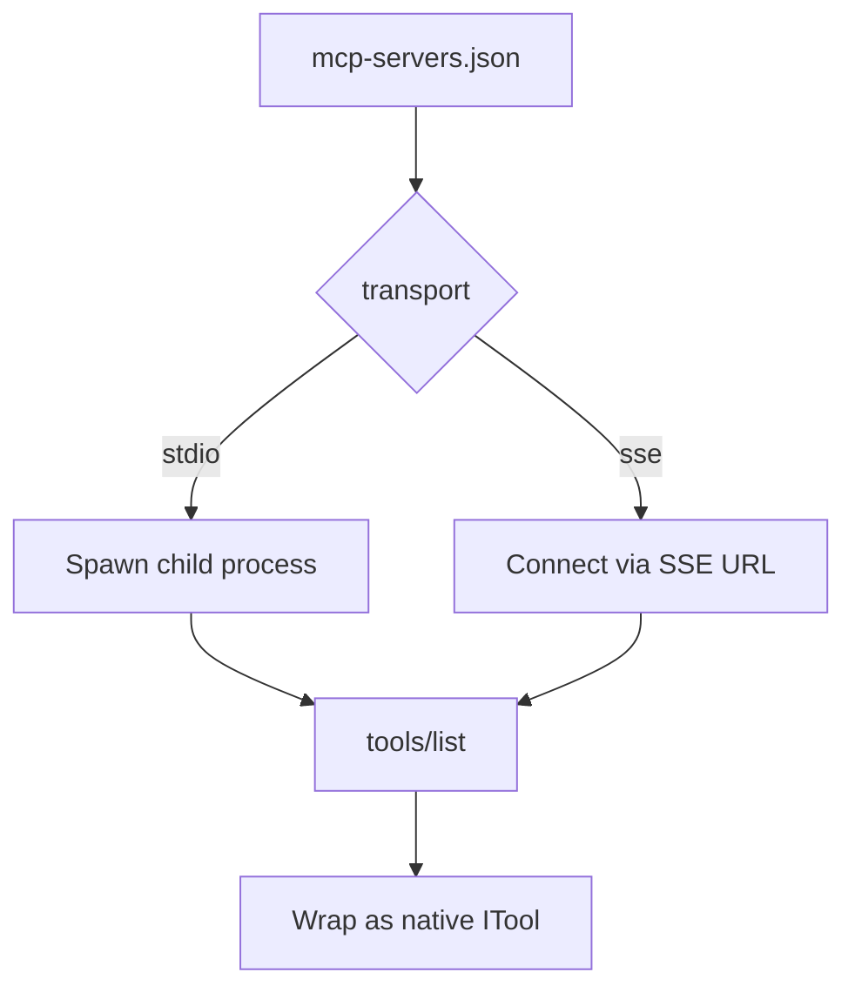

# Theory: Model Context Protocol (MCP)

::: tip TL;DR
MCP is a standard way for an AI app to plug into external tools.  
Manna uses MCP at startup to discover tools from servers and expose them as normal agent tools.
:::

## Why MCP exists

Without MCP, every integration is custom:

- custom API client
- custom auth handling
- custom tool wrapper
- custom maintenance forever

MCP solves this by standardizing how tools are described and called.

---

## Core mental model (ADHD-friendly)

Think of MCP like **USB for AI tools**:

1. Server exposes capabilities
2. Client asks "what tools do you have?"
3. Client calls a tool with JSON input
4. Server returns structured result

---

## Transport layer in practice

MCP supports multiple transports. In Manna:

- `stdio` → spawn a local process (common for `npx` MCP servers)
- `sse` → connect to remote MCP server URL

---

## How Manna uses MCP

At startup, Manna:

1. reads config (`MCP_CONFIG_PATH` or `data/mcp-servers.json`)
2. connects to each server
3. checks health (`listTools`)
4. discovers tools (`listTools`)
5. wraps each tool as native `ITool`
6. namespaces as `mcp_{server}__{tool}`
7. injects into normal tool arrays

Example names:

- `mcp_github__create_issue`
- `mcp_filesystem__read_file`

---

## Safety and failure behavior

Manna MCP bridge is fail-open:

- `MCP_ENABLED=false` → bridge disabled, startup continues
- config missing → log + continue
- one server fails → skip only that server
- other servers still load

This prevents MCP issues from blocking the API server.

---

## Quick glossary

| Term         | Meaning                                |
| ------------ | -------------------------------------- |
| MCP          | Model Context Protocol                 |
| MCP server   | Process/service exposing tools via MCP |
| MCP client   | App that discovers/calls MCP tools     |
| `tools/list` | Discover available tool descriptors    |
| `tools/call` | Execute a tool with JSON arguments     |
| Transport    | Communication method (`stdio`, `sse`)  |

---

## Next step

If you want practical setup and examples, go to:

- [MCP in Manna: Setup, Use, and Examples](/packages/mcp)
