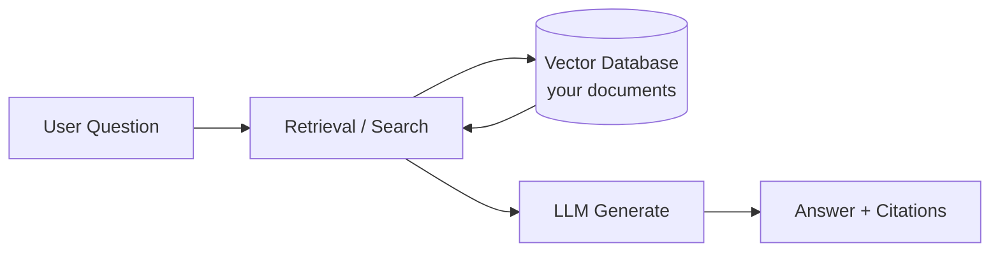
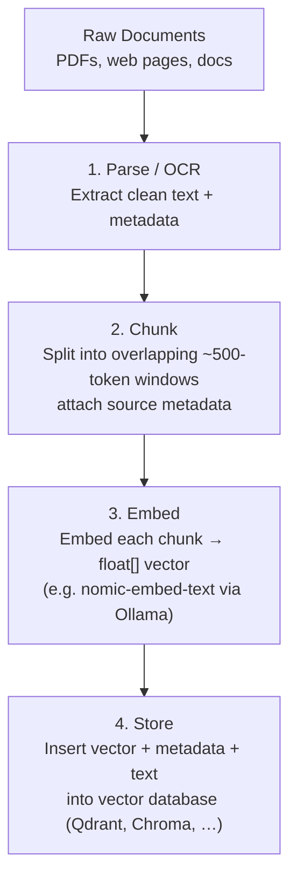
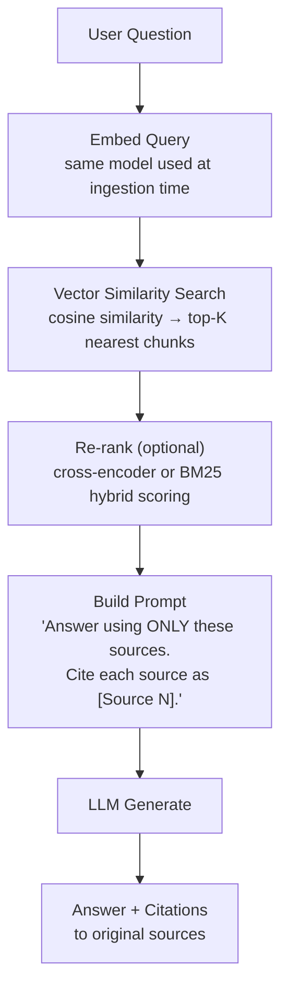
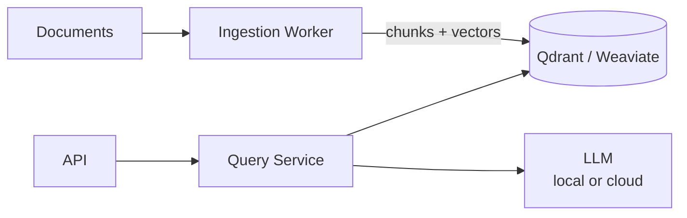
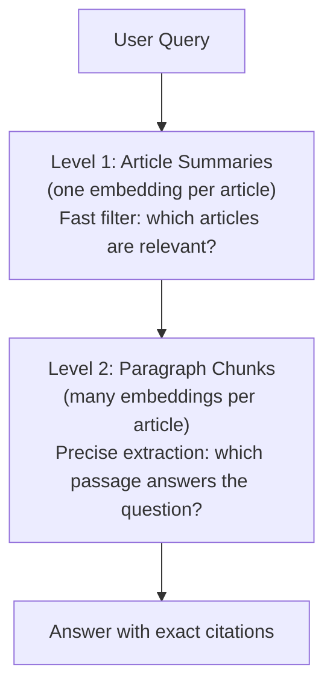

# Theory: Retrieval-Augmented Generation (RAG)

::: tip TL;DR
RAG = retrieve relevant facts from a document store, then feed them to an LLM so it can answer questions it was never trained on — with citations.
:::

## What Is RAG?

**Retrieval-Augmented Generation (RAG)** is a pattern for grounding LLM answers in a private or up-to-date knowledge base. Instead of asking the model to recall a fact from training data (which can be stale, incomplete, or hallucinated), you first search a document store for relevant passages and then inject those passages into the prompt.



The LLM only "reads" the passages you gave it in the prompt. It cannot access knowledge outside of those passages (if you prompt it correctly). This gives you:

- **Recency** — the database can be updated any time without retraining the model.
- **Verifiability** — every claim in the answer maps back to a specific source chunk.
- **Privacy** — documents never leave your infrastructure.
- **Reduced hallucination** — the model is constrained to evidence you provide.

---

## How It Works: Step by Step

### Phase 1: Ingestion (Offline)



**Key design choices at ingestion time:**

| Decision | Why it matters |
|---|---|
| Chunk size (tokens) | Too small → each chunk lacks context. Too large → less precise retrieval. 300–800 tokens is typical. |
| Overlap between chunks | Prevents splitting a key sentence at a boundary. 10–20 % overlap is common. |
| Metadata attached to chunks | Source file, page number, section, date — enables post-retrieval filtering. |
| Embedding model | Must be the same model at ingestion and query time. Changing models requires re-embedding everything. |

---

### Phase 2: Query (Runtime)



---

## RAG vs. Plain LLM vs. Fine-Tuning

| Approach | When to use | Pros | Cons |
|---|---|---|---|
| **Plain LLM** | General knowledge, no private data | Zero setup | No private data, stale cutoff, can hallucinate |
| **Fine-tuning** | Domain style/behaviour, not facts | Internalises domain patterns | Expensive, no source citations, hard to update |
| **RAG** | Private documents, factual retrieval | Cheap, updatable, citable | Retrieval can fail; multi-hop reasoning is hard |
| **RAG + fine-tune** | Large specialised domains | Best factual accuracy | Most expensive to build and maintain |

**Rule of thumb**: if you have a body of documents and want to answer questions about their *content*, use RAG. If you want the model to *write in a specific style*, use fine-tuning. If you want *both*, combine them.

---

## Real-World RAG Architectures

### Minimal (Personal tool)

```
SQLite / JSON file  ←→  numpy cosine similarity  ←→  Ollama LLM
```

For a few hundred documents this is perfectly sufficient. No separate vector DB required.

### Standard (Team / production)



### Hybrid search (better relevance)

Pure semantic search misses keyword-specific matches. Hybrid search combines:

- **Semantic (dense)**: embedding cosine similarity — captures meaning
- **Keyword (sparse/BM25)**: exact token overlap — captures specific terms, names, acronyms

Most modern vector DBs (Qdrant, Weaviate, Elasticsearch) support hybrid scoring natively.

### Multi-pass / Hierarchical RAG

For large document collections, a two-level approach significantly improves recall:



This is the approach recommended for the Scientific American use case in this project.
See → [Library Ingestion & Search](/library-ingestion)

---

## When RAG Fails (and How to Fix It)

| Failure mode | Cause | Mitigation |
|---|---|---|
| Wrong chunks retrieved | Semantic gap between query wording and document wording | Query expansion; synonym augmentation; hybrid search |
| Answer not in top-K chunks | K too small, or the relevant chunk ranked low | Increase K; use re-ranking |
| Multi-hop question fails | Answer requires combining info from multiple chunks | Chain-of-thought retrieval; explicit multi-step queries |
| Hallucinated citation | LLM guesses a page number | Store exact metadata at ingestion; validate citations in post-processing |
| Stale chunks | Documents updated but not re-ingested | Incremental ingestion pipeline; document version tracking |
| Context window overflow | Too many chunks × too large → exceeds LLM context | Limit chunk size; limit K; use a model with a larger context window |

---

## RAG in This Project

This codebase uses Qdrant as a **memory store** for the agent loop (not for full RAG over a document corpus). Key files:

- `packages/memory/memory.ts` — hybrid ring buffer + Qdrant memory
- `packages/tools/semantic.search.ts` — `semantic_search` tool that embeds a query and retrieves similar file contents
- `packages/tools/pdf.read.ts` — `read_pdf` tool for extracting text from PDFs

The proposed **Library** endpoints extend these capabilities to a full RAG-style ingestion and retrieval system over a collection of PDFs.
See → [Library Ingestion & Search](/library-ingestion)
See → [Vector Databases](/theory/VECTOR_DATABASES)

---

## Further Reading

- [Lewis et al. (2020) — "Retrieval-Augmented Generation for Knowledge-Intensive NLP Tasks"](https://arxiv.org/abs/2005.11401) — the original RAG paper.
- [LangChain RAG documentation](https://python.langchain.com/docs/modules/data_connection/)
- [LlamaIndex](https://docs.llamaindex.ai/) — alternative orchestration framework focused on RAG.
