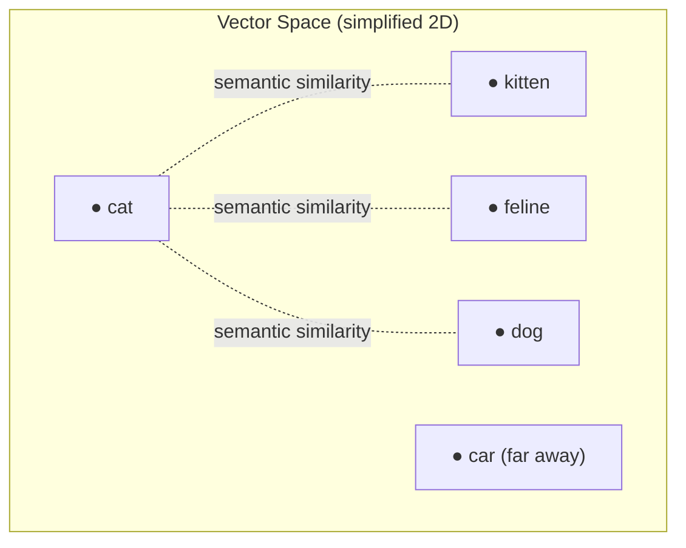
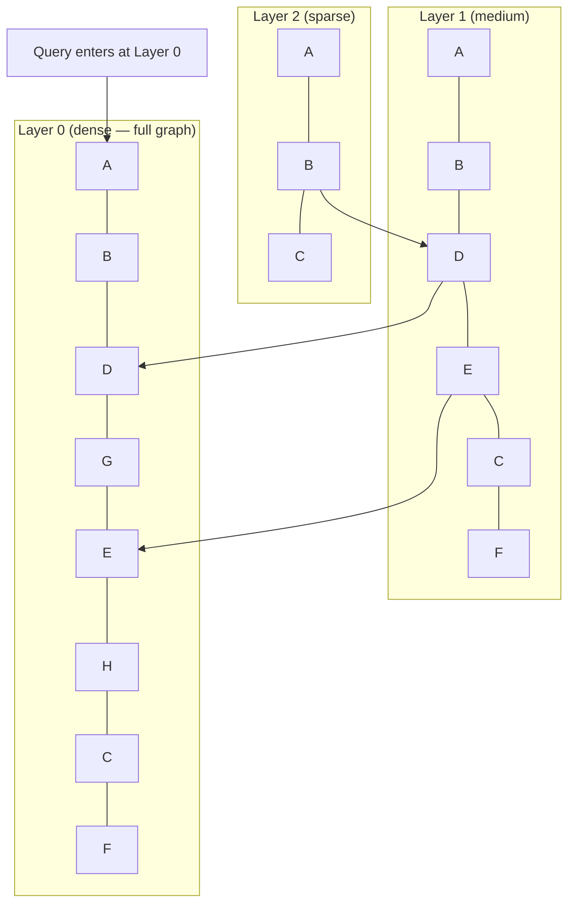
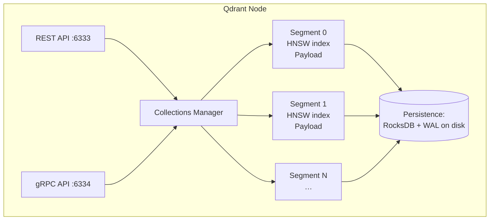

# Theory: Vector Databases

::: tip TL;DR
Vector databases store high-dimensional float arrays (embeddings) and retrieve the nearest ones to a query vector in sub-millisecond time — something SQL and key-value stores cannot do efficiently.
:::

## What Is a Vector Database?

A **vector database** is a storage engine optimised for one operation: given a query vector `q`, return the K stored vectors most similar to `q` — fast, even across millions of entries.

"Vectors" here are the numerical representations produced by [embedding](/glossary#embedding) models: arrays of 384–4096 floating-point numbers (depending on the model). Each dimension encodes some semantic feature of the original text or image. Nearby vectors in this high-dimensional space represent semantically similar content.



The database must answer: _"which stored vectors are closest to my query vector?"_ — a task called **Approximate Nearest Neighbour ([ANN](/glossary#ann)) search**.

---

## How Vector DBs Differ from SQL / NoSQL

| Feature             | SQL (relational)              | NoSQL (document / key-value)           | Vector DB                                                   |
| ------------------- | ----------------------------- | -------------------------------------- | ----------------------------------------------------------- |
| **Query type**      | Exact match, range, joins     | Exact match, full-text                 | Nearest-neighbour (semantic similarity)                     |
| **Index structure** | B-tree, hash                  | Hash / inverted index                  | ANN index ([HNSW](/glossary#hnsw), [IVF](/glossary#ivf), …) |
| **Filtering**       | `WHERE col = val`             | JSON path match                        | Post-filter on metadata attached to vectors                 |
| **Best for**        | Structured data, transactions | Flexible schema, high write throughput | Semantic search, embeddings, RAG                            |
| **Scaling axis**    | Rows × columns                | Documents                              | Vectors × dimensions                                        |

**None of these replaces the others.** Production RAG systems typically use:

- A **relational DB** for structured metadata (titles, dates, authors)
- A **vector DB** for embedding similarity search
- Optionally a **full-text search engine** (Elasticsearch, Typesense) for keyword (BM25) search

---

## Core Index Structures

### HNSW (Hierarchical Navigable Small World)

The most widely used ANN algorithm in production vector databases (Qdrant, Weaviate, Milvus).

Concept: build a multi-layer graph where each node is a vector. Higher layers are coarse skip-lists; lower layers are dense local neighbourhoods. Search traverses from the top layer down, greedily following the nearest node at each layer.



**Properties:**

- Query time: O(log N) average
- Build time: O(N log N)
- Memory: high (graph edges stored per node)
- Works well for up to ~100 M vectors

### IVF (Inverted File Index)

Clusters vectors into `nlist` Voronoi cells at build time. At query time, only `nprobe` nearest cells are searched.

- Query time: faster than HNSW for massive datasets
- Accuracy: depends on `nprobe` (more = slower but more accurate)
- Build time: requires training a k-means clustering step

### Flat (Brute Force)

Computes cosine/dot-product distance against every stored vector. Exact (not approximate). Only practical for < 100 K vectors in-memory.

This is what a pure `numpy` [cosine similarity](/glossary#cosine-similarity) implementation does — perfectly fine for personal-scale projects (< 10 K articles, < 500 K chunks).

---

## How Qdrant Works

[Qdrant](https://qdrant.tech/) is the vector database used in this project (optional, for the agent memory subsystem).

### Key Concepts

| Term           | Meaning                                                                    |
| -------------- | -------------------------------------------------------------------------- |
| **Collection** | Like a table. Each collection has a fixed vector size and distance metric. |
| **Point**      | A record. Contains: `id`, `vector: float[]`, `payload: {any JSON}`.        |
| **Payload**    | Arbitrary metadata attached to a point (title, date, page, file path, …).  |
| **Distance**   | `Cosine`, `Dot`, or `Euclidean`. Cosine is standard for text embeddings.   |
| **Filter**     | JSON predicate on payload fields, applied during or after ANN search.      |
| **Segment**    | Internal storage unit; Qdrant manages segments automatically.              |

### Write Path

```typescript
// Insert a point into Qdrant
await qdrant.upsert("my-collection", {
  points: [{
    id: "article-42",
    vector: [0.12, 0.87, ...],   // 768-dim embedding
    payload: {
      title: "Ocean Acidification",
      year: 2026,
      month: "March",
      page: 42,
      pdfPath: "/storage/sa/2026/03.pdf"
    }
  }]
});
```

### Query Path

```typescript
// Search for nearest neighbours
const results = await qdrant.search('my-collection', {
    vector: queryEmbedding, // embed the user's question first
    limit: 5,
    filter: {
        must: [{ key: 'year', match: { value: 2026 } }] // optional metadata filter
    },
    with_payload: true
});

// results[0] = { id, score, payload }
// score = cosine similarity in [0, 1]
```

### Architecture Overview



### Practical Qdrant Settings for This Project

| Setting                | Recommended value        | Rationale                                                   |
| ---------------------- | ------------------------ | ----------------------------------------------------------- |
| Distance metric        | `Cosine`                 | Standard for text embeddings from nomic-embed-text / BGE    |
| Vector size            | `768` (nomic-embed-text) | Match the embedding model's output dimension                |
| HNSW `m`               | `16`                     | Default; sufficient for < 1 M vectors                       |
| HNSW `ef_construct`    | `100`                    | Default; higher = slower build but better index quality     |
| On-disk payload        | Yes                      | Keeps RAM usage low; payload is only fetched for top-K hits |
| Collection replication | 1 (single node)          | Personal/local use; no need for HA                          |

---

## Scaling Realities: Personal vs. Production

### Personal Scale (this project's primary use case)

| Metric                      | Typical value | Notes                               |
| --------------------------- | ------------- | ----------------------------------- |
| Documents                   | 100 – 10 K    | Years of a magazine, a book library |
| Chunks (if chunking)        | 1 K – 200 K   | ~10–20 chunks per article           |
| Summaries (if summary-only) | 100 – 10 K    | One embedding per article           |
| Query latency (HNSW)        | < 5 ms        | Negligible even on CPU              |
| Memory (Qdrant)             | 10 – 200 MB   | Easily fits in 32 GB RAM            |
| Embedding cost (local)      | $0            | nomic-embed-text via Ollama         |

At this scale, you could skip Qdrant entirely and do brute-force cosine similarity in memory (NumPy / `Float32Array`). Qdrant adds operational complexity without meaningful performance gain until you exceed ~100 K vectors.

### Production Scale

| Metric            | Typical range | When you need Qdrant/Weaviate/Pinecone      |
| ----------------- | ------------- | ------------------------------------------- |
| Vectors           | > 1 M         | Brute-force becomes too slow (> 1 s)        |
| QPS               | > 100         | Dedicated vector DB handles concurrency     |
| Multi-tenancy     | Yes           | Per-tenant collection isolation             |
| Filtered search   | Complex       | Vector DB filter pushdown beats post-filter |
| High availability | Required      | Qdrant cluster mode, Pinecone cloud         |

**Verdict for this project**: Qdrant is already in use for agent memory. For the library feature, using the same Qdrant instance with a per-library collection is the correct approach — it avoids adding a second dependency and scales to millions of article chunks if the library ever grows.

---

## Choosing an Embedding Model

By default this project uses **`nomic-embed-text`** via Ollama, configured via the `OLLAMA_EMBED_MODEL` environment variable. Any Ollama-compatible embedding model can be substituted by changing that variable — however, see the invariant below.

| Model                             | Dimensions | Best for                        | VRAM / RAM              |
| --------------------------------- | ---------- | ------------------------------- | ----------------------- |
| `nomic-embed-text`                | 768        | General text, English-heavy     | CPU only (< 500 MB RAM) |
| `bge-large-en-v1.5`               | 1024       | High accuracy English retrieval | CPU only (< 700 MB RAM) |
| `mxbai-embed-large`               | 1024       | Best-in-class MTEB score        | CPU only (< 700 MB RAM) |
| `text-embedding-3-small` (OpenAI) | 1536       | Cloud, multilingual             | N/A (API)               |

**Invariant**: the embedding model used at ingestion time **must** be the same model used at query time. Changing models requires re-embedding the entire corpus.

---

## Related Pages

- [Retrieval-Augmented Generation (RAG)](/theory/RAG) — how retrieval and generation combine
- [Library Ingestion & Search](/library-ingestion) — applied architecture for multi-PDF libraries
- [Memory subsystem](/packages/memory) — how this project already uses Qdrant for agent memory
