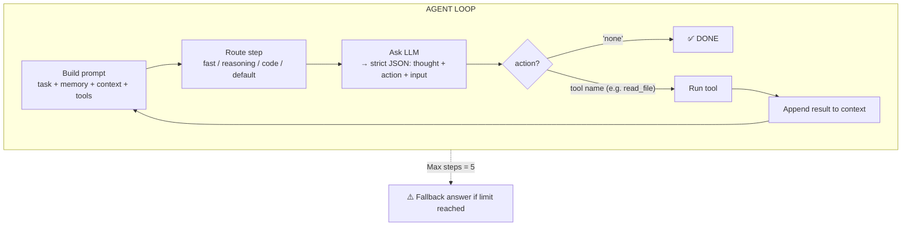
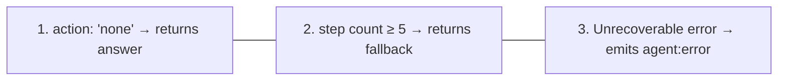
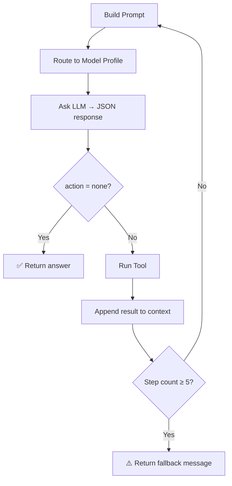

# Theory: Agent Loop Mental Model

::: tip TL;DR
The agent is a loop: ask the model → run the tool → repeat (max 5 steps) → return answer.
:::

## The one-sentence version

> The agent is a loop that asks the model "what should I do next?", runs the suggested tool, and repeats — until either the task is done or the step limit is hit.

## Visual loop



## Concrete example: "What npm scripts are available?"

```
Step 1:
  Prompt:   "What npm scripts are available? Tools: [read_file, shell, ...]"
  LLM:      { thought: "I should read package.json", action: "read_file", input: { path: "package.json" } }
  Tool:     reads package.json → returns JSON text
  Context:  appends result

Step 2:
  Prompt:   [original task] + [package.json content from step 1]
  LLM:      { thought: "I have the data, I can answer", action: "none", input: {} }
  Result:   "The available npm scripts are: dev, build, typecheck, ..."
```

## Why this works

- The model does **planning** (decides what to do)
- Tools do **deterministic execution** (actually do it)
- Context turns previous outputs into next-step inputs (memory within a run)

## Why max 5 steps matters

Without a step limit:

```
Infinite loop risk:
  Step 1: tool A fails
  Step 2: try tool A again
  Step 3: try tool A again
  ... forever
```

With max 5 steps:

```
Step 1-4: attempts
Step 5:   fallback message: "Max steps reached without a conclusive answer."
```

This caps cost, latency, and runaway behavior.

## Failure modes (and what happens)

| What goes wrong                         | What the loop does                                          |
| --------------------------------------- | ----------------------------------------------------------- |
| LLM returns invalid JSON                | Appends parse error to context, tries again next step       |
| LLM requests a tool that does not exist | Appends "unknown tool" error + valid tool list, tries again |
| Tool throws a runtime error             | Appends error message to context, continues loop            |
| Max steps reached                       | Returns fallback string, emits `agent:max_steps` event      |

The loop is built to **recover and continue** whenever possible.

## Stop conditions




