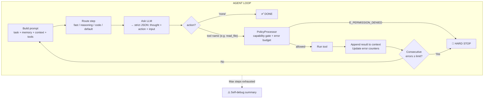
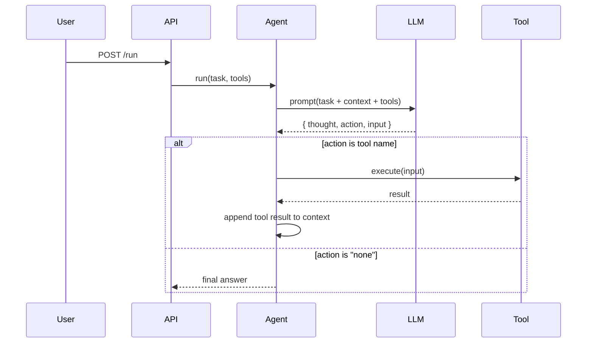
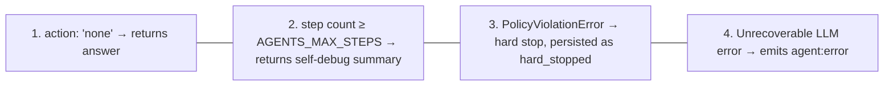

# Theory: Agent Loop Mental Model

::: tip TL;DR
The agent is a loop: ask the model → run the tool → repeat (up to `AGENTS_MAX_STEPS`) → return answer. Repeated failures are caught early and reported cleanly.
:::

## The one-sentence version

> The agent is a loop that asks the model "what should I do next?", runs the suggested tool, and repeats — until either the task is done, the step limit is hit, or a policy guardrail stops the run.

## Visual loop



## One step as a sequence



## Concrete example: "What npm scripts are available?"

```
Step 1:
  Prompt:   "What npm scripts are available? Tools: [read_file, shell, ...]"
  LLM:      { thought: "I should read package.json", action: "read_file", input: { path: "package.json" } }
  Tool:     reads package.json → returns JSON text
  Context:  appends result

Step 2:
  Prompt:   [original task] + [package.json content from step 1]
  LLM:      { thought: "I have the data, I can answer", action: "none", input: {} }
  Result:   "The available npm scripts are: dev, build, typecheck, ..."
```

## Why this works

- The model does **planning** (decides what to do)
- Tools do **deterministic execution** (actually do it)
- Context turns previous outputs into next-step inputs (memory within a run)

## Tool selection and loop guards

Before each step, the runtime can narrow tool candidates using a **tool reranker** (embedding similarity between request and tool descriptions). This reduces noisy tool menus and improves selection accuracy.

During execution, a **tool-call deduplicator** blocks repeated identical calls (`same tool + same args`) inside the same run and emits `E_DUPLICATE_CALL` instead of re-running pointless work.

Together, reranking + deduplication reduce token waste and retry loops.

## Why max steps matters

Without a step limit:

```
Infinite loop risk:
  Step 1: tool A fails
  Step 2: try tool A again
  Step 3: try tool A again
  ... forever
```

With max steps and a consecutive-error budget, runs terminate cleanly
instead of burning tokens on hopeless retries.

## Failure modes (and what happens)

| What goes wrong                         | Code                   | Recovery action                                                        |
| --------------------------------------- | ---------------------- | ---------------------------------------------------------------------- |
| LLM returns invalid JSON                | `E_JSON_PARSE`         | Appends parse error to context, tries again next step                  |
| LLM requests a tool that does not exist | `E_TOOL_UNKNOWN`       | Appends "unknown tool" error + valid tool list, tries again            |
| Tool throws a runtime error             | _(generic)_            | Appends error message to context, increments consecutive-error counter |
| Tool path escapes project root          | `E_PATH_OUTSIDE_ROOT`  | Actionable message with actual root path; increments hard-stop counter |
| Write tool called without `allowWrite`  | `E_PERMISSION_DENIED`  | Immediate hard stop — not retried                                      |
| Same tool + same args repeated          | `E_DUPLICATE_CALL`     | Skipped with notice, increments error counter                          |
| N consecutive errors (default N=3)      | `E_CONSECUTIVE_ERRORS` | Immediate hard stop, persisted as `hard_stopped`                       |
| Max steps reached                       | `E_BUDGET_EXCEEDED`    | Self-debug summary returned, emits `agent:max_steps`                   |

## Stop conditions



## Run states

| State       | Trigger                     | Persisted status |
| ----------- | --------------------------- | ---------------- |
| `Done`      | `action: "none"` from model | `completed`      |
| `SelfDebug` | Max steps exhausted         | `max_steps`      |
| `HardStop`  | `PolicyViolationError`      | `hard_stopped`   |
| _(error)_   | Unhandled LLM exception     | `error`          |

See also: [Operating Modes](./operating-modes.md) · [Error Taxonomy](./error-taxonomy.md)

Further reading:

- [ReAct paper (arXiv:2210.03629)](https://arxiv.org/abs/2210.03629)
- [Anthropic tool use overview](https://docs.anthropic.com/en/docs/agents-and-tools/tool-use/overview)
